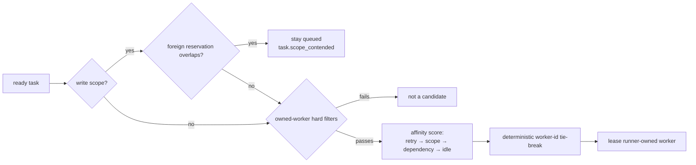

# ADR 0079: Owned-worker routing prefers existing context

Status: accepted (2026-08-07). Refines worker selection in
[ADR 0019](0019-runner-pull-worker-execution.md) and consumes foreign-process
scope reservations from [ADR 0078](0078-adopted-workers.md). Verification
independence remains a hard filter.

## Context

A structurally capable first-match router discards useful context. A retry can
land on a worker that did not see the failure, a dependent task can miss the
worker that completed its dependency, and an already-busy worker can win while
an equivalent peer is idle.

Foreign adopted agents create a different concern. The runner cannot execute
or settle them as mission workers, but an active directed adoption represents a
possible writer in the mission workspace. Worker preference and foreign-writer
exclusion must remain separate concepts: the former chooses among executable
workers, while the latter decides whether a write task may start at all.

## Decision

Executable worker selection is a hard filter followed by a deterministic
affinity score. Foreign-process reservations gate runner pull claims before
that selection.

- **Hard filters retain authority.** Task kind, `preferredHarness`, `canWrite`,
  and the verification-independence exclusion set determine eligibility. No
  affinity score can promote an ineligible worker.

- **Affinity is ordered and deterministic.** In descending weight, selection
  prefers the worker that ran the previous attempt, a worker with a settled
  assignment whose write scope overlaps this task, a worker that completed a
  direct dependency, and an idle worker over a busy one. Ties break
  lexicographically by worker id. Inputs come from mission runtime state, so
  replay produces the same choice.

- **A foreign adoption is not a candidate.** `WorkerScopeReservation` is a
  separate type from `WorkerDescriptor`. It carries only reservation identity,
  canonical workspace root, and enforced scope. It cannot receive an
  assignment, report a result, or satisfy verification.

- **Reservations block paths rather than filter workers.** The runner exports
  active directed adoptions for its canonical repository root on every claim.
  A task with overlapping write scope remains queued and emits one
  `task.scope_contended` event per episode. Routing to another owned worker
  would still create a second writer, so no worker choice can bypass the gate.
  A scope-free task remains eligible.

- **Release is naturally recoverable.** Claims carry current reservations, not
  cached scheduler state. When an adoption is released or lapses, the next
  claim omits it and the queued write task can lease normally.

- **Push and pull share executable-worker selection.** `StaticWorkerRouter` and
  `leaseReadyTask` use the same capability and deterministic descriptor
  selection. Foreign reservations belong to the runner pull boundary because
  that boundary owns live local-process knowledge. The static push router never
  treats a foreign adoption as a descriptor, so the two paths cannot disagree
  about whether that process is executable.

## Options weighed

- **Keep first-match selection** — rejected because it rebuilds context and
  ignores load even when the mission already records better signals.
- **Represent a directed adoption as a worker with a large score penalty** —
  rejected because any finite penalty still claims the process can execute a
  task. It cannot.
- **Filter only the worker associated with a conflicting path** — rejected
  because the conflict belongs to the path; another worker would create the
  same concurrency violation.
- **Use the adopter's declared glob as the reservation** — rejected because the
  runner cannot enforce that glob on a foreign process. ADR 0078 therefore
  supplies a whole-workspace enforced reservation.
- **Use wall-clock recency in affinity** — rejected because pauses would change
  routing for an otherwise identical event history.

## Consequences

- Retries and dependent tasks prefer the runner-owned worker that already paid
  for their context.
- A live directed foreign writer produces an explicit queued state instead of
  a duplicate writer or an unexplained stall.
- Scheduler tests cover every score tier, verification exclusion, reservation
  contention, repeated polling, read-only progress, and recovery after release.
- Existing missions with one capable worker select exactly as before.
