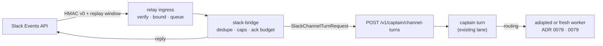

# ADR 0080: Slack is a channel, not a second captain

Status: accepted (2026-08-07). Follows the tracker-channel ingress established
for Linear (`docs/linear-agent-webhook-ingress.md`) and the lane-address rule
from [ADR 0048](0048-discord-user-session-transport.md) (the lane is derived
from the channel, not the transport). Routes reach existing agents through
[ADR 0078](0078-adopted-workers.md) and
[ADR 0079](0079-routing-prefers-the-worker-that-already-holds-the-context.md).

## Context

Clankie already accepts direction from three ingress shapes: the operator
dispatch route (TUI, RN, macOS, Herdr), the Discord bridges, and the Linear
agent-session webhook. The Linear path is the mature one and it is three
concerns, not one: the relay owns public HTTPS termination, HMAC verification,
replay-window rejection, body bounds, and a retained delivery queue; the bridge
app owns dedupe, per-issue and per-workspace caps, ack budget, and the mapping
from a tracker thread to a captain turn; the control plane owns the turn itself.

The owner wants to hand Clankie direction from Slack. The naive read of that ask
is "add a Slack client to the captain" — a second place that decides what an
instruction means. That is the failure this repository is organized against: the
captain boundary is where intent becomes a plan, and a transport that plans for
itself becomes a second captain with its own drift.

There is also a schema pressure. `LinearChannelTurnRequestSchema` is close to
what Slack needs but its `identity` carries `workspaceId` and `appUserId`, and
its body carries `issue`, `session`, and a `trigger` with `rootCommentId` — all
Linear-shaped. Slack has team, channel, thread, and message identity instead.
Doctrine is explicit that a provider never reuses another provider's field under
a new meaning.

## Decision

Slack enters as a third instance of the existing ingress shape. It introduces no
new decision-making surface.

- **A sibling schema family, not a widened one.**
  `SlackChannelTurnRequestSchema` and `SlackChannelIdentitySchema` are added
  alongside the Linear family; the Linear schemas are not touched. The
  control-plane route accepts a discriminated union over the channel source.
  Slack carries `teamId`, `channelId`, `threadTs`, and `messageTs`; it does not
  borrow `workspaceId` or `issue`. Two near-identical schemas are the correct
  cost of the no-field-reuse rule — the alternative is a field whose meaning
  depends on which transport wrote it, which is unreadable at the point it
  matters most.

- **The thread is the conversation address.** A Slack thread maps to one durable
  operator conversation, keyed on `(teamId, channelId, threadTs)`, derived from
  the channel exactly as Discord derives its lane
  ([ADR 0048](0048-discord-user-session-transport.md)). A follow-up in the same
  thread continues the same conversation and therefore the same Eve session; a
  new thread starts a new one. Instruction context accumulates where the humans
  can see it.

- **The relay owns verification; the bridge owns judgment.** Slack signature
  verification (`v0=` HMAC over the versioned basestring), the five-minute
  replay window, and body bounds live in the relay next to the Linear
  equivalents. The bridge owns `event_id` dedupe, per-channel and per-team caps,
  and evidence. Neither owns what the instruction means.

- **Slack's three-second ack is a transport deadline, not a work deadline.** The
  bridge acknowledges within budget and executes detached, exactly as the
  operator dispatch route acknowledges a turn with a `runId` before the work
  runs. A slow mission never turns into a Slack retry storm.

- **Privileged actions do not gain a Slack path.** An instruction may arrive
  from Slack; an approval may not. Approval requests render as a link to the
  authenticated approval surface. This preserves the invariant that no lane
  widens approval authority, which the operator dispatch contract already states
  for its own `input_response` family.

- **Bot and app-mention events only.** The bridge subscribes to explicit mention
  and thread-reply events on channels the owner configured, never to a broad
  message firehose, so unaddressed workplace conversation never becomes model
  input.

## Options weighed

- **Generalize the Linear schema into one `ChannelTurnRequest`** — rejected. It
  would either widen Linear's frozen fields to optional (weakening a contract
  currently in production) or overload them with Slack meanings, which doctrine
  forbids outright.
- **Slack client inside the captain app** — rejected. It puts transport
  concerns (signatures, retries, rate limits) inside the planning boundary and
  creates a second place where an instruction is interpreted.
- **Slack as a device surface on the operator dispatch route** — rejected. That
  route authenticates paired devices and captain/operator bearers; a workspace
  bot is neither, and stretching device identity to cover it would weaken the
  grant model that gates `chat` and `steer`.
- **Post directly to a mission-creation route, skipping the captain turn** —
  rejected. It would let a Slack message create a mission with no plan, no
  doctrine evaluation, and no approval, bypassing every gate between intent and
  execution.

## Consequences

- Slack gains exactly the authority Linear has: it can direct, ask, and receive;
  it cannot approve, merge, or deploy.
- A third transport now depends on the relay's webhook machinery, which makes
  that machinery a shared asset worth factoring; the Slack implementation
  mirrors the Linear modules rather than importing them, and a later refactor
  can unify them once the third instance has proven the shape.
- Thread-keyed conversations mean a long Slack thread holds one Eve session and
  its full history, so context grows with the thread; retention and cursor
  recovery follow the existing operator-conversation contracts unchanged.
- The owner can direct the fleet from Slack without a terminal, and — combined
  with adoption — can direct it at an agent that was already running before the
  message was sent.
