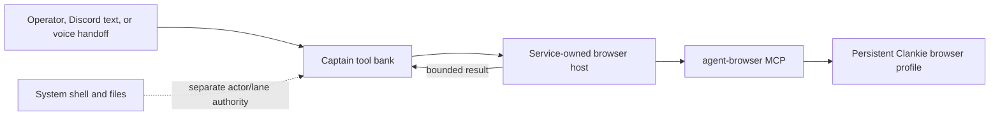

# ADR 0082: Clankie holds the browser

Status: accepted (James, 2026-08-08). This amended an earlier, unretained
decision that kept web reach out of the captain. Its relevant rationale is
summarized here instead of citing a nonexistent ADR file. References to a
doctrine-governed worker projection describe the retired architecture.

## Context

The earlier architecture delegated web research to coding workers because it
treated all execution as one risk. That grouped unlike capabilities together:
shell and file writes can alter the repository and its safeguards, while reading
a web page cannot. Conversational browsing through a delegated worker also had
the wrong latency and could not answer directly in the room.

Clankie now leads coding agents through Herdr rather than a worker protocol, but
the same distinction remains: his browser is a first-class conversational tool,
not a coding-agent task.

## Decision

The Clankie service owns one persistent `agent-browser` MCP process and projects
its complete paginated catalog into the captain's tool bank. A small everyday
set starts active; tool search activates uncommon browser actions additively.
If the process is unavailable, the captain receives one truthful unavailable
result rather than a partial catalog.

Browser access does not grant system tools.
[ADR 0095](0095-discord-system-actors.md) separately limits shell and filesystem
access by authenticated actor and lane.

Browser calls are serialized because every room shares one browser state. The
profile persists under the service's private state root and is Clankie's, never
the operator's browser profile.

The subprocess receives an allowlisted environment, dedicated home/temp/socket
paths, and no unrelated Clankie credentials. This hardens the process but does
not sandbox it: strong containment requires moving the browser process tree into
a VM or remote broker with no host mounts or credentials.

## Alternatives considered

- **Delegate one research agent per lookup** was rejected for conversational
  latency and indirect answers.
- **Register only a search service** was rejected because authenticated,
  JavaScript-heavy, and multi-step pages require a browser.
- **Let the captain spawn a browser itself** was rejected because process and
  credential ownership belong to the service host.
- **Expose only read-style browser actions** was rejected because a browser that
  cannot fill forms or navigate authenticated workflows does not cover the
  intended general-purpose seat.

## Consequences

- Every captain lane can browse through one shared, persistent profile.
- Untrusted room text can influence a full-action authenticated browser; content
  labels are not a security boundary, so authenticated profiles carry material
  risk until the process is isolated at the OS boundary.
- Deferred activation keeps the initial prompt small without reducing the
  registered catalog.
- Browser output remains bounded before entering model context.
- Current browser composition and tool inventory belong in the
  [architecture guide](../architecture.md).
