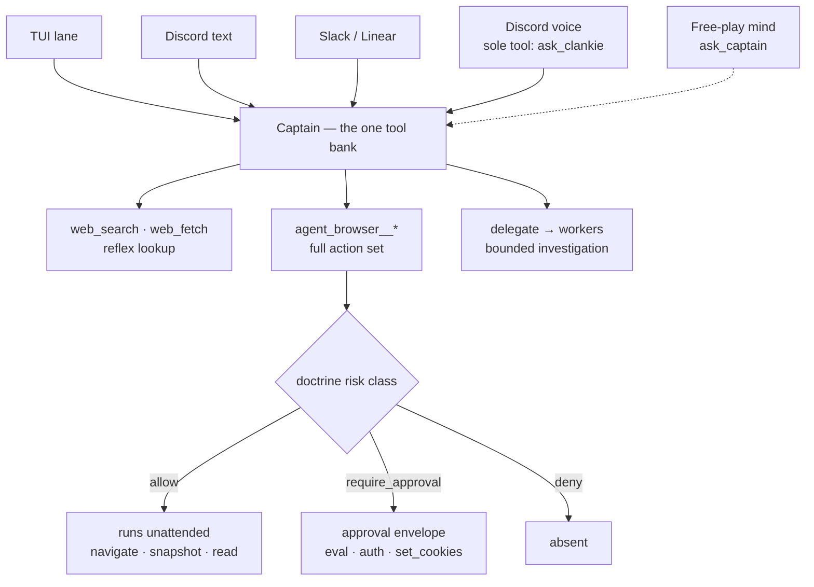

# ADR 0082: Clankie holds the browser

Status: accepted (James, 2026-08-08). Amends
[ADR 0027](0027-mcp-worker-tool-projection.md), which rejected giving the
captain web reach. ADR 0027 remains authoritative for the MCP registry, the
risk-class vocabulary, and the worker projection; only the captain's own
capability changes here.

## Context

Clankie already has one centralized tool bank and every branch already calls
it. The bank is `apps/captain-eve/agent/tools/`; the TUI, Discord text, Slack,
and Linear are captain lanes ([ADR 0080](0080-slack-is-a-channel-not-a-second-captain.md)),
and the Discord voice model's entire tool surface is `ask_clankie`, described
to it as "the captain holds every tool and memory"
([ADR 0057](0057-realtime-voice-with-captain-handoff.md)). No branch grew its
own tools. That part of the architecture was already right.

What the bank did not hold was any way to look something up. Measured on the
owner's machine, every web path was closed at once:

| Path | State |
| --- | --- |
| Captain `web_search` / `web_fetch` | `disableTool()` per ADR 0027 |
| Claude worker native web research | `CLANKIE_CLAUDE_WEB_RESEARCH_ENABLED` unset |
| Codex worker `agent-browser` | `CLANKIE_BROWSER_ENABLED` unset, binary not installed |

So "look that up" had no answer in any lane. In a Discord voice channel the
only sanctioned route — create a mission and delegate a research worker — costs
more than the question is worth, and the fast conversational path that
ADR 0057 exists to protect is exactly where lookups arrive.

ADR 0027 declined this on the grounds that "the tool-less captain is the
architecture's core safety property; execution belongs in governed workers."
That framing bundled two unlike things under one word. A captain with `bash`
and `write_file` can edit the doctrine it is judged against and the tests that
gate it — that is the property worth keeping. A captain that can read a web
page cannot. Web reach was swept along by a rule aimed at something else.

The second premise has also moved. ADR 0027 placed browsing with workers, but
the workers are Claude and Codex — coding agents, scoped to a worktree and a
diff. Clankie is the general-purpose seat. Browsing is not a coding task, and
routing every lookup through a coding agent shapes the system around the
wrong specialty.

Options weighed:

1. Leave it, and delegate a research worker per lookup. Rejected: the cost is
   wrong for conversation, and it was already the status quo that produced a
   captain who could not answer.
2. Register a search MCP server for the captain only. Rejected as insufficient
   alone: it answers search but not the authenticated, JavaScript-heavy, or
   multi-step pages that a real lookup reaches.
3. Re-enable eve's built-in web tools and give the captain `agent-browser`
   with its full action set. Accepted.

## Decision

**Web reach joins the bank.** `web_fetch` and `web_search` return as framework
tools. `web_fetch` has a real in-process executor and works on every model.
`web_search` is provider-backed — eve resolves a native backend for direct
OpenAI, Anthropic, and Google models and none for other providers, so the tool
is absent on some models. No Vercel AI Gateway is involved: that path applies
only to gateway id-string models, and every Clankie model is BYO through the
credential broker. The captain's instructions require him to say he cannot
search rather than answer from memory when the tool is absent.

**Shell and filesystem stay disabled.** `bash`, `read_file`, `write_file`,
`glob`, and `grep` remain `disableTool()`. That is the property ADR 0027 was
actually protecting, and it is unchanged.

**`agent-browser` becomes Clankie's browser, not a worker's tool.** The runner
hosts it as a stdio MCP server (`agent-browser mcp --tools all`) on a dedicated
headless profile — never the operator's logged-in one — and the captain reaches
it through the control plane like every other capability. It is registered in
the operator-authored MCP registry with one risk class per tool, so it is
governed by the same doctrine vocabulary as every other connector.

Unlike the Codex projection, the captain's browser carries **the full action
set**. The read-only policy that gates the Codex shell (`navigate`, `snapshot`,
`scroll`, `wait`, `read`, `get`) is a worker-shaped restriction; a
general-purpose seat that can read a page but never fill a form is not doing
the job asked of it.

**`require_approval` grants for the captain instead of withholding.**
`projectCaptainMcpToolGrants` differs from `projectMcpToolGrants` in exactly
one way, and it is the safety mechanism that makes the full action set
tractable. A worker cannot pause mid-tool for a human, so an approval-class
tool in a worker's set would either execute unapproved or deadlock — hence the
worker rule. The captain is the seat that *owns* the approval envelope, so
withholding approval-class tools from it would mean no principal could ever
perform them. `deny` still denies, and an undeclared tool is still never
projected.

## Consequences

- Every lane gains lookup at conversational cost. A question asked in voice is
  answered on the same path as one asked in the TUI, which is what one
  character with one bank was always supposed to mean.
- **A full-action browser sits behind `ask_clankie`, so untrusted room text can
  reach it.** This is the real cost of the decision and it is accepted
  deliberately. Three things bound it: the browser runs on a dedicated profile
  holding none of the operator's sessions, every credential- or
  script-bearing verb (`eval`, `auth`, `set_cookies`) is approval-class and
  stops for a human, and the registry stays a closed list so an undeclared
  tool is never projected. Room speech still never carries approval authority
  ([ADR 0050](0050-voice-presence-authority-tier.md)).
- Risk classes follow agent-browser's own tool profiles rather than being
  enumerated per command, so new commands land in an existing class instead of
  requiring a doctrine edit per release.
- The high-assurance overlay's exact `web.search` / `web.fetch` denials still
  bind, and an overlay can deny any `mcp.agent_browser.*` action outright.
- `web_search`'s provider dependence is a known seam. Because eve documents
  overriding it with `defineTool()`, the browser host makes a
  provider-independent implementation possible later; until then the tool's
  absence is disclosed to the model rather than hidden.
- Workers keep everything they had. The Codex read-only browser projection and
  the Claude native web research path are unchanged.

## Status of the work

Landed: web reach restored to the bank with the instruction that governs it;
`projectCaptainMcpToolGrants` and its tests; the `agent_browser` registry entry
with all thirty-three tools classified.

Not yet landed: the runner's stdio MCP host and loopback gateway, the
control-plane routes, and the captain's dynamic tool set that turns the
projection into callable tools. Until those land the registry entry is
inert — the contract-first shape this repository already uses, where a
declared surface precedes its wiring.
