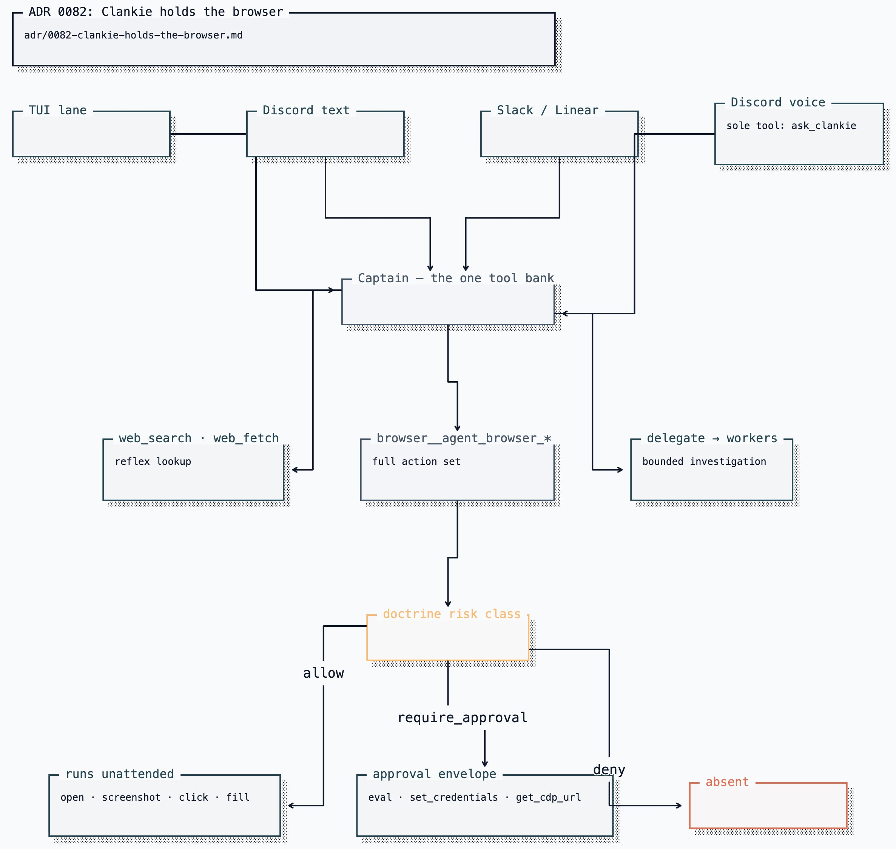

# ADR 0082: Clankie holds the browser

Status: accepted (James, 2026-08-08). Amends
ADR 0027, which rejected giving the
captain web reach. ADR 0027 remains authoritative for the MCP registry, the
risk-class vocabulary, and the worker projection; only the captain's own
capability changes here.

## Context

Clankie has one centralized tool bank in `apps/clankie/src/captain/tools.ts`.
Every captain lane uses it, and Discord voice reaches it through `ask_clankie`
([ADR 0057](0057-realtime-voice-with-captain-handoff.md)). Browser tools belong
in that bank so a lookup uses the same governed capability in every room.

ADR 0027 declined this on the grounds that "the tool-less captain is the
architecture's core safety property; execution belongs in governed workers."
That framing bundled two unlike things under one word. A captain with `bash`
and `write_file` can edit the doctrine it is judged against and the tests that
gate it — that is the property worth keeping. A captain that can read a web
page cannot. Web reach is swept along by a rule aimed at something else.

Workers remain coding agents scoped to worktrees and diffs. Clankie is the
general-purpose seat, so conversational browsing does not require a worker.

Options weighed:

1. Delegate a research worker per lookup. Rejected: the cost is wrong for
   conversation and the captain cannot answer directly.
2. Register a search MCP server for the captain only. Rejected as insufficient
   alone: it answers search but not the authenticated, JavaScript-heavy, or
   multi-step pages that a real lookup reaches.
3. Mount `agent-browser` as a framework MCP connection on the captain. Rejected
   twice over: `defineMcpClientConnection` requires a URL speaking Streamable
   HTTP or SSE and `agent-browser mcp` is stdio-only, and even bridged it
   would put process ownership in the captain and replace doctrine projection
   with a static allow/block filter.
4. Give the captain a service-owned `agent-browser` with its full action set.
   Accepted.

## Decision

**Browser reach joins the bank.** The service reads the live MCP catalog and
projects each declared `agent-browser` tool into the pi session. If the host is
unavailable, the captain receives one truthful `browser_unavailable` tool
instead of silently answering from memory.

**Browser access does not grant system tools.** [ADR 0095](0095-discord-system-actors.md)
limits pi's shell and filesystem tools to the operator and configured system
actors. Browser projection follows its own catalog and risk classes.

**`agent-browser` is Clankie's browser, not a worker's tool.** The Clankie
service hosts it as a stdio MCP server (`agent-browser mcp --tools all`) and the
captain reaches it through the same in-process capability bank. It
is registered in the operator-authored MCP registry with one risk class per
tool, so it is governed by the same doctrine vocabulary as every other
connector.

**The profile is his, and it persists.** A browser that forgets every session
turns each lookup behind a login into a password request, which is the
opposite of the capability being added. The profile therefore lives in the
service's private state root and is reused across runs
(`AGENT_BROWSER_RESTORE_SAVE=always`, the deliberate opposite of the Codex
projection's `never`). It is Clankie's own profile, never the operator's
browser. The accumulated credentials are precisely why
`agent_browser_set_credentials`, `agent_browser_eval`, and
`agent_browser_get_cdp_url` are approval-class: the profile gets more valuable to an attacker
over time, so the verbs that could exfiltrate it stay behind a human.

Unlike the Codex projection, the captain's browser carries **the full action
set**. The read-only policy that gates the Codex shell (`navigate`, `snapshot`,
`scroll`, `wait`, `read`, `get`) is a worker-shaped restriction; a
general-purpose seat that can read a page but never fill a form is not doing
the job asked of it.

**`require_approval` grants for the captain instead of withholding.**
`projectCaptainMcpToolGrants` differs from `projectMcpToolGrants` in exactly
one way, and it is the safety mechanism that makes the full action set
tractable. A worker cannot pause mid-tool for a human, so an approval-class
tool in a worker's set would either execute unapproved or deadlock — hence the
worker rule. The captain is the seat that _owns_ the approval envelope, so
withholding approval-class tools from it would mean no principal could ever
perform them. `deny` still denies, and an undeclared tool is still never
projected.

## Consequences

- Every lane gains lookup at conversational cost. A question asked in voice is
  answered on the same path as one asked in the TUI, which is what one
  character with one bank is always supposed to mean.
- **A full-action browser sits behind `ask_clankie`, so untrusted room text can
  reach it.** This is the real cost of the decision and it is accepted
  deliberately. Three things bound it: the browser runs on Clankie's own
  profile rather than the operator's, every credential- or script-bearing verb
  (`eval`, `set_credentials`, `get_cdp_url`) is approval-class and stops for a
  human, and
  the registry stays a closed list so an undeclared tool is never projected.
  Room speech still never carries approval authority
  ([ADR 0050](0050-voice-presence-authority-tier.md)). The persistent profile
  raises the stakes over time rather than lowering them, which is the reason
  the approval gate is enforced by the service on every call instead of
  by a step-scoped hook that a replayed turn could skip.
- Risk classes are assigned per tool against the names `agent-browser mcp
  --tools all` advertises (64 at v0.33.2), not against CLI command groups. The
  host drops anything the registry does not declare, so upgrades verify against
  a live `tools/list`.
- An overlay can deny any `mcp.agent_browser.*` action outright.
- Workers keep their own coding-oriented research paths.

## Current state

The service owns the stdio MCP host, projects the live browser catalog into pi,
applies the registry's risk classes, and routes calls through the approval gate.

The live agent-browser 0.33.2 and Chrome 151 check projects 64 tools,
14 approval-gated (every irreversible-write, publish-external, and destructive
class under `self-build-lab`), with `agent_browser_open` and
`agent_browser_get_title` returning a real page title. Reads and page
interaction — including `click`, `fill`, and `screenshot` — run unattended.

`CLANKIE_BROWSER_ENABLED` **defaults on**, and only an explicit falsey value
turns it off. Enabling is not granting — a compiled doctrine profile and a registry
are still both required, and a missing binary degrades to a logged
unavailability rather than a boot failure. Those two stay explicit on purpose:
the profile decides what he may actually call, so defaulting it would silently
choose a permissive lab profile on someone's behalf.

The free-play mind has no direct browser route. In a voice room, browser
questions reach the captain through `ask_clankie`; direct play-loop
interjections remain inside the loop.
