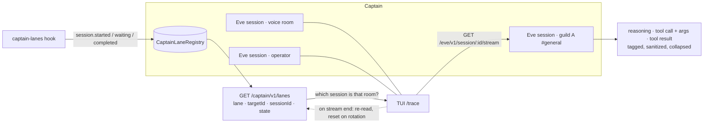

# ADR 0083: Every room he thinks in is watchable

Status: accepted (James, 2026-08-09). Extends
[ADR 0032](0032-conversation-scoped-operator-lanes.md), which made the
conversation the unit of captain identity, and completes the multi-lane gap
`clankie trace` documented but could not close.

## Context

Clankie answers in a lot of rooms. Each Discord server and channel he speaks in
is its own durable Eve session, and so are voice, gameplay, and every operator
conversation ([ADR 0032](0032-conversation-scoped-operator-lanes.md),
ADR 0023). The operator console renders his
reasoning, tool calls, tool arguments, and tool results in full — for exactly
one of those sessions: the one it is talking in.

For every other room the operator could see the outcome and nothing else. The
Discord bridge posts his reply; the presence stream reports which channel he is
in; the durable transcript projection records message and tool _names_ for
operator conversations only. What he was thinking when he answered a stranger in
someone else's server, which tool he reached for, and what came back were
visible on the machine but not from the seat that supervises him. That inverts
the standing rule that the head sees what the branches do, and it is the exact
case where seeing matters most: the rooms the operator is not in are the ones
he cannot otherwise check.

The missing piece was never the transport. `GET /eve/v1/session/:id/stream` is
public on loopback, replayable from any index, and already carries every event
the console renders. What was missing was the **map**: nothing published which
durable session belongs to which room, so a client had no way to name the stream
it wanted. `clankie trace` recorded this precisely — its `--lane` flag was a
label typed by the operator, not a resolution, and the TUI README stated that a
live multi-lane merge "would need a public session→lane listing API" first.

That map already exists and is authoritative. `CaptainLaneRegistry` is a durable
SQLite table inside captain-eve, reconciled on every session lifecycle event by
the `captain-lanes` hook: one row per `(characterId, lane, targetId)` holding the
bound session id, its state, and when it last moved. It was simply unreadable
from outside the captain process.

Options weighed:

1. Have the console read the lane registry's SQLite file directly. Rejected: it
   makes another app's private state a cross-process interface, and mode-0600
   state under a state root is not a contract.
2. Publish the trace through the mission event store instead. Rejected: reasoning
   and tool payloads are high-volume conversational data, and the event store is
   the deterministic authority for mission facts. Pushing one into the other
   would make every future trace consumer read a mission log.
3. Extend the durable operator-conversation projection to every lane. Rejected as
   insufficient: that projection deliberately drops tool arguments and results,
   which is most of what "look into what he did" means. It remains the right
   shape for durable scrollback, not for live inspection.
4. Publish an authenticated, identity-only lane listing and let the console
   subscribe to the public session stream itself. Accepted.

## Decision

**The session→lane map becomes a public read.** `GET /captain/v1/lanes` on the
captain's authenticated route surface returns, per room: the lane, the target id
(`guildId:channelId` for Discord), the durable session id when one is bound, its
state, and when it last changed. It is served from `CaptainLaneRegistry.list()`,
so it reports what actually ran, never what a model asserted.

**The listing is identity only.** No message, reasoning, tool, or continuation
field appears in `CaptainLaneListingSchema`, and the route reads
`CaptainLaneSnapshot`, which structurally cannot carry a continuation token —
that lives one layer down in `CaptainLaneResumeState`. The channel serving it
declares routes and nothing else: it never sends, receives, or resumes a turn.
Observing a lane therefore cannot become steering it.

**The console attaches with the client it already has.** `/trace` in the TUI
lists the rooms, matches an argument against a lane name, a room key, a target
id, or a substring, and starts a read-only tail per selected room. Each tail
renders through the same `EveFaceRenderer` the operator's own conversation uses,
so a Discord room's reasoning, tool call with arguments, and tool result land as
the same blocks, tagged with the room and collapsed the same way.

**Watching another room never touches the operator's turn.** A tagged renderer
does not drive the turn loader or the status bar, never labels an incoming turn
as "You", and passes tool arguments and results through
`sanitizeForSupportBundle` — another room's payloads are not the operator's to
leak into a transcript that gets pasted around.

**Rotation is the tail's problem, not the operator's.** A Discord text lane
starts a fresh Eve session per turn — only voice retains its cursor — so the
tail re-reads the listing whenever a stream ends, resets its stream index
and renderer when the session id changes, and keeps rendering one continuous
feed across turns.

## Consequences

- The supervising seat can finally inspect the rooms it is not in. `/trace`
  lists every room that has run a turn and tails any of them — several at once,
  each with its own renderer.
- **The listing hands an authenticated caller the session ids of rooms it is not
  talking in**, and `POST /eve/v1/session/:id` would accept a turn against one.
  Accepted deliberately: the credential involved is the captain token, which
  already authorizes talking to him, and injecting into a Discord lane's session
  delivers nothing to Discord — the bridge posts replies, not the session. The
  alternative considered was proxying the stream behind a hashed session
  reference so the id never leaves the captain; it was rejected as buying little
  against a token that is already trusted, at the cost of a second streaming
  path. If the captain token is ever widened beyond the local trusted plane,
  this is the decision to revisit first.
- The listing is a live map, not a history. It holds the current session per
  room, so attaching backfills the session in progress and follows forward; it
  cannot reconstruct a Discord text room's earlier turns, because each of those
  was a separate session the registry has already replaced. Durable multi-turn
  scrollback per room remains the operator-conversation projection's job.
- `clankie trace` keeps its typed `--lane` label and still follows the headless
  session. The listing is what a lane-resolving `--target` would be built on;
  that flag is not added here.
- Watching is a subscription, so a watched room's cost is one more reader of an
  already-replayable stream. Nothing about the watched turn changes: no
  steering, no admission, no continuation token, no write.

## Status of the work

Landed: the `CaptainLaneListingSchema` contract in `@clankie/protocol`; the
routes-only `captain-lanes` channel serving `GET /captain/v1/lanes`; the
console's lane client, rotation-aware tail, and `/trace` command; and the tagged,
sanitized, loader-safe renderer mode.

Unit-proven: listing shape, bounding, and the absence of identity and token
fields; lane selection by name, room, and substring; and the tail's index
resume, rotation reset, empty-room wait, and listing-failure recovery. The route
itself needs a captain restart to load the new channel before it answers live.
