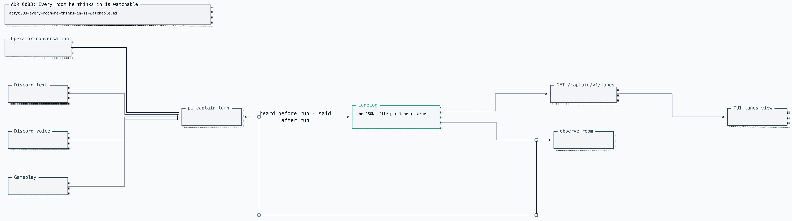

# ADR 0083: Every room he thinks in is watchable

Status: accepted (James, 2026-08-09). Applies to pi lane logs. Amended by
[ADR 0107](0107-a-one-shot-turn-still-leaves-a-trail.md), which keeps the tree a
one-shot turn writes so its tool calls survive the turn.

## Context

Clankie speaks in operator conversations, Discord text channels, Discord voice
rooms, and gameplay. The supervising seat needs a bounded, truthful view of the
other rooms without reaching into pi's private session files.

## Decision

`LaneLog` writes one append-only JSONL file per `(lane, targetId)` under the
captain state directory. Each entry is one bounded `heard` or `said` record.
Both the TUI lane view and Clankie's `observe_room` tool read that same log, so
there is one canonical room history rather than a second session-stream
projection.

`GET /captain/v1/lanes` is captain-authenticated and returns the bounded lane
observations the captain port exposes. The route does not expose pi JSONL trees,
continuation handles, provider credentials, or a write path.

## Consequences

- The operator can inspect every room from one seat.
- Discord text stays one-shot at the model layer, but its lane log still has a
  durable past. The lane log is the bounded room view; the per-turn tree beside
  it is the full record of what he ran there.
- Room observation is a bounded read of what is heard and said, not a dump of
  private model reasoning.
- Rotation and replay belong to the append-only lane log, not to framework
  session ids.
