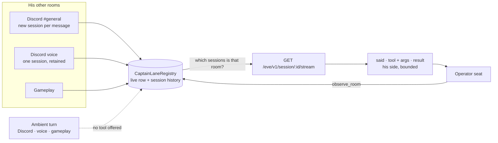

# ADR 0084: The head can read his branches

Status: accepted (James, 2026-08-09). Extends
[ADR 0083](0083-every-room-he-thinks-in-is-watchable.md), which made every room
watchable **by the console**, and closes the same gap for Clankie himself.

## Context

Asked in the operator console whether he had used his browser over in Discord,
Clankie answered:

> Oh—in Discord, I can't see that room's transcript from here, so I can't
> confirm what I used there.

He was reporting his instructions accurately. Three layers said the same thing,
and all three were load-bearing:

1. **No mechanism.** Nothing let a captain turn read another lane's session.
   ADR 0083 had just given the _console_ a render-only tail of any room, but
   that reach belonged to the TUI process, not to the model sitting in it.
2. **The lane instructions forbade it.** `captainLaneInstructions` told every
   lane, operator included, to "never infer, request, copy, or reuse another
   lane's token **or transcript**", and that the fence covered other rooms'
   contents.
3. **The presence card asserted it was impossible.** "Where you are" ended with
   "you still have no access to another room's transcript" — in the one seat
   where that had stopped being the desired answer.

What already flowed up-chain was the _summary_ layer: `remember_episode` notes
recalled into every lane as "Recently, elsewhere" ([ADR 0054]), and presence —
which rooms he is in — on the standing card ([ADR 0032], VUH-938/939/940).
Neither answers "which tool did you reach for over there", because an episode is
a sentence he chose to write and presence is an address, not an act.

A fourth thing was quietly broken underneath. `CaptainLaneRegistry.bindSession`
refused to let a room adopt a new session while its current one was anything but
`completed`/`failed`. A Discord **text** room mints a fresh Eve session per
message and parks on `waiting` between them ([ADR 0083]), so its second message
threw `CaptainLaneSessionConflictError` inside the reconcile hook and the room
stayed pinned to its first session forever. Anything reading that room — the
registry, `GET /captain/v1/lanes`, `/trace` — was pointed at a session that had
already been replaced.

Options weighed:

1. Lean on episodes: prompt him to note every notable tool call, and widen
   recall. Rejected: lossy by construction (it records what he chose to write,
   after the fact), and it answers a question about what happened with a
   memory rather than a reading.
2. Project a durable per-lane transcript, the way operator conversations are
   projected today. Rejected: it duplicates content Eve already stores durably
   and replayably, and buys a retention policy, a redaction-at-write path, and
   a write on every event of every turn.
3. Read Eve's own durable session streams, and keep the room→session map that
   names which streams belong to which room. Accepted.

## Decision

**A room's session history becomes durable.** `CaptainLaneRegistry` keeps a
bounded per-room list of the Eve sessions it has run
(`CAPTAIN_LANE_SESSION_HISTORY_MAX = 64`), so a room that rotates its session
every message has a readable past instead of only a latest turn. The rotation
that was throwing is now allowed: only a room with a genuinely **active** turn
refuses to be displaced, and cross-room adoption stays fail-closed — a session
that has rotated out of the live binding still belongs to the room that ran it,
enforced against the history as well as the live row.

**The history is identity only.** `CaptainLaneSessionRecord` carries a session
id and timestamps and has no continuation-token field; historical sessions never
store one, and a rotated session no longer inherits the previous session's
token — that handle resumes the conversation that issued it, and the new session
is not it. Reading a room therefore cannot become resuming it.

**`observe_room` is the read.** It lists his rooms and, given one, replays its
sessions newest-first off the public loopback `/eve/v1/session/:id/stream` and
renders **both sides of that room**: what people said to him (`heard`), what he
said back (`said`), which tools he called with what arguments, and what came
back. Reasoning is deliberately not carried — that is his deliberation, not
something he did in that room.

The first cut of this rendered his own side only, and it answered the wrong
question. Asked in the console what was going on in Discord text, he could read
his own replies and still had to say he did not know what people were saying
there — which is the same continuity break this ADR exists to close, moved one
step along. What a room said to him is what he heard; a conversation with one
side missing is not a conversation. The inbound event was already in the stream
(`message.received`) and simply was not rendered.

**Reach runs down-chain, never sideways.** The tool is resolved per session and
is offered **in the operator lane only**. The supervising seat reads every room;
an ambient Discord, voice, or gameplay turn — where the conversation is
untrusted and anyone present can ask him anything — keeps the original fence and
sees none of the others. The gate is the trusted channel context read at
`session.started`, never a tool argument: a tool executor receives the AI SDK's
options rather than the eve session context, so it cannot check its own lane,
and an argument could be prompt-injected.

**Both doctrine layers now say what the seat can actually reach.**
`captainLaneInstructions` keeps the transcript fence verbatim for ambient lanes
and replaces it in the operator lane with an instruction to look before
answering. The presence card takes an explicit `reach`, and **omits the sentence
entirely** when the caller cannot resolve its own lane — which `get_self_state`
cannot, so it now asserts neither answer instead of contradicting the standing
card.

## Consequences

- The console seat can answer "did you use your browser in Discord?" by looking,
  and is told to look rather than to decline.
- **A Discord text room has a past again.** The rotation fix is what makes the
  session history non-trivial, and it also repairs `GET /captain/v1/lanes` and
  `/trace`, which were following a stale session for those rooms.
- **The asymmetry is deliberate and is the security boundary.** An operator
  conversation is authenticated; a Discord channel is not. Letting an ambient
  room read the others would let anyone who can type at him pull the operator
  transcript, which is exactly what the fence was for. If a future surface needs
  cross-room reach from an untrusted lane, this is the decision to revisit.
- The reading is bounded by wall clock as well as by size: 4s per session, 10s
  per look, and a race rather than a bare abort, because "read what you did over
  there" must never be able to stall the turn that asked. A short read says so
  in its note instead of passing a partial past off as the whole one.
- It is a live read of durable state, not an archive. A session Eve has aged out
  of its run store is gone, and the history holds the newest 64 sessions per
  room — a busy channel's older turns fall off, and a quiet room cannot be aged
  out by a loud one.
- Nothing about a watched room changes: no send, no steering, no continuation
  token, no write.

## Status of the work

Landed: the durable per-room session history and the rotation fix in
`CaptainLaneRegistry`; the room directory, selector, and bounded reader in
`apps/captain-eve/lib/lanes/rooms.ts`; the lane-gated `observe_room` tool; and
the reach-aware lane instructions and presence card.

Unit-proven: session history across a rotating lane, the still-refused active
displacement, cross-room adoption of a rotated-out session, and that a rotation
drops the old continuation token; room selection by key, target, lane, and
fragment; the reader's newest-first order, boundary stop, entry cap, exclusion
of reasoning, and its hard time bound against a stream that ignores its abort;
and that the operator seat is told it can read while every ambient lane keeps
the fence.

The tool is resolved at session start, so the captain must be restarted before
the seat has it.
