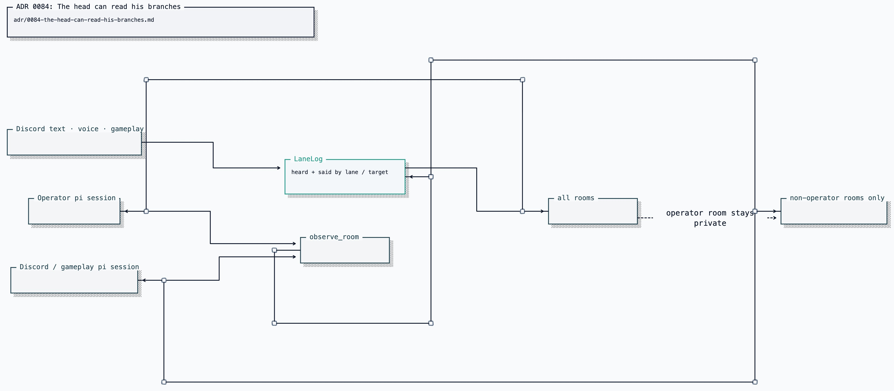

# ADR 0084: The head can read his branches

Status: accepted (James, 2026-08-09). Applies to pi lane logs.

## Context

Presence says which rooms Clankie occupies, but it cannot answer what somebody
said there or what he said back. The answer must come from a room record, not a
model-authored memory or another framework's private session stream.

## Decision

`observe_room` reads `LaneLog`, the same bounded append-only room history used by
the TUI lanes view. With no arguments it lists rooms; with `(lane, targetId)` it
returns recent `heard` and `said` entries.

The tool is available to every captain lane, but visibility is asymmetric. An
operator turn may read every room. A Discord, voice, or gameplay turn may read
non-operator rooms and can never list or read the operator lane. The gate comes
from the current lane captured by the host, not from a model-controlled
argument.

## Consequences

- Clankie can look before answering questions about another room.
- Ambient users cannot pull the operator transcript through him.
- A read never sends, steers, resumes, or changes the observed room.
- The record is intentionally only what is heard and said; private reasoning
  and raw pi session state remain outside the room log.
