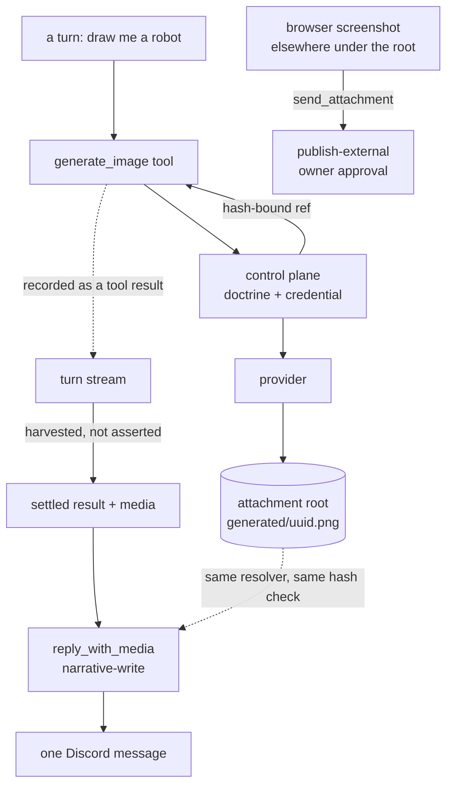

# ADR 0085: A picture he made is something he said

Status: accepted (James, 2026-08-09). Increments
[ADR 0029](0029-media-generation-connector.md), which froze the media boundary at
images and named the conditions for extending it, and carves one narrow lane
through the `publish-external` gate that
[ADR 0024](0024-discord-dual-plane-presence.md) put in front of attachments.

The attachable-media boundary here is widened by [ADR 0088](0088-a-screenshot-is-something-he-showed-you.md): browser
screenshots ride a reply on the same provenance argument. Everything else
under the attachment root keeps `send_attachment` and its approval.

## Context

`@clankie/media-connector` has existed since ADR 0029 with adapters for three
image providers, a doctrine action, artifact hashing, and a pixel-art carve-out.
Nothing called it. `/image-model` existed in the TUI as autocomplete strings with
no command behind them. Clankie could not make a picture, and ADR 0029's own
consequences section said so: "TUI execution wiring requires an authority-owning
service call site; autocomplete scaffolding alone is not such a boundary."

Two things had to be decided to close that.

**Where generation runs.** The captain process has neither compiled doctrine nor
the credential store; both live in the control plane, which already mediates the
browser this way ([ADR 0082](0082-clankie-holds-the-browser.md)). A captain-side
adapter would have meant shipping provider keys into the process that runs model
output, for no gain.

**Whether showing a picture needs an approval.** This is the harder one.
`discord.presence.send_attachment` is `publish-external` and mints an approval
request per attachment, which is right for what it was built for: an arbitrary
artifact from the runner's disk, including browser screenshots of pages nobody
else should see. But a picture he drew because somebody in a channel asked him to
draw it is not that. It is a reply. Gating it behind an owner approval would mean
every drawing in a conversation stops dead until James answers a prompt, which
makes the feature useless in exactly the setting it exists for.

Refusing to distinguish the two cases would have meant choosing between a
capability nobody can use conversationally and a hole big enough to post any file
under the attachment root on a prompt-injected turn.

## Decision

**Generation lives in the control plane.** `ConfiguredMediaGenerator` projects
`media.generate.image` or `media.generate.video` through compiled doctrine,
resolves the credential from the broker (falling back to the provider's declared
environment variables, the same two connections `/auth` reports), calls the
connector, and returns a hash-bound reference. Provider and model come from
operator config — `/image-model`, `/video-model`, new `image_model` and
`video_model` refs beside the existing model roles — never from the request. A
turn chooses what to draw; the operator chooses what it costs.

**Refusals are sentences, not exceptions.** No model configured, no credential,
doctrine denied, provider failed, artifact too large: each comes back `200` with
a reason he can say out loud. He has to tell whoever asked something, and an
exception is not something he can relay.

**A picture is conversational when he made it this turn.** The distinction is
carried by a filesystem fact rather than a judgement:

- the generator's only write target is `generated/` beneath the attachment root;
- **no tool the captain holds can write there** — `write_file`, `glob` and `grep`
  are `disableTool()`, and any shell he is given must be sandboxed to a writable
  root disjoint from the attachment root;
- therefore a reference under `generated/` is provably something the control
  plane made on his behalf, and nothing else can be.

State the second point as a property, not as an inventory. Written as "he has no
filesystem tool at all" it was true when this was drafted and stopped being true
within the hour, in a parallel change that had no reason to look at media code.
Written as "nothing he holds can write _there_", it survives a shell — provided
whoever grants one keeps the writable root out of the attachment root.

`discord.presence.reply_with_media` is a new presence action classified
`narrative-write`, whose payload schema admits only such a reference. It is a
distinct action rather than an optional field on `reply` so the frozen risk-class
table states the truth about what may carry bytes into a channel. Everything else
— browser screenshots, repository files, anything under the root but outside
`generated/` — keeps `send_attachment`, `publish-external`, and its approval.

**The attachment is harvested, never asserted.** `EveCaptainChannelTurnPort`
reads the turn's own `action.result` events for a successful `generate_image` or
`generate_video` call and puts that reference on the settled result. He is never
asked which file to attach and never sees a reason to paste a `sha256:…` string
into a channel. The last successful generation wins: asked for three tries, the
one he settled on is the one that posts.

**Video is a job, and schema version 2 says so.** ADR 0029 made `kind` an enum so
video could arrive as an increment with "its own validated request semantics and
doctrine action". It has both: `durationSeconds` and `resolution` are fields an
image request has no use for, `media.generate.video` is separately deniable, and
xAI's renderer is asynchronous — submit, poll, download from a provider-hosted
URL. The route waits a bounded 90 seconds and then returns `pending` with the
request id; calling again with that id resumes the same render rather than paying
for a second one. The download checks the host against the provider's own domain,
refuses redirects, and bounds the bytes, because a URL this process fetches is an
SSRF question regardless of who supplied it.

## Consequences

- Clankie can draw, edit what he drew, and render short clips, in every lane at
  once: the tools are authored agent-global, so operator conversations, each
  Discord channel, voice, and gameplay get them without per-surface wiring.
- A drawing lands in a Discord channel as one message with no approval prompt.
  The blast radius of that decision is exactly the `generated/` directory, and it
  stays that size only while nothing he holds can write there. **Any change that
  gives him a write path into the attachment root silently widens this boundary**
  — enabling `write_file`, adding a writable root to the shell sandbox, or
  relocating either root must scope the write away from `generated/` or move
  `reply_with_media` back behind an approval. Neither change would fail a media
  test, which is why it is stated here rather than left to be noticed.
- Generating remains read-class and independently auditable from posting, as ADR
  0029 required. What changed is that one _specific_ publication became
  narrative, not that generation became publication.
- A surface that cannot show media ignores the `media` field rather than
  behaving differently, so adding one later needs no change to how he works.
- The connector's schema version 1 no longer parses. It had no callers, so
  nothing migrated; the tests that asserted v1's frozen "images only" boundary
  now assert v2's, which is the increment ADR 0029 anticipated rather than a
  weakened assertion.
- Video defaults are unset, so an operator who configures `video_model` gets the
  provider's defaults until they pass `durationSeconds`. A 1080p 15-second render
  can exceed Discord's upload ceiling; that surfaces as an `artifact_too_large`
  refusal he relays, not a failed turn.
- Neither action is listed in `self-build-lab.yaml`. They are read-class, that
  profile allows the read class by default, and adding redundant entries would
  churn a doctrine hash the evaluation suite pins for no behavioural gain. An
  operator who wants video denied adds the entry then, which is what
  `high-assurance-overlay.yaml` does — that profile denies both, alongside the
  web actions, because a profile refusing to reach outward at all should not
  spend a provider's tokens on a picture either.
