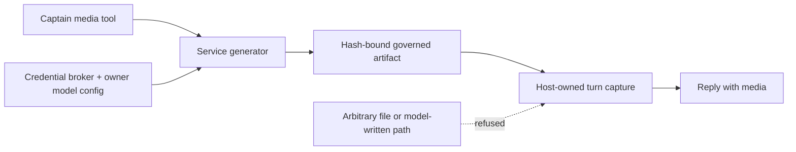

# ADR 0085: A picture he makes is something he says

Status: accepted (James, 2026-08-09). Widened by
[ADR 0088](0088-a-screenshot-is-something-he-shows-you.md) and extended for
long renders by
[ADR 0094](0094-a-render-that-outlives-the-turn-comes-back-to-the-room.md).
Doctrine profiles and approval envelopes mentioned in the original rationale
were later removed; the provenance-based conversational publication boundary
remains.

## Context

`@clankie/media-connector` provides provider-neutral image/video generation,
artifact hashing, and the pixel-art carve-out. The service, not the captain,
owns provider credentials and operator-selected models.

At ratification arbitrary `send_attachment` publication required an approval,
while a generated picture requested in conversation needed to behave like the
reply itself. Treating both paths identically either stopped every drawing for
ceremony or let arbitrary files masquerade as generated output. The approval
system is historical; the structural provenance distinction is still the
decision.

## Decision

Generation lives in the Clankie service. The owner chooses provider/model
configuration; a turn chooses the prompt. The generator resolves credentials
from the broker and returns a hash-bound artifact reference. Missing config,
credential failure, provider failure, or artifact bounds become a typed reason
Clankie can relay rather than an opaque failed turn.

A picture is conversational only when a governed tool captures it in the same
turn:

- the generator writes only beneath its governed artifact root;
- a successful media tool result writes the hash-bound reference into a
  host-owned turn capture;
- model text and arbitrary filesystem paths cannot set the capture; and
- a Discord reply attaches only a validated captured reference.

The attachment is captured, never asserted. The last successful generation in
a turn wins, so the model cannot attach a path by describing it.

Video remains a resumable asynchronous job. A bounded wait may return a request
id; a later call resumes that render rather than purchasing a duplicate. Remote
downloads are host-checked, redirect-refused, and byte-bounded because any URL
fetched by the service is an SSRF boundary.

## Alternatives considered

- **Let the captain call providers directly** was rejected because it would put
  credentials and vendor response types in the agent runtime.
- **Allow any artifact under the attachment root** was rejected because prompt
  injection could turn unrelated private files into conversational media.
- **Require a separate publication ceremony for every generated reply** was
  rejected because it breaks the intended conversational surface.

## Consequences

- Generated pictures and short clips can ride the same settled reply that
  requested them.
- The blast radius is limited to a validated artifact captured from a successful
  governed tool result in that turn.
- Generation and publication remain separate auditable events even though this
  publication path is conversational.
- Surfaces that cannot display media may ignore the captured field without
  changing generation behavior.
- Current providers, model commands, artifact limits, and pending-render
  operation belong in the
  [TUI operating guide](../../apps/tui/README.md) and
  [media connector README](../../packages/media-connector/README.md).
