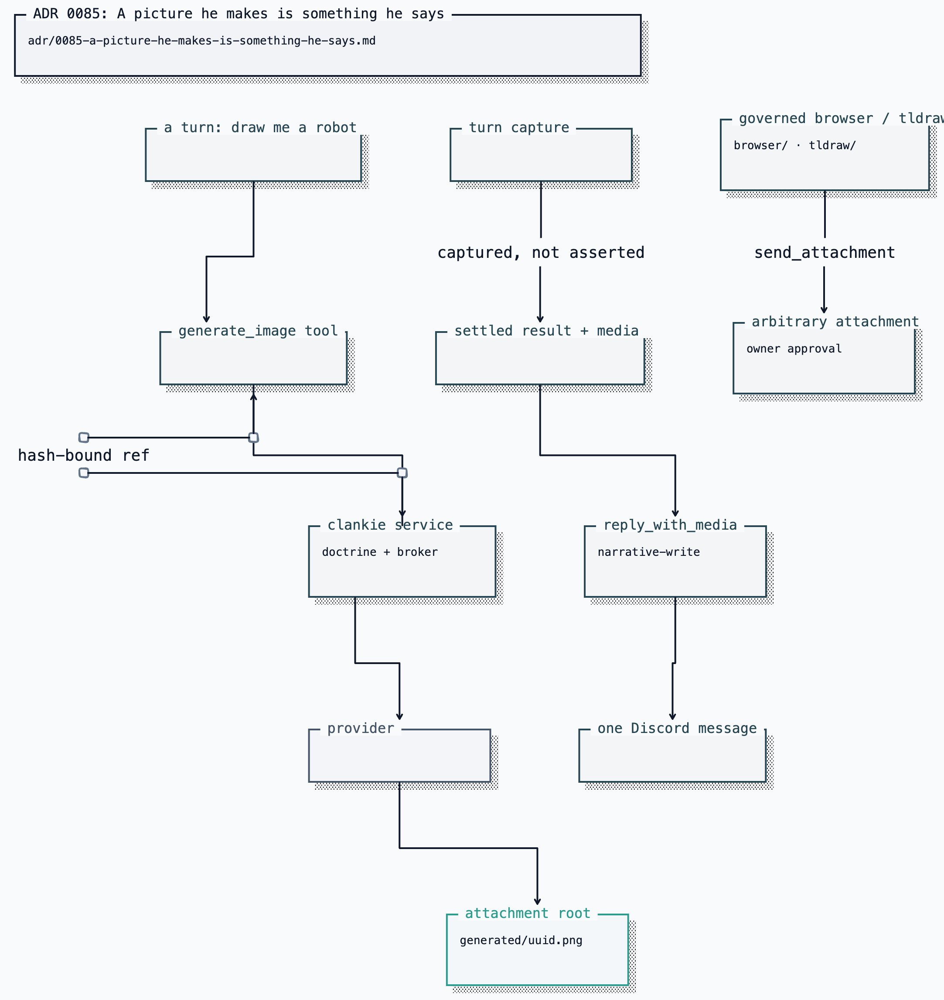

# ADR 0085: A picture he makes is something he says

Status: accepted (James, 2026-08-09). Defines conversational publication for
[ADR 0029](0029-media-generation-connector.md) media under the attachment
authority in [ADR 0024](0024-discord-dual-plane-presence.md).

The attachable-media boundary here is widened by [ADR 0088](0088-a-screenshot-is-something-he-shows-you.md): browser
screenshots ride a reply on the same provenance argument. Anything not captured
by a governed tool keeps `send_attachment` and its approval.

## Context

`@clankie/media-connector` provides adapters for image and video providers,
doctrine actions, artifact hashing, and the pixel-art carve-out. `/image-model`
and `/video-model` configure the service-side generator. Two boundaries govern
the capability.

**Where generation runs.** The captain has neither compiled doctrine nor direct
credential access; the service capability owns both and also mediates the
browser this way ([ADR 0082](0082-clankie-holds-the-browser.md)). A captain-side
adapter would ship provider keys into the agent runtime for no gain.

**Whether showing a picture needs an approval.** This is the harder one.
`discord.presence.send_attachment` is `publish-external` and mints an approval
request per attachment, which is right for what it is built for: an arbitrary
artifact from service state, including browser screenshots of pages nobody
else should see. But a picture he draws because somebody in a channel asks him to
draw it is not that. It is a reply. Gating it behind an owner approval means
every drawing in a conversation stops dead until James answers a prompt, which
makes the feature useless in exactly the setting it exists for.

Refusing to distinguish the two cases forces a choice between a
capability nobody can use conversationally and a hole big enough to post any file
under the attachment root on a prompt-injected turn.

## Decision

**Generation lives in the Clankie service.** `ConfiguredMediaGenerator` projects
`media.generate.image` or `media.generate.video` through compiled doctrine,
resolves the credential from the broker (a SuperGrok OAuth on `xai` first, then
an API key, then the provider's declared environment variables — the same
connections `/auth` reports), calls the
connector, and returns a hash-bound reference. Provider and model come from
operator config — `/image-model`, `/video-model`, new `image_model` and
`video_model` refs beside the existing model roles — never from the request. A
turn chooses what to draw; the operator chooses what it costs.

**Refusals are sentences, not exceptions.** No model configured, no credential,
doctrine denied, provider failed, artifact too large: each comes back `200` with
a reason he can say out loud. He has to tell whoever asked something, and an
exception is not something he can relay.

**A picture is conversational when a governed tool captures it this turn.** The
distinction is structural:

- the generator's only write target is `generated/` beneath the attachment root;
- a successful `generate_image` or `generate_video` tool call writes the
  hash-bound reference directly into the host-owned turn capture;
- model text and arbitrary filesystem paths cannot set that capture; and
- the bridge attaches only the validated media field on the settled turn.

`discord.presence.reply_with_media` is a presence action classified
`narrative-write`, whose payload schema admits only such a reference. It is a
distinct action rather than an optional field on `reply` so the frozen risk-class
table states the truth about what may carry bytes into a channel. Repository
files and arbitrary artifact refs keep `send_attachment`, `publish-external`,
and its approval.

**The attachment is captured, never asserted.** The captain turn capture records
a successful `generate_image` or `generate_video` result and puts that reference
on the settled result. He is never
asked which file to attach and never sees a reason to paste a `sha256:…` string
into a channel. The last successful generation wins: asked for three tries, the
one he settled on is the one that posts.

**Video is a job, and schema version 2 says so.** `durationSeconds` and
`resolution` are fields an
image request has no use for, `media.generate.video` is separately deniable, and
xAI's renderer is asynchronous — submit, poll, download from a provider-hosted
URL. The route waits a bounded 90 seconds and then returns `pending` with the
request id; calling again with that id resumes the same render rather than paying
for a second one. The download checks the host against the provider's own domain,
refuses redirects, and bounds the bytes, because a URL this process fetches is an
SSRF question regardless of who supplied it.

## Consequences

- Clankie can draw, edit what he draws, and render short clips, in every lane at
  once: the tools are authored agent-global, so operator conversations, each
  Discord channel, voice, and gameplay get them without per-surface wiring.
- A drawing lands in a Discord channel as one message with no approval prompt.
  The blast radius is limited to a validated artifact captured by a successful
  governed media tool in that same turn.
- Generating remains read-class and independently auditable from posting, as ADR
  0029 requires. One _specific_ publication path is narrative; generation in
  general is not publication.
- A surface that cannot show media ignores the `media` field rather than
  behaving differently, so adding one later needs no change to how he works.
- The connector accepts only schema version 2. No version-1 callers or migration
  path exist; tests pin version 2's media boundary.
- Video defaults are unset, so an operator who configures `video_model` gets the
  provider's defaults until they pass `durationSeconds`. A 1080p 15-second render
  can exceed Discord's upload ceiling; that surfaces as an `artifact_too_large`
  refusal he relays, not a failed turn.
- Neither action is listed in `self-build-lab.yaml`. They are read-class, that
  profile allows the read class by default, and adding redundant entries would
  churn a doctrine hash the evaluation suite pins for no behavioural gain. An
  operator who wants video denied adds the entry then, which is what
  `high-assurance-overlay.yaml` does — that profile denies both, alongside the
  web actions, because a profile refusing to reach outward at all should not
  spend a provider's tokens on a picture either.
