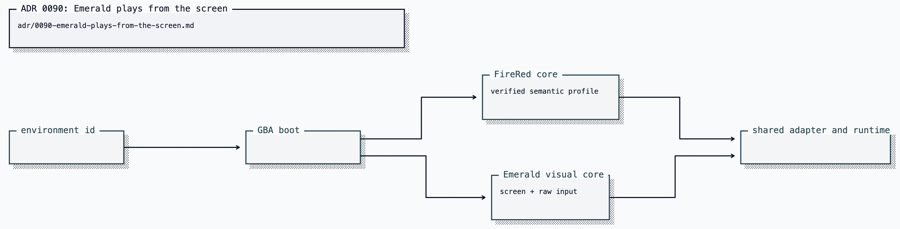

# ADR 0090: Emerald plays from the screen

Status: accepted (James, 2026-08-11). Extends
[ADR 0040](0040-real-mgba-core-behind-the-emulator-seam.md) without widening
the FireRed RAM profile in
[ADR 0043](0043-version-pinned-firered-gameplay-profile.md).

## Current status (2026-08-26)

Local asked-play Emerald still boots through `MgbaVisualCore` and plays from
the screen: that body has no Emerald RAM profile. Hosted Emerald is a different
body. PokeAgents VUH-987 publishes Emerald adapter version 2 as a verified
payload — overworld map, position, and facing; party slots with species, level,
HP, and moves; field readiness; dialog lines; and nullable map size.
`HostedWorldBody` selects the state schema by the observation's
`(gameId, adapterVersion)` pair: `firered@2` and `emerald@2` map into the
existing `GbaDriverIo` seam; every unknown pair fails closed. FireRed-only
NPCs, map connections, and decoded menu entries stay optional and are never
invented for Emerald. Detailed menu, battle, and inventory observations still
refuse when their verified payload is absent.

## Context

The asked-play path serves Pokémon FireRed through a pinned mGBA body and a
FireRed-specific decoder. Adding Pokémon Emerald has two independent parts:
running the cartridge and interpreting its RAM. The first reuses the existing
emulator, framebuffer, bounded input, checkpoint, activity, and evidence paths.
The second requires a separately verified Emerald address profile; applying
FireRed offsets would produce plausible but false position, party, menu, and
battle state.

Emerald also has an RTC. A power-on run can render the same title frame while
serializing different clock-dependent state, so runtime-generated boot states
are not stable identity anchors.

## Decision

`pokemon-emerald` boots the verified BPEE rev-0 ROM and a digest-pinned title
savestate from the operator-local GBA directory. ROM and savestate bytes never
enter the repository. The runner advertises both Pokémon environments and
passes the selected environment id into the shared GBA boot path.

The local body, `MgbaVisualCore`, exposes real framebuffer observation, bounded
raw buttons, frame advance, RAM/framebuffer digests, and checkpoints. It
reports scene mode `unknown`. That adapter therefore refuses decoded
observations and composite actions (`walk_to`, dialog, naming, and menu
selection) with `semantic_state_unavailable`; raw buttons and frame advance
remain available.

The hosted body does not reuse that visual-only profile. It consumes the
adapter state the world already verified, selecting `firered@2` or `emerald@2`
and mapping the shared decoded fields through the same `GbaDriverIo` kinds.
Party identities carry the real game id (`emerald-species-<id>`), and dialog
speaker and semantic-refusal text are game-aware. Game-specific extras the
selected schema does not verify stay fail-closed.

## Options weighed

- **Interpret Emerald through FireRed offsets** — rejected because wrong state
  is more dangerous than absent state.
- **Wait for a complete Emerald decoder** — rejected because visual play is a
  real, bounded capability already supported by the existing body.
- **Generate a title savestate at every boot** — rejected because Emerald's RTC
  makes the serialized identity clock-dependent.

## Consequences

- Clankie can start, watch, control, checkpoint, resume, and stop local Emerald
  through the same asked-play lifecycle as FireRed, reading the screen when the
  local body has no decode.
- Hosted Emerald play reads verified VUH-987 position, party, dialog, and map
  size through `GbaDriverIo`. Composite menu, battle, and inventory views stay
  refused until those payloads exist; FireRed extras are not inferred.
- CI remains ROM-free. A ROM-gated local test boots the operator-local pinned
  state, verifies the title framebuffer exists, and proves a raw button
  changes it. Hosted Emerald semantic mapping is proven against a fake world
  that speaks the verified adapter-v2 shape.
