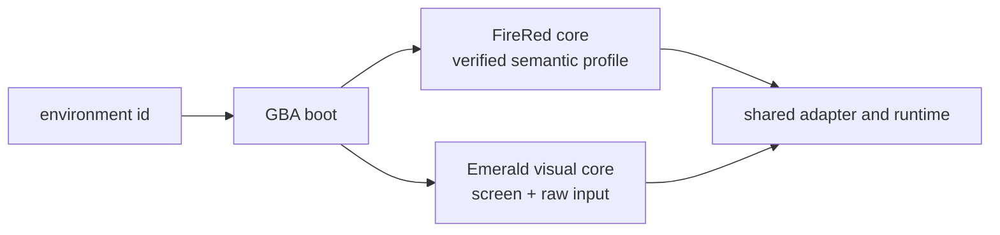

# ADR 0090: Emerald plays from the screen

Status: accepted (James, 2026-08-11). Extends
[ADR 0040](0040-real-mgba-core-behind-the-emulator-seam.md) without widening
the FireRed RAM profile in
[ADR 0043](0043-version-pinned-firered-gameplay-profile.md).

## Context

The asked-play path serves Pokémon FireRed through a pinned mGBA body and a
FireRed-specific decoder. Adding Pokémon Emerald has two independent parts:
running the cartridge and interpreting its RAM. The first reuses the existing
emulator, framebuffer, bounded input, checkpoint, activity, and evidence paths.
The second requires a separately verified Emerald address profile; applying
FireRed offsets would produce plausible but false position, party, menu, and
battle state.

Emerald also has an RTC. A power-on run can render the same title frame while
serializing different clock-dependent state, so runtime-generated boot states
are not stable identity anchors.

## Decision

`pokemon-emerald` boots the verified BPEE rev-0 ROM and a digest-pinned title
savestate from the operator-local GBA directory. ROM and savestate bytes never
enter the repository. The runner advertises both Pokémon environments and
passes the selected environment id into the shared GBA boot path.

`MgbaVisualCore` exposes real framebuffer observation, bounded raw buttons,
frame advance, RAM/framebuffer digests, and checkpoints. It reports scene mode
`unknown`. The adapter therefore refuses decoded observations and composite
actions (`walk_to`, dialog, naming, and menu selection) with
`semantic_state_unavailable`; raw buttons and frame advance remain available.

## Options weighed

- **Interpret Emerald through FireRed offsets** — rejected because wrong state
  is more dangerous than absent state.
- **Wait for a complete Emerald decoder** — rejected because visual play is a
  real, bounded capability already supported by the existing body.
- **Generate a title savestate at every boot** — rejected because Emerald's RTC
  makes the serialized identity clock-dependent.

## Consequences

- Clankie can start, watch, control, checkpoint, resume, and stop Emerald
  through the same asked-play lifecycle as FireRed.
- Emerald play initially spends more decisions on raw navigation and reads text
  from the framebuffer. Composite actions become available only as verified
  Emerald decoders land.
- CI remains ROM-free. A ROM-gated test boots the operator-local pinned state,
  verifies the title framebuffer exists, and proves a raw button changes it.
