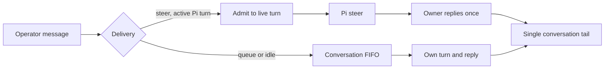

# ADR 0091: A mid-turn message steers the turn

Status: accepted (2026-08-15). Defines interruption semantics for durable
Discord lanes.

## Operator input delivery

Operator conversation sends accept an optional `delivery: "steer" | "queue"`.
For Clankie's Pi conversations, `steer` admits the message alongside the active
human or autonomous invocation; `queue` waits on the conversation FIFO for its
own turn. Both start a turn when idle. A queued continuation alone does not
open a live lane. Omitting delivery preserves automatic admission: human input
steers an active autonomous invocation, and other pairs wait on the FIFO
([ADR 0130](0130-goals-and-self-wakes-share-the-operator-thread.md)). Channel
rounds and external seats retain their own delivery behavior.

`clankie send --conversation ID --delivery steer|queue (MESSAGE | --stdin)`
submits through this API and returns an admission receipt.

Steering reuses Pi's live-input mechanism. Queuing uses the conversation FIFO
instead of Pi's `followUp`, so each queued prompt owns a separate run receipt,
reply, and cancellation target. In-flight tools finish before a steer takes
effect. The owning run writes one `captain.turn.settled` metrics line; an
absorbed steer does not write a second.

## Context

The durable Discord voice lane is one pi session per channel. A second utterance
during an active turn enters that turn instead of failing or waiting behind
strict queue semantics. The second speaker reaches the thought in progress and
the room receives one merged reply.

In a live voice room, words arriving mid-reply are the normal case, not an
edge case. The conversationally right behavior is interruption: fold the new
words into the thought in progress and answer once. pi already ships the
mechanism — `prompt()` with `streamingBehavior: "steer"` queues the message
into the live run, the agent loop delivers it at the next turn boundary and
drains the queue before settling, and the original `prompt()` promise
resolves only after the merged run finishes. (Design cribbed from opencode's
v2 steer/queue input admission, minus the durable inbox: pi's in-process
queue is the admission.)

Two captain-side gaps remain around pi's mechanism. First, exactly one HTTP
caller may carry the reply — voice ingress speaks every `settled` response,
so two would double-speak. Second, pi flips `isStreaming` only after
`prompt()` gets past its own awaits, leaving a window where two callers could
both believe the lane is idle and start racing runs.

## Decision

`runDurableTurn` in `captain.ts` dispatches every durable-lane turn:

- An idle lane starts the run and that caller carries the final reply. The
  lane records the run's settlement promise while it is in flight.
- A lane already streaming gets the message steered into the live run, and
  the caller reports `absorbed` once the merged run settles. An absorbed turn
  returns `state: "silent"` — voice ingress already speaks nothing for
  silent, so the run owner's merged reply answers everything heard, exactly
  once, with no protocol change.
- The idle check and the `prompt()` call share one synchronous stretch (with
  template expansion off, pi reaches its own streaming check without
  awaiting), so the state observed is the state pi acts on. The window where
  a run is accepted but not yet streaming is covered by the recorded
  settlement promise: an arrival there waits it out and re-decides.
- A steered turn whose run fails reports failed, not silent: the words are
  never actually heard.

Only the run owner resets the turn's media capture; a steerer never clobbers a
live run's captured media. The lane log stays honest under merging: two
`heard` entries, one `said`.

## Consequences

- One spoken reply covers everything heard during the run, at the model's
  next turn boundary instead of after full settlement — interruption, not a
  ticket queue.
- The reply rides the first caller's HTTP response; later callers get
  `silent`. Nothing downstream distinguishes "chose silence" from "absorbed",
  which is sufficient while the only consumer speaks or stays quiet.
- A message arriving during auto-compaction still fails its turn (pi refuses
  prompts mid-compaction). Rare, and no worse than before; a retry inside
  `runDurableTurn` is the upgrade path if it shows up in lane logs.
