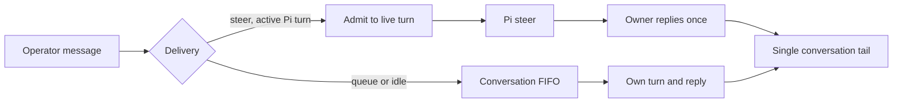

# ADR 0091: A mid-turn message steers the turn

Status: accepted (2026-08-15). Defines interruption semantics for durable
Discord lanes.

## Operator input delivery

Operator conversation sends accept an optional `delivery: "steer" | "queue"`.
For Clankie's Pi conversations, `steer` admits the message alongside the active
human or autonomous invocation; `queue` waits on the conversation FIFO for its
own turn. Both start a turn when idle. A queued continuation alone does not
open a live lane. Omitting delivery preserves automatic admission: human input
steers an active autonomous invocation, and other pairs wait on the FIFO
([ADR 0130](0130-goals-and-self-wakes-share-the-operator-thread.md)). Channel
rounds and external seats retain their own delivery behavior.

The console uses Enter to steer and Alt+Enter to queue. One tail observes all
accepted inputs until they settle, including prompts submitted during startup.
The headless equivalent is `clankie send --conversation ID --delivery steer|queue MESSAGE`.

Steering reuses Pi's live-input mechanism. Queuing uses the conversation FIFO
instead of Pi's `followUp`, so each queued prompt owns a separate run receipt,
reply, and cancellation target. In-flight tools finish before a steer takes
effect. The owning run writes one `captain.turn.settled` metrics line; an
absorbed steer does not write a second.

```mermaid
flowchart LR
  Input[Operator message] --> Mode{Delivery}
  Mode -->|steer, active Pi turn| Live[Admit to live turn]
  Mode -->|queue or idle| FIFO[Conversation FIFO]
  Live --> Pi[Pi steer]
  Pi --> Merged[Owner replies once]
  FIFO --> Next[Own turn and reply]
  Merged --> Tail[Single conversation tail]
  Next --> Tail
```

## Context

The durable Discord voice lane is one Pi session per channel. Mid-turn input
from the same person can refine the thought in progress. A different person's
unrelated ask must retain its own run and reply attribution.

Pi's `prompt()` with `streamingBehavior: "steer"` delivers new input at the next
turn boundary and keeps the owning run alive until that input is consumed.
The original caller owns the answer; refinements report `absorbed`.

### Group voice admission (2026-09-28)

`DiscordVoiceIngress` admits one speaker's handoffs per guild/channel at a time.
That speaker's further handoffs can reach the active run as steers; other
speakers wait in arrival order and receive their own handoffs. Queued refinements
from the next speaker enter together. Admission remains held until every call
in the current speaker's group settles, including absorbed calls and failures.
Room identity and actor identity come from Discord, never model arguments.
A queued request whose originating voice conversation closed is dropped before
submission. Text-lane admission and authority planning are unchanged.

We considered bounded parallel per-speaker sessions. We retain one active
speaker instead: handoffs can mutate the same machine, and parallel sessions
would introduce tool-order races and split the room's durable history. This
choice bounds active work to one speaker but can delay another person's lookup.
It does not serialize the realtime room: banter, hearing, and local voice tools
continue during a handoff. Revisit parallel read-only work if live evidence
shows queue delay dominates; do not infer safe parallelism from a model summary.

Each realtime tool call has a distinct delivery id (room delivery plus call id).
The result includes its gateway-attributed recipient for a brief, clearly
addressed spoken gist. The result and recipient travel together, so intervening
room turns cannot change whose answer it is. Same-speaker absorption is intended
for refinements: the realtime model decides what needs a handoff, not a phrase
classifier. Offline simulations are evidence of admission, not proof that the
model consistently selects the right handoff in a real call.

The 2026-09-29 amendment to [ADR 0057](0057-realtime-voice-with-captain-handoff.md)
absorbs unheard realtime replies across a room burst before provider dispatch
or playback. This does not cancel work already admitted to the durable lane.
Repeated asks join the same speaker's pending handoff (normalized identical
request, or a model-selected `join_call_id` checked against that speaker), so
only the original call delivers the result. New refinements still steer;
other speakers still receive separately attributed work. A stop suppresses
late spoken results without discarding completed work or changing text lanes.

Two captain-side gaps remain around pi's mechanism. First, exactly one HTTP
caller may carry the reply — voice ingress speaks every `settled` response,
so two would double-speak. Second, pi flips `isStreaming` only after
`prompt()` gets past its own awaits, leaving a window where two callers could
both believe the lane is idle and start racing runs.

## Decision

`runDurableTurn` in `captain.ts` dispatches every durable-lane turn:

- An idle lane starts the run and that caller carries the final reply. The
  lane records the run's settlement promise while it is in flight.
- A lane already streaming gets the message steered into the live run, and
  the caller reports `absorbed` once the merged run settles. An absorbed turn
  returns `state: "absorbed"`, distinct from a deliberate `silent` result.
  Voice ingress speaks neither; the run owner's answer covers its refinements.
- The idle check and the `prompt()` call share one synchronous stretch (with
  template expansion off, pi reaches its own streaming check without
  awaiting), so the state observed is the state pi acts on. The window where
  a run is accepted but not yet streaming is covered by the recorded
  settlement promise: an arrival there waits it out and re-decides.
- A steered turn whose run fails reports failed, not silent: the words are
  never actually heard.

Only the run owner resets the turn's media capture; a steerer never clobbers a
live run's captured media. The lane log stays honest under merging: two
`heard` entries, one `said`.

## Consequences

- One voice reply covers the active speaker's refinements. Other speakers'
  actionable requests wait for independent turns while the realtime room keeps
  talking. A continually refined ask can delay later work.
- The reply rides the first caller's HTTP response; its refinements get
  `absorbed`, distinguishable from choosing silence in receipts.
- A message arriving during auto-compaction still fails its turn (pi refuses
  prompts mid-compaction). Rare, and no worse than before; a retry inside
  `runDurableTurn` is the upgrade path if it shows up in lane logs.
