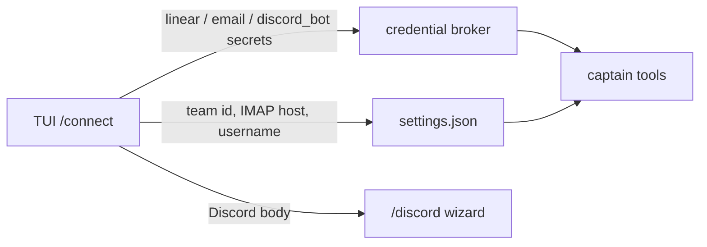

# ADR 0093: Owner-authored service connections

Status: accepted (2026-08-15).

## Context

Clankie is one agent per machine, configured by the person who runs him. Discord
already works that way: `/discord` writes a bot token to the credential broker
and allowlists to `settings.json`. Linear and email did not. The TUI still
autocompleted `/auth mcp linear` from the pre-pi port, but no command stored a
credential and the captain had no tools that would use one.

So "give him access to my Linear / my mail / my Discord servers" was a product
claim without a path. The expected comparison is Claude Code or Codex: an owner
opens the console, connects a service, and the agent can use it.

Three unlike things were being asked for under one word, "access":

| Service | What access means here                | Existing path                             |
| ------- | ------------------------------------- | ----------------------------------------- |
| Discord | He is present in the owner's servers  | `/discord` — first-class body, not a tool |
| Linear  | He can search and file issues         | none                                      |
| Email   | He can read and send the owner's mail | none                                      |

Options weighed:

1. **Generic MCP registry on the captain.** Paste `npx @linear/mcp-server` and
   hope. Rejected as the primary path: [ADR 0082](0082-clankie-holds-the-browser.md)
   already put process ownership of MCP in the service, not the session, and a
   raw MCP add is not "easy" for someone who just downloaded him.
2. **Browser login only.** He already has a persistent browser profile. Rejected
   as the only path: it is access without tools, so "what's ENG-123?" becomes a
   scrape.
3. **First-class `/connect` catalog.** Accepted. Curated connectors, brokered
   secrets, captain tools that refuse honestly when nothing is connected.

## Decision

**`/connect` is the catalog.** Aliased as `/integrations`. `/auth` stays
provider keys and subscriptions; typing `/auth mcp` redirects here.

**Discord remains a body.** `/connect discord` opens the existing wizard and
adds a portal primer plus an invite URL derived from the application id. Any
user can create their own application; Clankie is not a hosted multi-tenant
bot they OAuth into.

**Linear is a tool connector.** `/connect linear` signs in with Linear's MCP
OAuth 2.1 (dynamic client registration + PKCE against `mcp.linear.app`) and
stores the tokens in the broker. That is the same authorization server Claude
Code and Codex use. A personal API key remains an advanced fallback. Tokens
are sent as `Authorization: Bearer` to GraphQL. Optional default team UUID in
settings. Tools: search, get, create, update, comment, teams. Available in
every room — that is why someone connects their tracker.

**Email is IMAP/SMTP.** Password in the broker (`email`); host and username in
settings. Presets for Gmail, iCloud, Fastmail, and Outlook, plus custom.
Gmail and iCloud need an app password; the wizard says so. Mail tools are
**operator-lane only**: listing, reading, searching, and sending from Discord
would dump a mailbox into a room. A Discord turn that calls them is refused
with `operator_only`.

**Tools are always registered.** They refuse with `credential_unavailable` or
`not_configured` when the owner has not connected them, the same shape
`generate_image` uses. Connecting mid-session does not require a restart.

**Generic MCP is not a captain surface.** The browser host remains the pattern
for a service-owned MCP process. A future connector can join `/connect` without
teaching owners to spawn stdio servers.

## Consequences

- A new clone can run `/connect` after `/auth` and have Linear and mail the
  same day, with their own keys.
- Discord is still more steps than a consumer OAuth button, because the
  architecture is one owner, one bot application. The primer and invite link
  are the honest ease improvement.
- Inbox contents never become Discord message text through a tool.
- Linear issue text can appear in Discord, by owner choice, when they connect
  the workspace.
