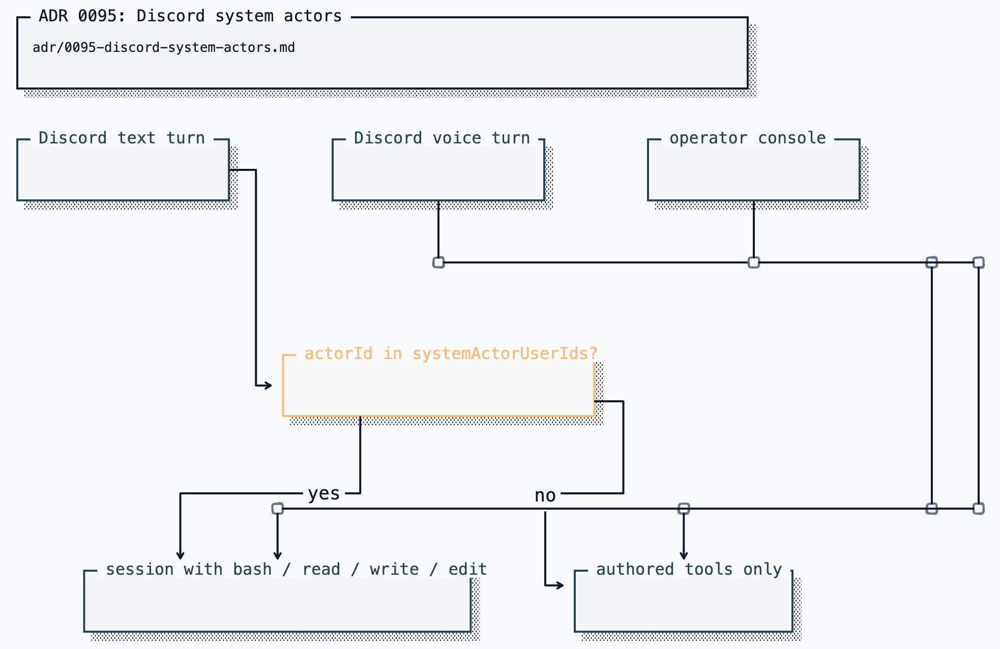

# ADR 0095: Discord system actors

Status: accepted (James, 2026-08-15). Defines the Discord authority split with
[ADR 0050](0050-voice-presence-authority-tier.md) and the operator-only coding
tools in the pi captain.

## Context

The captain leads through the herdr CLI over bash. Those coding tools
(read / bash / edit / write) are pi built-ins and run unsandboxed as the
service user. Only the operator console had them. A Discord lane is fed by
untrusted channel text, so it kept the authored tool bank — pictures, play,
the other rooms — and nothing that touches the filesystem. The framing
labels that text as untrusted, but a tools list is a boundary and a prompt
is not.

That is why a Discord "can you see what we're doing in herdr?" is answered
honestly with no. The herdr socket is reachable from the service
(`herdr pane list` works without `HERDR_ENV=1`); the tools are simply not
on the session.

The owner still wants to drive herdr from Discord — but only when _they_
ask. Ambient slash-command authority and the DM-policy owner are the wrong
bindings: ADR 0050 already refused to reuse `ownerUserId` for voice so two
unrelated policies would not move together, and `ambientUserIds` is the
tier that can `/clankie join`. Handing that tier a shell would collapse
"can summon him" into "can run commands on this machine."

## Decision

A new settings list, `discord.systemActorUserIds`, names the Discord users
whose **text** turns get the operator's machine tools.

- Empty means nobody. Discord stays social. Deny by default.
- The operator console is always privileged and does not consult the list.
- Voice never gets the tools. That session is durable and shared across
  speakers; builtins on it would let anyone in the call drive the machine.
- Distinct from `ownerUserId` (DM policy) and `ambientUserIds` (slash
  commands). Those policies can move without handing out a shell.
- Reloaded per turn from the settings file (environment still wins, same
  as every other Discord allowlist). Removing someone takes effect on the
  next message, not the next process restart.
- Mail stays operator-console only. Dumping an inbox into Discord is a
  disclosure, not a machine-control grant.

The herdr skill's `HERDR_ENV=1` stop is for agents sitting in a pane. The
captain is a service. His instructions say so, and `herdr` talks to
`~/.config/herdr/herdr.sock` from here.

## Options weighed

- **Reuse `ownerUserId`.** Rejected for the same reason as ADR 0050: DM
  policy and a shell are different blast radii.
- **Reuse `ambientUserIds`.** Rejected: that tier opens voice and slash
  commands; it must not open a shell.
- **Bespoke herdr tools.** Rejected: leadership already goes through bash
  plus the herdr skill. A second surface would drift from the console.
- **Builtins on every Discord turn, refuse at execution.** Rejected: the
  model would still see bash. The tools list is the boundary.
- **Builtins on voice when the current speaker is allowlisted.** Rejected
  because voice sessions are built once and shared; per-utterance tool banks
  require a different session boundary.

## Consequences

- A guild-channel turn from an allowlisted user still carries untrusted
  context messages. Prompt injection into that turn has a shell. That is
  the same shape as the owner pasting the channel into the console, and
  it is accepted for a named allowlist of one. Widening the list, or
  granting it in a public channel, is an operator decision with that
  cost.
- Email does not come along. Cross-channel disclosure stays its own gate.
- `HERDR_ENV` is not required. If `herdr` is missing from the service
  `PATH`, the command fails honestly and he says so.
