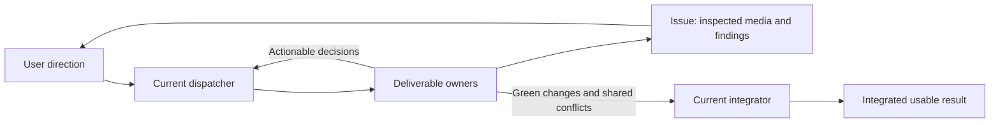

# ADR 0097: herdr-lead is the companion dashboard

Status: accepted (James, 2026-08-15). The console seat is pane-native. This
extends the herdr-as-fleet decision in the pi rewrite
([architecture](../architecture.md)) and the no-bespoke-herdr-tools rule in
[ADR 0095](0095-discord-system-actors.md). The second decision below — the
console opening the board beside itself — is amended by
[ADR 0106](0106-the-board-opens-when-asked.md): the board now opens only on
`/board`. [ADR 0131](0131-herdr-completion-watches-wake-the-operator-thread.md)
adds one narrow lifecycle tool that turns Herdr's native completion event into
an operator-thread wake. The rest of this record stands.

## Context

Clankie leads coding agents through the herdr CLI over bash. The service is
his durable body — Discord, memory, games, sessions that survive a pane
closing. The operator console is meant to sit _in_ a herdr pane, in the
same session as the agents he leads. That is the seat where he thrives.

The herdr-lead skill is the lead playbook plus a live board (roster, swarm
map, worktrees, tickets, library) with a headless digest (`herdr-lead state`)
and an idempotent `herdr-lead split`. Two things do not fit. The skill
assumed the lead process _is_ the pane (`HERDR_ENV=1`, bare `herdr-lead` in
this process) — his shell still runs in the service. And the console could
see sibling agents (`HerdrRoster`) but has no persistent picture of the
fleet sitting next to the conversation.

Bespoke Herdr leadership tools stay rejected (ADR 0095). The completion-watch
bridge in ADR 0131 is lifecycle plumbing, not a second leadership protocol.

## Decision

**Joining a herdr session is how he acquires the fleet.** When the operator
console is a herdr pane, that turn is a join: the pane is him, and a live
`herdr agent list` census rides the prompt as `<herdr_session>`. He can
lead those agents, route work to them, and harvest what they finish without
having to go look. The face reports `clankie` on that pane so the roster
and swarm map see him. The herdr-lead board is the companion dashboard —
the operator's view of the same session. `herdr-lead state` adds worktrees
when he needs them; he writes the board's Linear cache when ticket state
matters.

**The console opens the board beside itself, it does not become the board.**
Inside herdr, starting the operator console calls `herdr-lead split` with
this pane as `HERD_LEAD_TARGET` so jump-back lands on Clankie. `/board`
reopens; `/board focus` jumps. One board per session — a second open
inherits the existing pane. Outside herdr the call is a no-op.

**Never run bare `herdr-lead` from his shell.** The shell is still the
service process. Bare form starts the TUI in-process and hangs the tool
call. `herdr-lead split` and `herdr-lead state` are the verbs that belong
there.

## Operational ownership

James's September 7, 2026 Grapple swarm reflection distinguishes integration
from whole-fleet direction. Competing dispatches reassign lanes that still have
owners, and delayed relays turn old resource observations into unnecessary
waits. A long-running lead thread does not provide continuous visibility.

The current dispatcher owns priorities and assignments; the integrator owns
shared changes and delivery. One agent may hold both roles. Product scope and
evidence live on the issue; pane assignments and leadership transfers stay in
the current local handoff. The dashboard remains an observation surface.

James's September 8, 2026 direction makes inspected results the publishing unit.
Attempt-by-attempt threads and repeated coordinator handoffs obscure the media
and decisions the user needs. Workers publish directly using `linear-issues`:
what the media shows, the major hurdle, the decision and a human need only when
action is required. Detailed attempts remain in retained evidence records.

Optional planner and tracker roles divide attention: planner maintains bounded
deliverables and dependencies; tracker identifies missing evidence and stale
handoffs. Each deliverable has one harvest owner. These roles do not create a
mandatory relay or another dispatch authority. Clankie can be the lead instead
of another supervisor above it. The alternative of routing every result through
tracker and lead is rejected because it duplicates context and review without
changing the result. `herdr-lead` owns task-based effort guidance; fleet settings
carry the user's preferences, and the active harness applies actual effort.

The captain instructions and `herdr-lead` skill carry this operating guidance.
Only current pane, checkout and resource observations support a status claim;
a relay remains a report to verify before changing someone else's work. Seat
lifecycle tallies are activity observations, not acceptance or delivery metrics.

## Options weighed

- **Bespoke `herdr_*` captain tools.** Rejected again: leadership stays
  bash plus skills so the console and Discord cannot drift.
- **Collapse the service into a pane.** Rejected: Discord, memory, and
  game bodies have to outlive a session-local pane id. The face is
  pane-native; the body is not.
- **A new in-TUI fleet view.** Rejected: the board already exists, already
  scans worktrees and MRs, and already publishes the digest he can read.

## Consequences

- Opening Clankie inside herdr also ensures the board is up and reports
  this pane as `clankie`. The next operator prompt carries a live agent
  census. Closing the board is temporary; the next console start brings it
  back.
- A missing `herdr-lead` binary is an honest error, not a silent empty
  roster.
- The herdr-lead skill's `HERDR_ENV` stop does not apply to his shell. A
  turn that names a pane is the seat; env on the service process is not.
