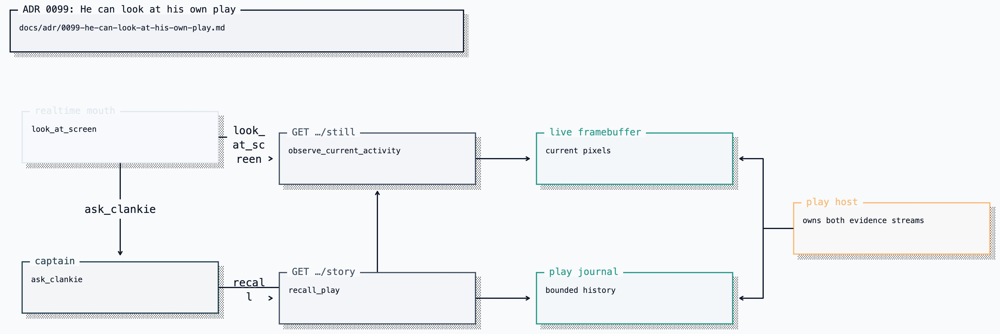

# ADR 0099: He can look at his own play

Status: accepted (2026-08-15). Narrows [ADR 0057](0057-realtime-voice-with-captain-handoff.md)
(the mouth's tool surface) and uses [ADR 0068](0068-a-playthrough-leaves-a-durable-trail.md)
(the play journal) as the store, never as the thing the mouth reads.

## Context

The talking half in Discord voice and the playing half that holds the GBA are
one character. People in the call can watch the activity surface. The mouth
receives pushed `While playing, Clankie just:` notes and a briefing that he is
at the controls, but neither carries pixels. `pokeagent_observe` stays
digest-only: "frame bytes stay on the rendered-surface media plane."
`observe_share` returns a short chronological JPEG sequence from _someone
else's_ Discord share.

Without a direct read seam, a screen description invents pixels or pays a full
captain turn for a lookup. Dumping the journal into the realtime session breaks
ADR 0057's context bound and repeats the ADR 0074 defect: monologues written for
the next button sound like telemetry when spoken.

## Decision

He may **pull** two things, and only those two:

1. **Glance.** One still of the live framebuffer, captured when he asks.
   `look_at_screen` is a read-only tool on the realtime session. It GETs
   `/v1/embodiment/sessions/live/still` and seeds an `input_image` item. It
   presses nothing. The captain's `pokeagent_observe` includes the
   same still when one exists, matching `observe_share`.
2. **Story.** A bounded card projected from the play journal: turns taken,
   current objective, maps, last eight `speakWanted` effects. Never monologue,
   notes, or the raw JSONL. `pokeagent_recall` is a captain tool;
   `/v1/embodiment/sessions/live/story` is the same card; the voice briefing
   includes it when he is playing. The mouth reaches the story through
   `ask_clankie` or the briefing, not by opening the log.

`ask_clankie` remains the only privileged tool. Room audio still cannot
press a button, write memory, or start play.

[Editable Turbopuffer tldraw source](../diagrams/clankie-docs-diagrams-2.tldraw)

## Consequences

- Looking at his own screen is the same kind of act as looking at a share:
  bounded pixels on demand, said in his own words. His screen is one current
  still; a share includes up to four 1 fps samples for coarse motion.
- Reconstructing a run is a projection, not a log client.
- Frames are still not on the digest activity snapshot. That contract stays
  hash-only so a present-tense card cannot grow a picture.
