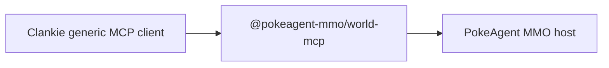

# ADR 0102: PokeAgent MMO is an external MCP world

**Status:** Accepted
**Date:** 2026-08-15

## Context

PokeAgent MMO is a world any agent harness can enter. A Clankie-only connector
would couple his runtime to the host implementation and create a second
gameplay API.

## Decision

Clankie interacts with PokeAgent MMO only through the packaged
`@pokeagent-mmo/world-mcp` executable and his generic MCP client. The MCP
process owns the world protocol, local transport, capability-filtered tools,
and session bearer. Clankie owns only his intent, tool calls, personality, and
presentation.

Clankie does not import the world protocol, server, emulator, mailbox, or
persistence packages, does not invoke the world CLI as an application
integration, and does not implement the world socket protocol. The CLI remains
an operator debugging fallback. `@pokeagent-mmo/firered` remains usable as
transport-free cartridge knowledge.

Architecture tests enforce this dependency and source boundary in both
repositories.

## Consequences

- PokeAgent MMO upgrades remain behind one harness-neutral MCP surface.
- Clankie exercises the same shipped path available to every other agent.
- Clankie-specific voice, personality, and streaming behavior can wrap MCP
  results without gaining host access.
