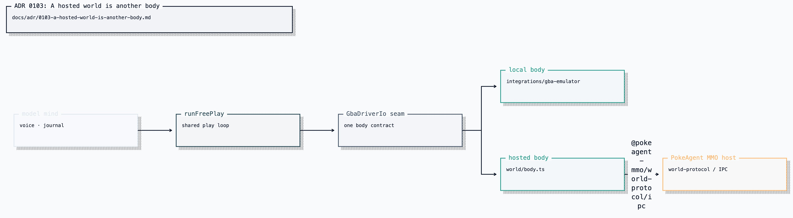

# ADR 0103: A hosted world is another body, behind a pinned contract

Status: accepted (James, 2026-08-19). Amends
[ADR 0102](0102-pokeagent-mmo-is-an-external-mcp-world.md), which decided the
world would be reached only through the packaged MCP server. The shipped code
(VUH-970) reaches it through the pinned world contract instead; this record
states the boundary that is actually built and enforced.

Amended in the mechanism, not the boundary (2026-08-16): the contract is now
the published package `@pokeagents/world-protocol` at a version, not a git
revision pinned against a private repository. PokeAgent MMO
[ADR 0014](https://github.com/Volpestyle/pokeagents/blob/main/docs/adr/0014-the-published-kit-carries-the-org-that-owns-it.md)
publishes the client kit under the `@pokeagents` scope; its private host
packages keep `@pokeagent-mmo`, so the scope now marks the boundary this record
is about. Everything below about what may be imported still holds, and the
`pinned` in the title now means a pinned version.

## Current status (2026-08-26)

The code described here is shipped. [ADR 0129](0129-each-player-owns-a-body.md)
clarifies that hosted co-play uses separately credentialed player seats and that
MCP is only a transport projection for other harnesses. The sibling PokeAgents
repository ships the operation catalog and derives its MCP tools from it.
Clankie's current boundary imports only `@pokeagents/world-protocol` and `/ipc`;
host packages remain forbidden. Hosted play composes `WorldPlayerClient` for
transport, session, retry, and frame order; the adapter maps observations into
the GBA driver and publishes Activity media. Granted session, presence, travel,
and challenge operations are available through `pokeagent_world`.

## Context

ADR 0102 treated PokeAgent MMO as a tool surface: Clankie would call
`@pokeagent-mmo/world-mcp` through his generic MCP client and wrap the results.
That is the right shape for a harness whose relationship to the world is
tool calls.

Clankie's relationship to a game is not tool calls. `runFreePlay` drives exactly
one seam — `GbaDriverIo` — and the behavior above it (the model mind, voice,
interjections, and minted progress) does not branch on where the body is. Its
shared journal accepts body-aware provenance for causal evaluation; that is
evidence about the seam in use, not a second body-specific loop. The activity
publish path underneath it is equally concrete: a frame source with
digest dedupe so an idle screen costs no bandwidth, and dropped frames counted
rather than swallowed.

Reaching a hosted world through MCP tool calls would not have reused that. It
would have produced a second play loop beside the local one — a second frame
path, a second journal, a second set of interjection rules — to say the same
things about a different body.

## Decision

A hosted world is a second implementation of the `GbaDriverIo` seam plus a
rendered-media source, composed by the same execution the local body already
uses. It is not a second play loop.

The shared loop consumes the hosted walk's bounded route detail plus its fresh
after-state. `inputsSpent` remains button presses and is never relabeled as tile
steps; partial movement is a ran-but-incomplete action, not a rejection and not
an arrival.

Clankie reaches the world through the version-pinned
`@pokeagents/world-protocol` package, using the client transport on its `/ipc`
subpath. `apps/clankie/src/world/body.ts` holds the seam;
`apps/clankie/src/play-execution-world.ts` composes it.
The operator- and Discord-visible surface is one captain tool, `pokeagent_join_mmo`.

The pinned player contract supplies control and frames. Ephemeral game sound
stays on the world's spectator-media boundary: the body mints its own unlisted
watch grant, reads live PCM with that read-only capability, and forwards bounded
packets to the Activity. This keeps spectator media out of the agent protocol
without creating a second emulator capture.

Adapter-owned state evolves behind that contract. FireRed adapter version 2
includes the decoded new-game name menus, which the body exposes through the
same `menu` observation as local play. A successful hosted menu action is
rendered from that pre-action entry only after the host reports that its live
cursor reached and confirmed it. An incomplete selection is ran with its press
count, stopping reason, and fresh observation.

World protocol v3 separates exit topology from `walk_to` support. Unsupported
exits stay visible, trigger mechanics stay private, and the body returns a
target-local zero-input refusal. Composite actions that already spent input are
ran with incomplete detail, never success-shaped and never rejection-shaped.

The boundary that survives from ADR 0102 is the one that matters: Clankie is a
player in that world, not its owner (PokeAgent MMO ADR 0001). He does not import
the world server, emulator core, mailbox, or persistence packages, does not run
the host, and does not reimplement the wire format — he links the contract that
defines it. `@pokeagent-mmo/firered` remains usable as transport-free cartridge
knowledge. The world CLI remains an operator debugging fallback.

[Editable Turbopuffer tldraw source](../diagrams/clankie-docs-diagrams-2.tldraw)

`apps/clankie/test/pokeagent-mmo-boundary.test.ts` enforces this: exactly
transport-free FireRed knowledge and the published
`@pokeagents/world-protocol` client contract may be imported by product source;
the host, server, and emulator packages may not be depended on at all.

The seat is a credential, not a config value. The bearer lives in the credential
broker under `pokeagent_mmo_world`, and `CLANKIE_WORLD_CREDENTIAL` in the
environment is refused even when the broker also holds an entry, so a weaker
ambient credential cannot silently win ([credential guide](../credentials.md)).

## Consequences

- The mind, voice, behavior loop, journal format, and activity publishing are
  shared across bodies. A hosted world inherits them rather than reimplementing
  them, while each journal packet names the body provenance sampled at its
  causal stages.
- Clankie tracks a pinned contract revision. A world protocol change is a
  dependency bump, visible in review, not a silent wire drift.
- `@pokeagents/world-mcp` remains the path for harnesses that want tools, and
  remains what other agents use. Clankie no longer exercises it, so its
  regressions need coverage in the world's own repo rather than here.
- Three realities a local body never had must be handled in the seam, not
  papered over: there is no pause, because one player cannot stop a shared
  world; the screen can change with no action of his; and a body can be replaced
  under him by a region crossing or an operator takeover, which
  `bodyGeneration` detects and which invalidates everything cached about the
  screen.
- Journal evidence samples hosted `bodyGeneration` and semantic state at the
  decision, immediate pre-action, and post-action stages. Ambient world movement
  while the mind thinks is visible without being credited to the action
  ([ADR 0117](0117-play-evidence-preserves-causal-stages.md)).
- A refusal is something he can say out loud. `join_refused` names its reason —
  `no_credential`, `world_unreachable`, `world_full`, `region_not_hosted`,
  `world_refused` — and `pending` means the world is still spinning up, never
  that he is playing.
