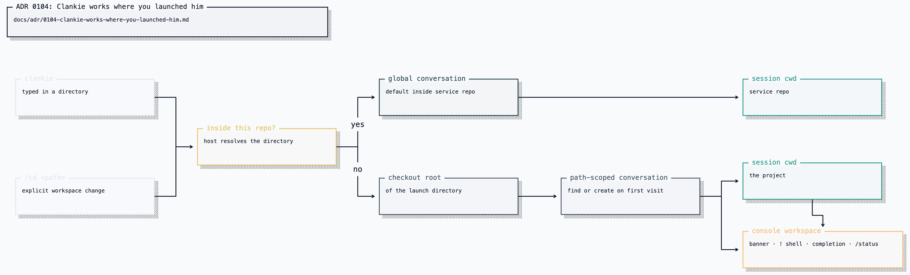

# ADR 0104: Clankie works where you launched him

Status: accepted (James, 2026-08-16). Gives the workspace scope of
[ADR 0032](0032-conversation-scoped-operator-lanes.md) a producer and a meaning;
the transport, durability, and revision fencing that ADR decided are unchanged.

## Context

The `clankie` launcher is a symlink into this repository, so `import.meta.dirname`
always resolves to the service repo no matter where the command was typed. That
one value fanned out to four different meanings:

- the cwd the launcher spawns services in — correct, they are workspace scripts;
- the roots for config, the skill catalog, and console state — correct, they are
  Clankie's own;
- the console's banner, `!` shell escape, and path completion;
- the cwd of the captain's pi session, which is where his `read`, `bash`, `edit`,
  and `write` tools land.

The last two are the operator's, not the service's. `clankie` typed in
`~/dev/some-project` opened a console that said `~/dev/clankie` and handed the
captain a shell rooted in his own body, so asking him to look at the project in
front of you meant naming absolute paths every time.

The single shared daemon on port `4310` rules out simply tracking `process.cwd()`.
The service starts once and every later console attaches to it; a per-attach cwd
would either restart the daemon or silently retarget whichever console attached
first.

## Decision

The working directory belongs to the conversation, not to the process.
`OperatorConversationScope` already carried a dormant `workspace` branch; its
`workspaceId` is now the absolute directory the conversation's session works in.
The captain builds that conversation's pi session with `cwd = workspaceId` — for
`createAgentSession`, for the resource loader that picks up the project's own
`AGENTS.md` and skills, and for the session header. Clankie's skills stay on the
path from the service repo, and a global conversation still works there.

The launch directory decides the fresh conversation's scope. Outside this
repository that is the launch directory's checkout root (nearest ancestor
holding `.git`, else the directory itself). Inside this repository there is no
workspace, so the fresh conversation has global scope. `/cd <path>` moves to the
newest retained conversation for that workspace (creating its first when none
exists), while `/new` creates a fresh conversation in the current scope. The
console's banner, shell escape, path completion, and `/status` follow the
selected conversation ([ADR 0111](0111-a-console-process-starts-one-conversation.md)).

[Editable Turbopuffer tldraw source](../diagrams/clankie-docs-diagrams-2.tldraw)

A workspace is fixed for the life of a conversation. `/cd` switches rooms rather
than repointing a live session, so a session's cwd never changes underneath a
turn and no session has to be torn down to move.

The registry is the boundary that validates a workspace: it refuses any scope
whose path is not absolute or does not already resolve to a directory on the
machine, because that path becomes the cwd of an unsandboxed shell.

## Consequences

- `clankie` in a project creates a fresh room with the captain's tools and the
  console's `!` shell both rooted there.
- Concurrent consoles in the same project have independent conversations and
  Pi contexts. `--chat` is the explicit way to share or resume one.
- The captain reads the project's own `AGENTS.md` and repository skills, so his
  instructions are the ones that repository publishes.
- Conversations created before this ADR carry a global scope and keep working in
  the service repo, unchanged.
- Discord text and voice lanes are unaffected: they have no workspace and
  continue to work in the service repo.
