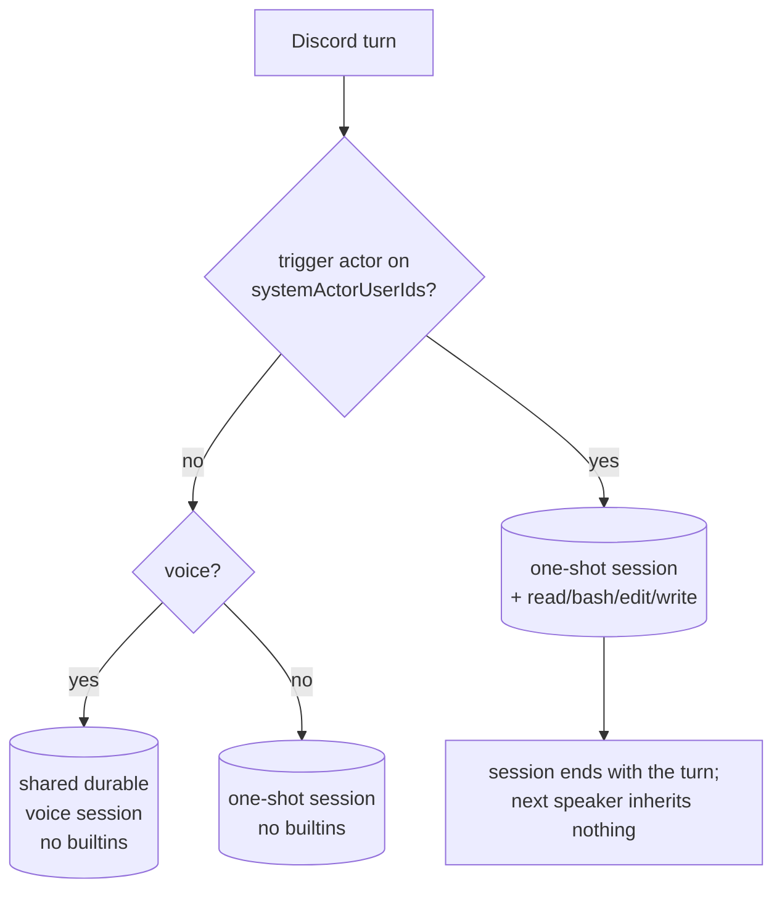

# ADR 0105: Voice is as capable as the room it is in

Status: accepted (James, 2026-08-16). Amends
[ADR 0095](0095-discord-system-actors.md), which weighed this exact grant and
rejected it for a precondition this record supplies.

## Context

`discord.systemActorUserIds` names who may drive this machine from Discord.
ADR 0095 gave that grant to text turns and withheld it from voice, listing the
reason among its rejected options:

> **Builtins on voice when the current speaker is allowlisted.** Rejected
> because voice sessions are built once and shared; per-utterance tool banks
> require a different session boundary.

The objection was never about who was asking. Voice attribution is as strong as
text attribution: each consented speaker has their own transcription session fed
by their own Discord-authenticated audio stream, the speaker is captured when the
floor decides to respond, and the handoff fails closed when it is unknown
(`voice_ask_clankie_no_speaker`). Identity is never inferred from the audio.

The objection was about _lifetime_. Builtins are bound when a pi session is
built, and the voice lane keeps one durable session per channel shared by every
speaker in it. Granting tools for an allowlisted speaker would leave them
attached to that session for whoever talked next.

The cost of the gap was a real hole in one Clankie: asking out loud for anything
that touches the machine got "I cannot from here," while the same sentence typed
into Discord — from the same person, over the same authenticated identity — got
a shell.

## Decision

The allowlist governs the actor, not the transport. A Discord turn whose trigger
actor is on `discord.systemActorUserIds` carries the operator's machine tools,
in text and in voice alike.

The missing session boundary is the one text already uses: **a privileged turn
never runs on a shared durable session.** When a turn is granted tools, it runs
one-shot on its own in-memory session, so the grant lasts exactly one turn and
answers to exactly one authenticated actor. Unprivileged voice turns continue
the channel's durable lane unchanged.

Nothing else moves. The turn framing still labels every body untrusted, because
the tools list is the boundary and the prompt is not. `ownerUserId` and
`ambientUserIds` remain separate policies. Mail stays console-only. Gameplay
and the operator lane never consult the list.

## Options weighed

- **Flip the lane check alone.** Rejected: it grants the shared session, which
  is precisely what ADR 0095 refused. The tools would answer to the next
  speaker.
- **A privileged durable session per allowlisted speaker.** Rejected: session
  sprawl per channel per actor, and the room's conversation stops being in one
  place. One-shot already models "this turn, this actor."
- **Rebuild the shared session per turn with the current speaker's tool bank.**
  Rejected: tearing down and rebuilding a durable session mid-call to change a
  tools list makes the boundary depend on timing.
- **Keep voice unprivileged and route these asks to the console.** Rejected by
  the owner: he is one Clankie across rooms, and a room where he cannot act is
  a worse answer than a room where he acts under a named grant.

## Consequences

- Asking out loud, as an allowlisted speaker, reaches the same tools the console
  has. Voice stops being the room where he has to refuse.
- The grant cannot leak across speakers by session reuse. Nothing an
  unprivileged participant says later lands on a session that holds builtins.
- A voice room is more often a public room than a text channel is. ADR 0095
  accepted that a privileged turn carries untrusted context, "the same shape as
  the owner pasting the channel into the console"; voice widens who is in that
  channel. Whether to sit in a public voice room while on the allowlist is an
  operator decision with that cost.
- The request the captain receives is composed by the realtime model from the
  room's conversation, not quoted verbatim from the allowlisted speaker. The
  _call_ is attributed; the _wording_ can carry what anyone present said. This
  is ADR 0095's accepted injection surface with the attribution of individual
  sentences lost in paraphrase. His instructions require him to say what he is
  about to do and take confirmation before anything destructive or
  far-reaching, which is a mitigation and not a boundary. Carrying the
  allowlisted speaker's verbatim utterance alongside the paraphrase would make
  it one, and is the natural next record.
- A privileged voice turn inherits the one-shot 10-minute ceiling. An expiry
  settles as `captain_turn_timeout` and the room hears the captain-unreachable
  sentence rather than silence.
