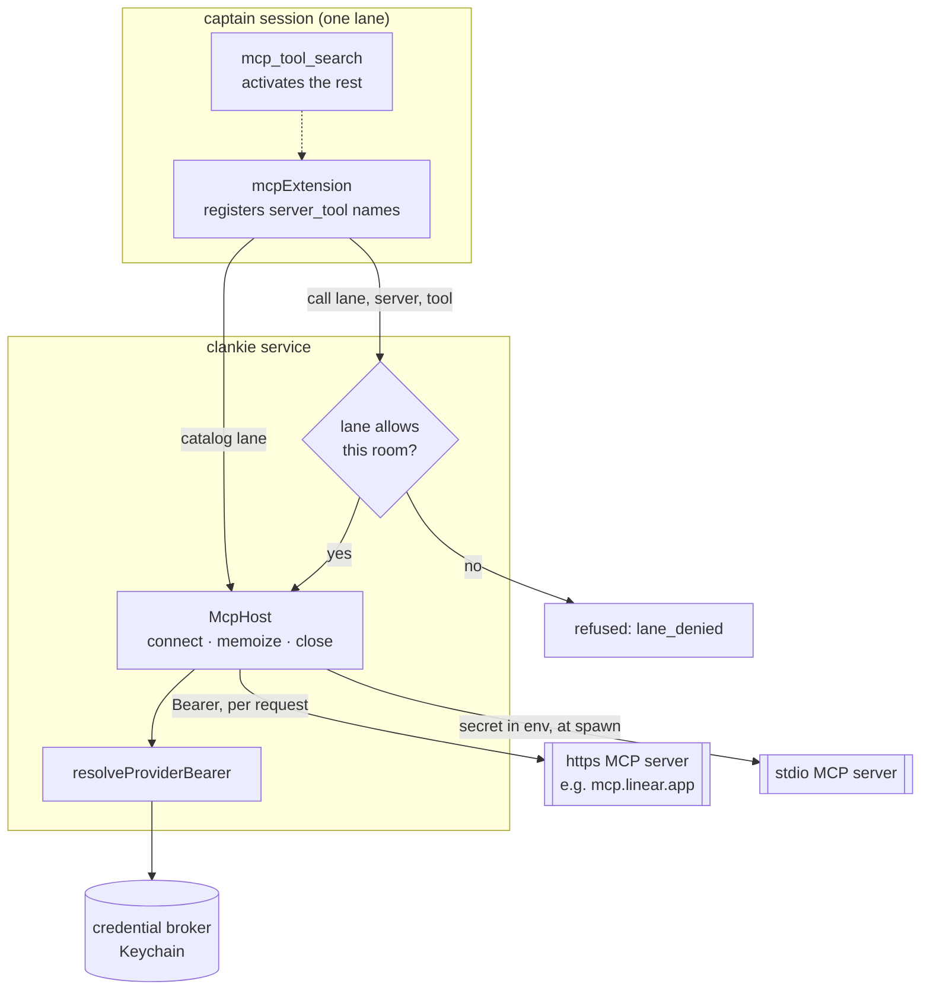

# ADR 0109: MCP is how he reaches a service

Status: accepted (2026-08-16). Amends
[ADR 0093](0093-owner-authored-service-connections.md): `/connect` remains the
catalog and the broker still owns every secret, but the clause holding that
"generic MCP is not a captain surface" is reversed — it is now the surface every
tool connector arrives on. Follows
[ADR 0082](0082-clankie-holds-the-browser.md)'s rule that the service owns MCP
processes and the session never does, and settles for tool connectors the
transport question [ADR 0102](0102-pokeagent-mmo-is-an-external-mcp-world.md)
left open for worlds.

## Context

ADR 0093 chose curated connectors over a generic MCP registry, for a good
reason: "paste `npx @linear/mcp-server` and hope" is not a setup story for
someone who just downloaded him. Linear became a hand-written port — seven
GraphQL calls, six authored tools, a default-team setting, and a team picker in
the `/connect` wizard.

What that decision could not see is where the credential already came from.
`/connect linear` signs in against **`mcp.linear.app`**, with dynamic client
registration and PKCE, for the resource `https://mcp.linear.app/mcp`. Clankie
was already doing the MCP handshake in full and then declining to speak MCP,
re-implementing against GraphQL the surface the token was minted for. Every
Linear capability he did not have was a function somebody had to write.

The cost is not only Linear. A second connector meant a second port, a second
tool bank, a second refusal vocabulary, and a second wizard branch — and the
`browser-host.ts` stdio JSON-RPC client sitting one file over, hardcoded to one
server, was proof the machinery already existed and could not be reused.

Options weighed:

1. **Keep hand-written ports.** Rejected. Every connector costs a file, and each
   one is a smaller surface than the server it wraps.
2. **Generic MCP registry, owner pastes a command.** Rejected as the _only_
   path, for ADR 0093's original reason, which still holds.
3. **Both, with curation on top.** Accepted.

## Decision

**One MCP host in the service.** `apps/clankie/src/mcp-host.ts` owns every
connection over stdio or streamable HTTP. The captain asks it for a catalog and
calls tools through it, never holding a transport or a token — the same
ownership line ADR 0082 drew for the browser.

**Curated connectors keep the `/connect` promise.** A connector Clankie ships
knowing about needs no configuration: storing its credential is the whole act of
connecting. Linear is one entry in `CURATED_MCP_SERVERS`, pointed at the
endpoint its own OAuth tokens are already minted for.

**Owner-authored servers are the escape hatch.** `settings.mcp.servers` takes
anything else. Non-secret, like everything in settings: `credential` names a
broker provider id, never a token.

**Lane is the authority gate, and it defaults closed.** Every server declares
which rooms may reach it. Owner-added servers default to `operator` — the
console only — because a server reachable from every room is a capability handed
to everyone who can type at him. Linear keeps `everywhere`, which is what
ADR 0093 chose and why anyone connects a tracker. The gate is checked when the
catalog is built _and_ again at call time, so a session cannot outlive it.

**Secrets stay broker-owned and are resolved late.** An http server's bearer is
resolved per request, so an OAuth token that expires mid-session refreshes
instead of failing until someone restarts him. A stdio server's is injected into
its environment at spawn.

The gate is drawn once but checked twice — at catalog build and again at call —
because a session outlives the moment its tools were registered.

**Only the useful few tools start active.** A tracker's server advertises dozens
of tools, and an active tool is described in the prompt on _every_ turn. Servers
register in full, `initialTools` decides what starts on, and `mcp_tool_search`
reveals the rest on demand — the same shape the browser catalog already uses.

**A retired settings section is dropped, not fatal.** `settings.linear` no
longer exists. The strict schema still rejects an unknown key loudly, because
that is how a typo stays visible; a _named_ retired section is discarded on read
so an owner's existing file still opens.

## Consequences

- Every Linear capability is available the day Linear ships it, including the
  ones nobody would have written a wrapper for.
- `apps/clankie/src/linear.ts` and its six authored tools are gone, along with
  the default-team setting and the wizard's team picker — the MCP server
  resolves the team itself.
- Tool names change: `linear_search` becomes `linear_list_issues`, and the rest
  follow their server's naming. Nothing outside his own instructions referenced
  the old names.
- A connector that speaks MCP now costs a settings entry instead of a file.
- `browser-host.ts` keeps its own hand-rolled client. It is a _specialized_
  host — artifact extraction, a blocklist, a protocol-typed catalog — and
  folding it in would be churn against working code for no capability gained.
- Adding an MCP server is still an owner action with a real blast radius. The
  closed-by-default lane is what keeps a careless entry from becoming a
  capability every Discord room holds.
