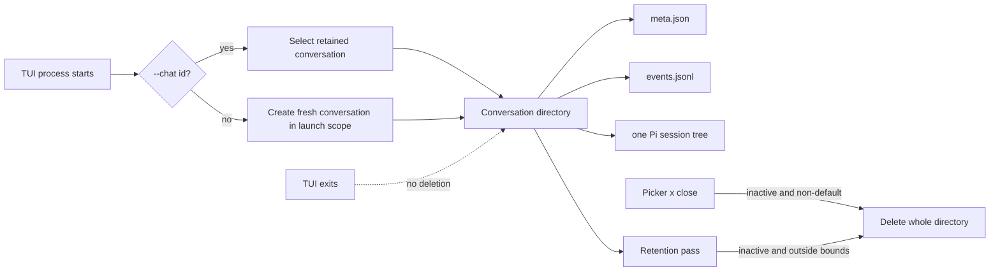

# ADR 0111: A console process starts one conversation

Status: accepted (James, 2026-08-16). Refines the operator lifecycle from
[ADR 0032](0032-conversation-scoped-operator-lanes.md) without adding another
session identity.

## Current status (2026-08-26)

Per-turn tool-shape counters live in `~/.clankie/captain/turn-settled.jsonl`,
outside the conversation directory the retention pass deletes. Presence already
uses `captain.turn.settled` in `~/.clankie/events.jsonl` for idle/waiting_user,
so the metrics line is a sibling captain file rather than a second payload
under the same domain-event type.

## Context

Persisting a console's last selected conversation and silently reopening it on
the next process launch makes a project directory accumulate one effectively
immortal model context. It also makes the local selection file look like a
second session record even though the server conversation already owns the
transcript, Pi tree, revision, and replay log.

Deleting a conversation when its TUI exits is unsafe. Another console or device
may be attached, and an accepted turn deliberately survives a detached client.
Keeping every detached conversation forever is unsafe in the other direction:
the public event log and Pi tree are append-only evidence and otherwise grow
without a storage lifecycle.

## Decision

A TUI process starts one fresh server-owned conversation. A normal `clankie`
launch creates it in the launch workspace scope; a launch inside this repository
creates it in global scope. `clankie --chat <conversationId>` is the explicit
resume path. `/conversation` switches to a retained conversation, `/cd` switches
workspace scope, and `/new [title]` starts another fresh conversation in the
current scope.

The conversation picker may explicitly close an inactive, non-default
conversation. Close uses the registry's whole-directory removal path, so its
public event log and Pi session tree leave together. The service refuses close
while a turn is active and always protects the default global conversation.

The conversation remains the only durable model-session identity. It owns one
Pi session tree and one public event log in the same directory. The TUI keeps
only an in-memory selected id. Its durable tail file is a delivery checkpoint,
not a session or a transcript cache: one surface id and at most 256 recent
conversation cursors. Because the fullscreen transcript is process memory, an
explicit selection hydrates it from the retained log boundary before incremental
tailing resumes at the newly rendered cursor.

Retention removes inactive, non-default conversations as whole directories.
The registry retains at most 64 conversations, 30 days of inactivity, and 256
MiB across retained conversation directories. It protects the conversation
being created or settled, every active conversation, and the required default
global identity; those protected directories can temporarily be the remaining
overage. Retention runs at service boot, conversation creation, and turn
settlement.

Each public event log retains at most 500 events and trims back to 400 as one
atomic rewrite. Cursors remain monotonic. A client behind the retained boundary
gets the existing typed `cursor_expired` recovery and resumes from the returned
cursor. When a conversation is pruned, its public events and Pi evidence leave
together and any cached in-memory Pi lane is disposed.

## Alternatives

- Persist the last selected conversation per workspace: rejected because a new
  process silently inherits an old model context and recreates a second durable
  pointer to the session.
- Delete on TUI exit: rejected because process ownership does not match shared
  conversation ownership and can destroy detached work.
- Rotate Pi sessions inside one conversation: rejected because it makes
  conversation and model-session lifetime diverge. Retention deletes their one
  shared directory instead.

## Consequences

- Starting `clankie` gives clean model context; resuming is intentional.
- Exiting the console is nondestructive, so accepted turns and other attached
  surfaces remain safe.
- Recent conversations remain inspectable and resumable, while their logs have
  explicit count, age, byte, and event bounds.
- The picker closes an unwanted inactive conversation immediately without
  weakening the protections around active work or the default global room.
- The non-deletable default global conversation remains available to clients
  that explicitly select it, but it is not the normal TUI startup target.
