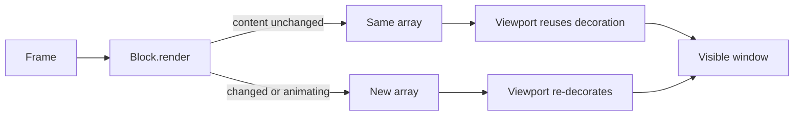

# ADR 0112: A frame costs the same at turn one thousand

Status: accepted (James, 2026-08-16).

## Context

The console felt progressively laggy to type in as a session went on. The cause
was structural rather than incidental: laying out a frame rendered every block in
the transcript, not the forty-odd rows actually on screen. `renderBlocks` walked
the whole scrollback, each block re-parsed its markdown and rebuilt its header,
and every line was pushed through `truncateToWidth` twice — once inside the block
and once again by the viewport applying its own decoration.

Only the viewport window is thrown away at the end, so the wasted work grew
linearly with the length of the conversation while the visible output stayed a
constant forty rows. Measured with `bench/transcript-render.ts` at width 120:

| Blocks in scrollback | Before   | After   |
| -------------------- | -------- | ------- |
| 10                   | 1.99 ms  | 0.01 ms |
| 100                  | 19.43 ms | 0.02 ms |
| 250                  | 48.70 ms | 0.03 ms |
| 500                  | 99.87 ms | 0.05 ms |

At 250 blocks — an ordinary working session — every keystroke paid 49 ms before
the terminal saw anything. That is the lag, and it is a property of session
length, not of the machine.

## Decision

A transcript block renders once per change, not once per frame. Blocks whose
content is fixed memoize their lines through `ClankieRenderCache` and hand back
the same array on every subsequent frame. The viewport memoizes the decoration it
wraps around those lines — collapse preview, selection marker, truncation —
keyed on the identity of the array the block returned plus the state that can
change the decoration without changing the content: width, focus, selection,
collapsed, and first-block spacing.

Array identity is the invariant that ties the two layers together, and it gives
animation for free rather than special-casing it. A block that genuinely differs
next frame returns a different array and is re-decorated: a running tool header
pulls a spinner frame and drops itself back out of the cache, while the same
header in a settled state stays cached.

The consequence for anyone adding a transcript block component: return a stable
array while your content is unchanged, and clear the cache in `invalidate` and in
every setter. A component that rebuilds its array each call stays correct — the
identity check simply misses — but it re-pays its own cost on every keystroke for
the rest of the session.

Windowing the layout to the visible rows was the alternative. It is the stronger
guarantee, since it never touches an off-screen block at all, but block heights
are only known by rendering them, so it needs a height index maintained across
collapse, resize, and streaming edits. Caching reaches the same steady state
against the existing structure, and the bench is the guard if that stops holding.

## Consequences

Frame cost is now driven by what changed rather than by how long the session has
run, and the residual growth is one identity comparison per block. The chrome
bands are still measured redundantly — `layoutBandRows` and `maxTranscriptRows`
between them render the banner, status, typeahead, and editor about eight times
per frame — but that is 0.28 ms and constant in session length, so it stays as it
is rather than trading legible layout code for a rounding error.
