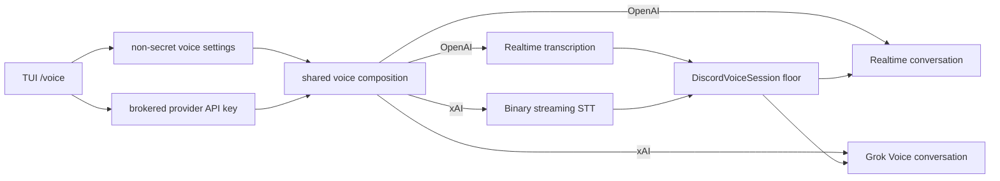

# ADR 0113: One voice port has multiple realtime providers

Status: accepted (2026-08-16). Extends
[ADR 0057](0057-realtime-voice-with-captain-handoff.md); the group-room floor,
captain handoff, and consent stay unchanged. Current-status addendum
(2026-08-19): [ADR 0128](0128-vox-is-the-sole-discord-media-owner.md) now owns
the Discord media boundary; provider selection remains TypeScript policy above
Vox.

## Context

Grok Voice exposes an OpenAI-compatible realtime conversation endpoint, but
its dedicated streaming speech-to-text endpoint uses raw binary PCM and a
different event stream. Provider selection in either Discord app would make
the bot and user-session bodies drift, while treating xAI as only another base
URL would leave dormant transcription broken.

## Decision

`@clankie/discord-presence-core` owns one provider-aware composition behind
`DiscordVoiceRealtimePorts`. Both Discord bodies consume that composition.
OpenAI keeps its transcription and conversation sessions. xAI uses binary PCM
streaming STT at `/v1/stt` for each attributed speaker and the compatible
`/v1/realtime` conversation endpoint for the one engaged room agent.

The TUI stores provider-specific models and voices independently, so switching
providers preserves the inactive setup. It configures the provider, realtime
model, voice, xAI reasoning effort, and brokered API key. xAI streaming STT has
no model parameter, so the UI exposes none. The default Grok model is pinned to
`grok-voice-think-fast-2.0`; `grok-voice-latest` remains available as an explicit
operator choice.

xAI native speech is the supported Grok mouth. ElevenLabs text synthesis stays
paired with OpenAI because xAI Voice does not document a text-only response
modality. Provider API keys remain broker-only and API-type credentials are
required at startup.

The protocol choices follow xAI's
[Speech to Speech](https://docs.x.ai/developers/model-capabilities/audio/speech-to-speech)
and [streaming Speech to Text](https://docs.x.ai/developers/model-capabilities/audio/speech-to-text)
contracts.

## Alternatives considered

- Provider branches in both Discord apps are rejected because two bodies would
  acquire separate voice behavior and readiness logic.
- Reusing the OpenAI transcription protocol against xAI is rejected because
  xAI streaming STT requires binary frames and `transcript.*` events.
- Sending mixed room audio directly to Grok is rejected because Discord stream
  attribution and the repository-owned group floor are load-bearing.

## Consequences

- Provider choice changes vendors, models, voices, credentials, disclosure,
  and readiness without changing consent or authority.
- The xAI listener buffers only until `transcript.created`, bounded to five
  seconds of PCM, and zeroes buffered audio on send or close.
- xAI Voice does not document OpenAI's explicit truncation controls. Session
  lifetime, engagement hold, decay, and idle leave remain bounded locally;
  readiness labels xAI context as provider-managed instead of claiming those
  OpenAI controls apply.
- Live readiness probes the selected provider's listener and engaged agent.
- Adding another realtime provider means implementing this shared port once,
  not changing either Discord body.
