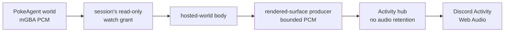

# ADR 0114: A rendered game surface carries live sound

Status: accepted (James, 2026-08-16). Extends
[ADR 0047](0047-discord-activity-presence-plane.md) and the hosted body in
[ADR 0103](0103-a-hosted-world-is-another-body.md).

## Context

The Discord Activity shows Clankie's game frames but omits the cartridge's
sound. A hosted PokeAgent body already produces sound at its mGBA core; capturing
or encoding it again in Clankie would create two media sources for one body.

Audio also cannot use the retained latest-frame behavior. A late viewer should
start now, while a slow viewer should lose old sound rather than hear the game
several seconds behind its picture.

## Decision

The hosted-world body obtains live PCM through its own existing read-only watch
grant. It forwards bounded stereo signed 16-bit packets through the rendered
surface producer. The Activity hub validates and fans them out without retaining
them, and drops audio whenever a socket is backpressured.

The client schedules packets with the Web Audio API, resets after a sequence gap
or excessive latency, and starts only after an explicit **Enable sound** action
because browsers block unsolicited playback.

Local bodies can publish the same rendered-surface audio message when they
expose native PCM; the Activity transport does not depend on the hosted world.
No PCM enters observations, journals, memory, or any semantic event.

## Alternatives considered

- Synthesizing sound from semantic game state is incomplete and duplicates the
  cartridge.
- Retaining the latest audio packet for new viewers starts playback in the past
  and creates a pop or repeated fragment.
- Adding spectator PCM to the pinned agent protocol couples control clients to
  an ephemeral browser concern.

## Consequences

- Discord Activity viewers hear the same native game sound as focused web
  viewers after one click.
- Backpressure degrades by dropping sound, never by growing an unbounded queue.
- Go Live remains a separate H264 path without source audio.
