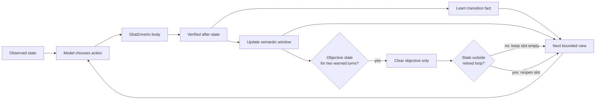

# ADR 0116: Learned transitions and stale objectives are bounded facts

Status: accepted (2026-08-17). Extends
[ADR 0049](0049-free-play-agency-and-non-deterministic-evidence.md) and
[ADR 0092](0092-a-repeat-that-changes-nothing-is-something-he-should-know.md).

## Context

Exact action repetition detects a literal wedge, but it misses a player who
alternates actions around the same few semantic states. A live hosted FireRed
run revisited the same table and doorway for 35 turns while
`longestUnchangedRun` remained two. The run had already proved the correct door
transition, but bounded recent history evicted it and self-authored notes later
replaced it. The standing objective then kept the obsolete plan prominent every
turn with no supported way to clear it.

## Decision

The free-play loop keeps three bounded, harness-owned facts above `GbaDriverIo`:

1. Successful map transitions record the exact observed source position and
   facing, chosen action, and observed destination. They are deduplicated,
   capped, and shown only when their source map is current.
2. A twelve-state semantic window detects recurring positions, scene state,
   menus, battles, and dialog even when actions differ. Volatile frame and RAM
   digests do not define semantic identity.
3. Objective and map tenure are reported once they cross the existing
   twelve-turn stall threshold. If one objective remains unchanged through two
   consecutive decisions with recurring-state evidence, the loop retires it.
   Retirement chooses neither an action nor a replacement objective. It keeps
   the objective slot empty while play remains in the retired loop's semantic
   states, then opens the slot as soon as the body reaches a state outside that
   set. Rephrasing the stale objective is not world progress and cannot
   resurrect it.

`null` explicitly clears an objective; omission retains it for custom minds.
Structured model calls repeat the current objective text when they want to keep
it. Hosted `walk_to` effects derive truthful arrival or transition text from the
verified before/after state when the transport provides no route detail; input
presses are never mislabeled as steps.

## Alternatives considered

- Growing recent history until an old door recipe survives was rejected because
  prompt cost would grow with play time.
- Writing harness facts into the model's notes was rejected because notes remain
  self-authored.
- A scripted story route or automatic recovery action was rejected because it
  would replace the model as player.
- Prompt-only warnings were rejected because they cannot bound stale objective
  anchoring.
- Comparing objective strings semantically was rejected because another model
  judgement cannot prove the body escaped a loop. The observed state can.

## Consequences

- A transition learned early in one session remains available after recent
  history rolls, without injecting the journal or a route.
- Alternating loops become visible during play and measurable as
  `longestRecurringRun`.
- Stale optional objectives cannot anchor a loop indefinitely; retirement is
  auditable per turn and counted as `objectivesRetired` in the summary.
- Transition facts are session-local. Cross-session hosted memory requires a
  player-identity persistence decision rather than an implicit global cache.
