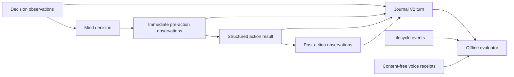

# ADR 0117: Play evidence preserves causal stages

Status: accepted (James, 2026-08-17). Amends
[ADR 0049](0049-free-play-agency-and-non-deterministic-evidence.md) and
[ADR 0068](0068-a-playthrough-leaves-a-durable-trail.md).

## Context

A turn digest proves that an observation exists, but it cannot show whether an
action makes sense or works. Hosted worlds also move while the model thinks.
Comparing decision state directly with post-action state attributes that ambient
movement to the action.

## Decision

Journal V2 stores one bounded causal evidence packet with every turn:

- exact semantic observations presented to the production mind;
- distinct immediate pre-action and post-action observations;
- the complete structured action result, not the bounded legacy detail string;
- available progress, refusal, repeat, stall, objective, notes, timing, and body
  provenance signals;
- `null` for a stage that does not exist, including pre/post state on
  `invalid_decision` and `mind_failed` turns.

PNG, PCM, credentials, media bytes, the full room transcript, and generated
voice wording do not enter the packet. A narration attempt stores only the exact
bounded game event offered to the room beside its `speechDeliveryId`. The words
actually generated and heard remain unknown by policy. A delivery id is a join
key, not delivery proof; only a matching played, suppressed, or refused receipt
settles that question.

The offline evaluator reads V1 and V2 journals. V1 evidence remains `unknown`.
It may join the service's canonical `CLANKIE_EVENT_LOG`/`CLANKIE_STATE` event
trail for terminal lifecycle and the canonical `DISCORD_BRIDGE_RECEIPT_PATH`
receipt trail for narration delivery. A missing summary is terminal only when a
durable matching terminal lifecycle event exists; its actual outcome, including
`lease_lapsed`, remains distinct from a completed summary.

## Consequences

- Movement start, target, end, and effectiveness are inspectable without frame
  bytes or inference from hashes.
- Failed decisions and crash-recovered runs remain part of evaluation rather
  than disappearing from successful-turn averages.
- One journal line is capped at 256 KiB. An oversized line fails as a whole; no
  partial action result is made to look complete.
- Mechanical evaluator verdicts remain conservative. Missing semantic evidence
  is `unknown`, not failure or success.
