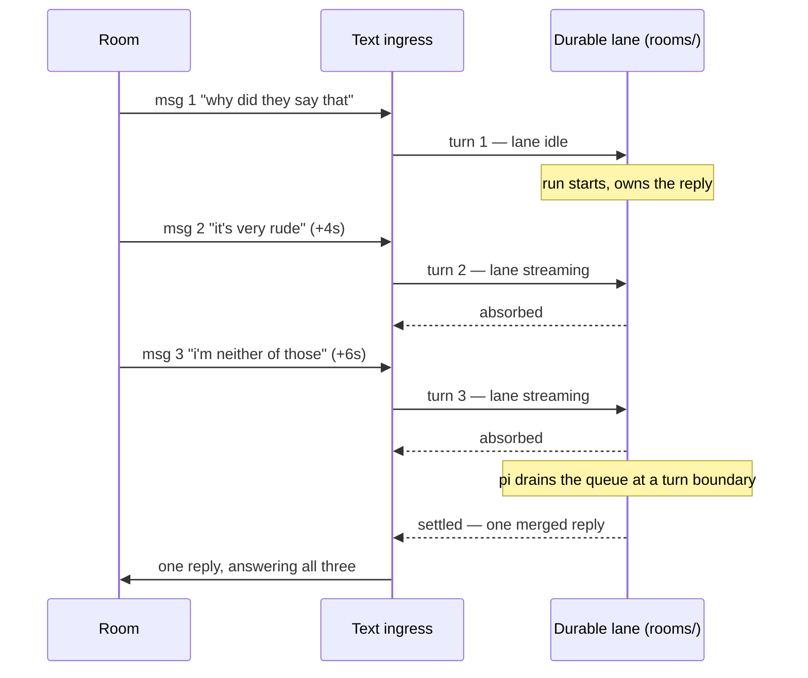
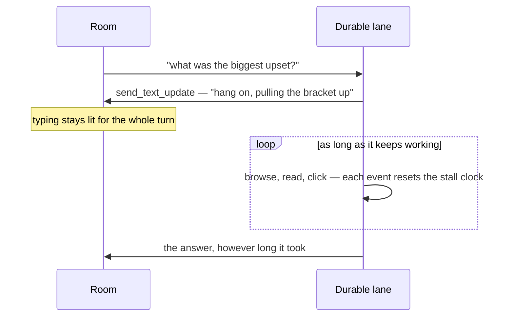

# ADR 0118: A text room is a durable lane

Status: accepted (2026-08-18). Extends
[ADR 0091](0091-a-mid-turn-message-steers-the-turn.md), which gave durable
voice lanes their interruption semantics and named the missing protocol state
as its own upgrade path. This takes that path and applies the whole mechanism
to Discord text. Also touches
[ADR 0107](0107-a-one-shot-turn-still-leaves-a-trail.md) (where a text turn's
evidence lives) and [ADR 0085](0085-a-picture-he-makes-is-something-he-says.md) (one
message carries the words and the picture). Narrowed by
[ADR 0124](0124-one-self-has-many-local-threads.md): the active voice room owns
text-only input from its attached chat, so that delivery does not also start a
text-lane turn. Amended by
[ADR 0133](0133-a-machine-grant-belongs-to-a-discord-lane.md): explicitly
trusted private DMs and guild rooms carry a separate durable system lane.

## Context

On 2026-08-18 someone asked Clankie about a Deadlock lobby in three messages,
four and six seconds apart. He answered twice. The two answers disagreed in
tone — the first dismissive, the second the one you would want — and the second
landed after the asker had already moved on to another subject. Nine days of
lane logs hold the same shape repeatedly, and one worse instance: on 2026-08-17
a browsing turn wrote its answer, lost it to a failed media write, and then two
prods from the room became two concurrent turns that each re-browsed start.gg
and posted near-identical replies 429 ms apart.

The cause is structural, not a tuning problem. Every admitted text message
became its own one-shot pi session, and those sessions ran concurrently with no
knowledge of each other:

- Nothing coalesced a burst. Three messages meant three turns, three typing
  indicators, three sets of tool calls, and up to three replies.
- Each turn's only view of the conversation was ten messages of channel history
  fetched at turn start, so a turn that began four seconds after its sibling
  could not see the reply that sibling was about to post.
- The turns cost the same whether they spoke or not: about 16,600 input tokens
  for a median 26 output tokens, and a decline billed exactly like an answer.

Voice already solved this. ADR 0091 keeps one durable pi session per channel;
a second utterance during a live run is steered into that run, pi delivers it
at the next turn boundary, and the merged reply answers everything heard. Text
was left one-shot for context isolation — nothing carries forward, the channel
history arrives with each request — and that isolation is exactly what made him
answer the same person twice.

ADR 0091 also recorded what it deliberately did not build: _"Nothing downstream
distinguishes 'chose silence' from 'absorbed', which is sufficient while the
only consumer speaks or stays quiet."_ Text is a second consumer, and it is not
sufficient there. Text ingress writes evidence and tracks whether he is still
in a conversation; recording an absorbed message as a decline would both lie in
the trail and age him out of the room he is most actively talking in.

Two failures around the same incident shaped the rest of this decision:

- The lost reply was an attachment-root disagreement. The service wrote its
  screenshot under runner state when `CLANKIE_DISCORD_ATTACHMENT_ROOT` was
  unset; the bridge's resolver threw on the same unset variable. Two processes,
  two different readings of one path, and because a picture and its words ride
  one message (ADR 0085), the picture took the words down with it.
- A turn on 2026-08-17 hung for twenty-two minutes. The provider stream died at
  five minutes and pi kept auto-retrying; the ten-minute backstop was a single
  `setTimeout`, and the host suspended, so the timer resumed owing its full
  remaining delay and fired twelve minutes late. The durable path had no
  backstop at all — survivable only while text was one-shot.

## Decision

**A Discord text room is a durable lane, exactly as a voice channel is.**
`normalizeDiscordTurn` marks every Discord turn durable; a privileged turn
still drops to a one-shot through `discordTurnUsesDurableSession`, so a granted
shell never outlives the actor who earned it. Presence lanes keep their pi
trees under `<state>/captain/rooms/`, beside `voice/` rather than inside it.

**A mid-turn message steers the live run, and says so.**
`CaptainChannelTurnResult` gains `absorbed`, distinct from `silent`. Both write
nothing from their own delivery. They differ in everything after: absorbed
refreshes the exchange like a settled turn and is recorded as `absorbed` in the
ingress evidence, while silent stays a decline that lets the channel age out.
Voice maps `absorbed` onto the same quiet path it already had, so its behaviour
is unchanged.

**A warm lane is not sent the backlog it already holds.** The fetched channel
history is what a cold lane needs to know where it walked in. Once the lane
carries the conversation as its own turns, re-sending it quotes him back at
himself inside an untrusted block — the same words twice, once as his speech
and once as evidence about the room. The captain reads whether the lane is live
before the prompt is built. A lane resumed from disk after a restart reads as
cold and pays one redundant backlog per channel per boot, which is cheap enough
to leave alone.

**A turn takes as long as the work takes; only silence is bounded.**
Nothing caps a turn's duration. Asking him to look a bracket up, read a page,
or work a task is a thing the room is allowed to do, and a clock that cuts the
answer off at a tidy number turns honest slowness into failure — the nine-minute
bracket answer above was a _good_ answer to a question someone asked.
`runTurnWithStallWatchdog` wraps both the one-shot and the durable path and
subscribes to the session's event stream: a token, a tool call, a retry, any
sign of life at all resets the clock. Only five minutes with no event
whatsoever — which is what a dead provider stream looks like, and what nothing
that is actually working ever looks like — aborts the session, as
`captain_turn_stalled`. It re-reads `Date.now()` on a five-second tick rather
than trusting a single timer, so a suspended host overshoots by one tick of
awake time instead of by however long it slept.

**He tells someone waiting before he goes away, and keeps typing while he is gone.**
A long requested turn is rude if it is silent, so `send_text_update` gives him one
short text message to the channel mid-turn — threaded onto the message he is answering —
without ending the turn or spending his reply. Its description tells him when:
when someone is actually waiting on slow work and a meaningful delay would
otherwise leave them hanging. Unsolicited links he elects to inspect get no
progress announcement. What he says is his; nothing here writes it for him. The
typing indicator now also runs for the whole turn rather than stopping after a
minute, so "he is working" stays visible the entire time. Silence and answers
take about the same time, so delaying the indicator cannot distinguish them
without also hiding useful progress. Knowing sooner needs a mid-turn signal the
captain does not send today.

**One derived attachment root, shared by writer and reader.**
`discordAttachmentRoot(env)` in `@clankie/settings` defaults to
`<state>/attachments` instead of to nothing, and the service, the browser host,
the tldraw host, and the bridge all call it. The bridge additionally degrades
rather than throwing: an artifact it cannot resolve costs the picture and says
so in the reply, never the words.

A turn that has to go and find something out, meanwhile, is allowed to:

## Consequences

- A burst gets one answer. The run owner's reply covers everything heard while
  it was in flight, and the absorbed deliveries stay quiet without being
  mistaken for silence.
- He remembers the room. A text lane now carries its own conversation, which
  should also blunt the repetition the one-shot design produced — 40% of recent
  replies opened with the same word, written by sessions that could not hear
  themselves.
- Cost per burst falls to roughly one turn's worth. A decline still costs a
  full turn; that is unchanged and is the price of him deciding for himself.
- Per-turn evidence for ordinary text moves. `turns/<lane>~<target>/` keeps one
  tree per privileged one-shot, which is what ADR 0107 exists for; ordinary text
  now writes into the room's durable tree under `rooms/`, the way voice always
  has. The `trace-clankie` skill's trail map records both.
- A steered turn overwrites the lane's captured actor and message id while the
  owner's run is live, so a tool invoked mid-run attributes to the newest
  speaker in the same room. This is voice's existing behaviour and is accepted
  for the same reason: the room is the same, and only the run owner may reset
  captured media.
- A message arriving during auto-compaction still fails its turn, and now that
  can happen to text. Rare; the retry named in ADR 0091 remains the upgrade
  path for both planes.
- A wedged turn is caught in five minutes instead of twenty-two, and a working
  turn is never cut off at all. The cost is that a turn stuck inside a single
  slow tool call that emits nothing for five minutes is treated as dead; every
  bounded tool has a tighter deadline of its own, so this is a backstop rather
  than a live constraint.
- `send_text_update` is a channel write he controls, so it inherits every bound the
  other presence writes have (admitted guild and channel, 600 characters,
  content-free receipts) and none of the reply path's: it cannot carry media
  and does not settle the turn. A turn that abuses it posts twice, which reads
  as him talking too much rather than as a failure.
- Media generation is available by default, because the root it needed is now
  always defined. Setting `CLANKIE_DISCORD_ATTACHMENT_ROOT` remains a
  deliberate override, not a prerequisite.
