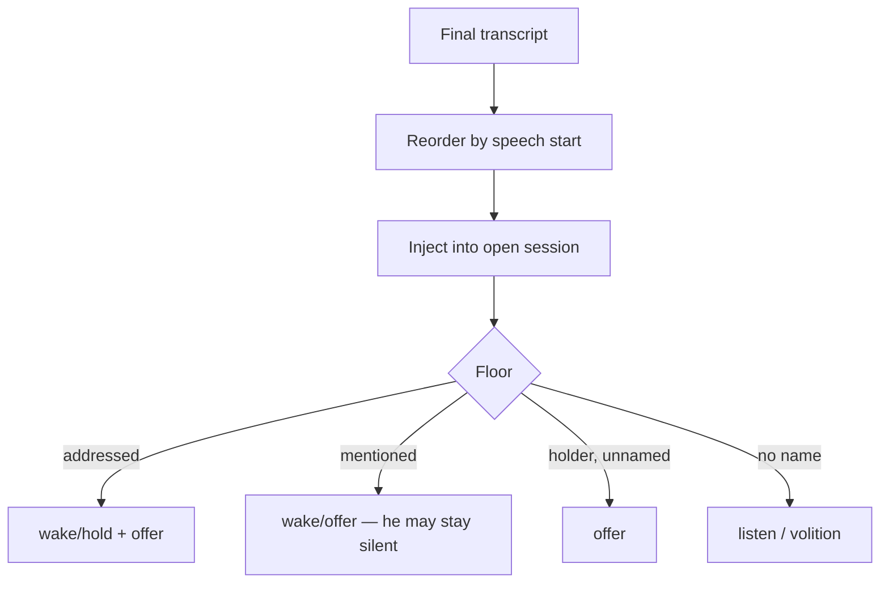

# ADR 0119: The room is heard; the floor is who he answers

Status: accepted (2026-08-18). Amends
[ADR 0057](0057-realtime-voice-with-captain-handoff.md): the realtime session
still owns the mouth, and the floor still owns `response.create`. Hearing the
room is no longer the same decision as spending a turn.

## Context

ADR 0057 built a group floor so 1:1 realtime defaults would not answer every
voice or let crosstalk cut him off. That machine treated the floor holder as
a private conversation: every further line from Alice was a `hold` and a
`response.create`, even after she had turned to Bob. Bob's undirected talk
was written into the overheard ring and withheld from the open session, so he
could not follow a side thread unless it was already in the ring at wake.
Utterances were labeled with Discord user ids only, so person memory said
`user 123` and he could not naturally say "Alice". Overlapping finals were
applied in commit order, not who started speaking.

Consent is not part of this amendment. Unconsented speakers stay unsubscribed.

## Decision

**An open session hears every consented utterance. `holderId` is who may barge
in, not who forces him to speak. Silence is a real floor outcome.**

A 12-second follow-up window was rejected: people pivot in the same breath
("yeah thanks. Bob, did you finish that thing?"), and that line is still
inside any clock measured from his last word. Grammar rules that scan `you`
across the whole sentence reopen the same hole ("bob can you ask clankie").
`hold` plus `createResponse` gives the model no way to stay quiet.

So:

1. **Nothing forces a spoken reply.** A clean hail, an ambiguous mention, and
   a nameless holder line all create a turn he may leave empty. Autonomy is
   the same; the matcher only decides whether to ask.
2. **`addressed`** (vocative, name-first that is not a third-person report,
   name-last) opens or keeps the session and moves `holderId`.
3. **`mentioned`** (name hit that is not clearly about him — including
   "clankie did you see that", "alright clankie go ahead") also opens or
   offers, from anyone, dormant or engaged. Word lists never drop these.
4. **`none`** (possessive, ask/tell object, another addressee first) is
   listen or the dormant volition gate.
5. **Holder nameless speech** is still `offer`. Occupant display names label
   utterances; identity stays `speakerId`.

Overlapping captures flush in `startedAtMs` order. Addressed speech is never
held for reorder, so a re-address can still barge in. Other finals wait at most
400 ms for an earlier-started capture.

## Options weighed

- **Keep holder-continues-as-hold and tell the model not to answer.** Rejected:
  a forced `createResponse` cannot be silence.
- **A follow-up clock instead of an offer.** Rejected: the common pivot is
  same-breath, inside any honest window.
- **Tighten address so about-him mentions never wake.** Rejected: once
  silence is a real outcome, the matcher's only job is opening a session.
  A missed "hey clankie" is worse than a declined "ask clankie".
- **Offer a turn on every overheard line.** Rejected: that is the 1:1 default
  with extra steps. Injection is enough; volition covers a genuine jump-in.
- **Transcribe unconsented speakers so the group is complete.** Rejected:
  consent (ADR 0071) is the hearing grant, not a group-conversation defect.

## Consequences

- A side conversation no longer looks like a private 1:1 with the last person
  who said his name.
- An open session bills overheard text. Existing truncation is the bound.
- A nameless holder line costs a realtime turn opportunity. Silence is cheap
  compared with speaking, and cheaper than answering Bob.
- A display name is what the gateway had at read time. Missing names stay ids.
- A name mention while talking about him still opens a session and spends an
  offer. The model is expected to produce no audio. That is cheaper than
  missing a real wake.
- Offer settlement is per pending turn. A session-wide flag would drop the
  second of two quick offers and emit a volition receipt on every addressed
  turn.
- `holderId` moves on a clean hail, or when he takes a mention offer. A bare
  mention does not steal barge-in.
