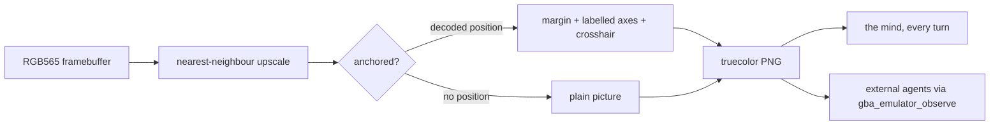

# ADR 0120: What he can see, he should be able to name

Status: accepted (2026-08-18). Narrowed by
[ADR 0122](0122-a-blocked-tile-is-not-an-identity.md): the `gObjectEvents`
alternative rejected below is adopted for the narrower question of which
blocked tiles are people, on evidence this record did not have. Extends
[ADR 0112](0112-a-frame-costs-the-same-at-turn-one-thousand.md): the frame is
still attached every turn and still costs the same. It now carries the
coordinate frame that makes what is in it addressable.

## Context

On 2026-08-18 he entered Professor Oak's lab at turn 23 and picked a starter at
turn 89 — 66 turns, 12m43s, in one room. His reasoning was not the problem. The
journal has him writing, correctly, at each step:

- T38 — "I'm at 16,10 facing the starter table"
- T39 — "At 18,10 facing east, right next to the starter table. **Three balls on
  screen.** Press A and see if I grab one."
- T40 — "A from 18,10 facing east did nothing — I'm on the wrong side of the
  table facing away from the balls."
- T43 — "A on the balls from 17,10 and 18,10 did nothing. Classic FireRed — Oak
  has to actually offer them."

He could see the table the entire time. The screenshot has been attached to
every decision since the mind was built, with a comment saying so: _looking at
the room is how he learns where the furniture is._ That part works.

What he could not do was **address** what he saw. `walk_to` takes `(x, y)`, and
nothing on a 240x160 picture says which pixel is which tile. So seeing the balls
became guessing a coordinate: walk to (18,10), find bare floor, press A at
nothing, re-guess. Nine A-presses across the run returned "no visible change —
the frame is identical".

Two fixes were considered and rejected before this one.

- **Decode `gObjectEvents` and put NPCs and objects in the observation.**
  (Rejected here; later adopted in narrowed form — see
  [ADR 0122](0122-a-blocked-tile-is-not-an-identity.md).) The
  RAM map is already there (base `0x02036E38`, `0x24` stride, entry 0 is the
  player, which is where the existing player coords and facing come from), so
  this is tractable. It is also a permanent tax: every object class someone
  remembers to decode is addressable and everything else stays invisible, in
  two ROM adapters, forever. And it does not help the case that started this —
  the starter table is not an obstacle in the decoded map at all. He walked
  _onto_ the tile he thought it occupied.
- **Name the blocker better.** Already done, and already good: the walk effect
  reads "the way was blocked at (12,11) by something the map does not show — an
  NPC, probably". It tells him a tile is occupied. It cannot tell him which tile
  the thing he is looking at sits on.

## Decision

**The frame carries labelled tile axes anchored to the tile he is standing on.**

The camera is player-locked — FireRed and Emerald both pad maps with a 7-tile
border (`FIRERED_MAP_BORDER_OFFSET`) precisely so it never has to clamp at an
edge — so the map tile under any pixel is a fixed offset from where he stands.
Measured against two live overworld frames with known positions, the player
sprite sits on screen column 7 of 15. Column `c` is therefore map
`playerX + c - 7`, and row `r` is `playerY + r - 4`.

- **Labels live in an added margin, not on the game.** The same encoder feeds
  the activity plane ([ADR 0047](0047-discord-activity-presence-plane.md)); a
  number stamped across a sprite would trade his problem for the room's. The
  rules themselves cross the picture, because a grid that does not is not a
  grid. A red crosshair marks his own tile so counting starts from a known
  point rather than from an edge.
- **An undecoded screen gets the plain picture.** Titles, cutscenes and battles
  have no overworld tile to anchor to. Drawing a grid there would be a
  coordinate frame that means nothing, which is worse than none
  ([ADR 0110](0110-an-undecoded-screen-is-a-fact-not-an-alarm.md)).
- **Watchers keep the plain frame.** The stream and glance paths pass a scale
  and no anchor. The grid is a tool for the player, not scenery for the room.
- **External agents get the same picture he does.** `gba_emulator_observe`
  already reads the observations before it renders the frame, so it anchors from
  the same decoded position. An agent driving this body through MCP reads
  `walk_to` coordinates off the image instead of guessing them.

## Consequences

- Every object on every map becomes addressable, including the ones no decoder
  was ever taught to name — which is the property the `gObjectEvents` route
  could not have.
- The grid is only as true as the player-locked camera assumption. A body whose
  camera is not player-locked passes `playerColumn`/`playerRow` explicitly;
  getting it wrong yields confidently mislabelled tiles, which is worse than no
  labels. The offsets are measured, not assumed, and the measurement is two
  frames — a third body should re-measure rather than inherit.
- The margin changes the frame's dimensions. Anything that assumed 240x160
  times the scale must read the PNG header instead.
- The hosted world body ([ADR 0103](0103-a-hosted-world-is-another-body.md))
  receives an already-encoded PNG from the world server and does not yet get
  the grid. It needs the same overlay server-side, or raw frames across the
  protocol. Until then the world path keeps the plain picture, and the 66-turn
  failure this ADR is named for remains reachable there.
