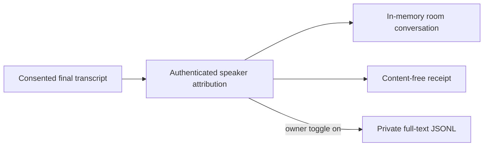

# ADR 0121: Development voice transcripts are explicit

Status: accepted (2026-08-17). Amends
[ADR 0045](0045-official-bot-dave-group-voice.md) and
[ADR 0057](0057-realtime-voice-with-captain-handoff.md): voice receipts remain
content-free, while the owner may separately retain exact consented speech for
development diagnostics.

## Context

Content-free receipts prove that transcription happened, which speaker Discord
attributed it to, how long it took, and what the floor did. They cannot answer
the most important speech-debugging question: what words did the transcriber
actually produce? Keeping exact text only in the live call made recognition,
addressing, and speaker-attribution failures impossible to investigate after
the fact.

Always retaining speech would silently change the privacy posture of every
deployment. Putting transcript text into the existing receipt stream would
also weaken a useful structural fence for every receipt consumer.

## Decision

**Full local voice transcript retention is an explicit owner setting, off by
default, and independent of content-free receipts.**

`discord.voiceTranscriptLoggingEnabled` is configured beside the Discord voice
consent policy in `/discord`. `DISCORD_VOICE_TRANSCRIPT_LOGGING_ENABLED` remains
the environment-wins operational override.

When enabled, both Discord bodies subscribe to the shared final-transcript seam
and append to
`${XDG_STATE_HOME:-~/.local/state}/clankie/discord-voice-transcripts.jsonl`.
Each line carries the body, timestamp, guild, channel, stay, delivery, Discord
speaker id, current display name when available, and exact final transcript
text. The directory is mode `0700`, the append-only file is mode `0600`, and a
symlink target is refused.

Only speech that already passed the active consent policy reaches the log.
Raw audio is never stored. `discord-live-receipts.jsonl` remains content-free
and continues to reject transcript-shaped fields. Join, opt-in, and status
wording disclose local retention when it is enabled; asked joins give Clankie
the same current setting as context for his own disclosure.

## Options weighed

- **Log exact text to service stdout.** Rejected: it mixes sensitive content
  into broad process logs and loses structured attribution and delivery ids.
- **Add text to `discord.voice.transcription` receipts.** Rejected: every
  existing receipt reader relies on that stream's content-free boundary.
- **Retain transcripts unconditionally in development builds.** Rejected:
  this repository is also how the long-lived local service runs, so a build
  label is not meaningful consent. The owner switch is.
- **Retain audio as well as text.** Rejected: exact final STT output answers the
  debugging question without creating an audio archive.

## Consequences

- A developer can reproduce what Clankie heard after a call and correlate it
  with receipts through `deliveryId` and `stayId`. The operator console tails
  the same captain-authenticated page (`/vt`, `Ctrl+Shift+V`) without reading
  the JSONL from disk or mixing speech into `/trace`.
- Enabling retention increases the sensitivity and unbounded size of the local
  state directory. The owner explicitly manages and deletes that log.
- The file records inbound final speech, not exact native-realtime audio output;
  provider-native spoken wording remains outside this transcript.
