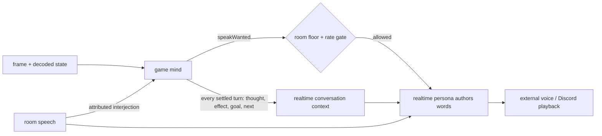

# ADR 0123: The room inherits the game's experience

Status: accepted (2026-08-18). Amends
[ADR 0074](0074-the-room-hears-one-voice.md), which keeps the realtime room
session as the sole author of audible speech.

## Context

A live 58-turn FireRed run exposed a gap between one audible character and two
model contexts. The game mind saw every frame, decoded every effect, and kept
its own thoughts and objective. The realtime room persona received one event:
`walk beside Oak ...`. It did not receive the preceding dialog saying Oak was
absent, the failed interactions, or the game mind's changing interpretation of
the NPCs. When it spoke, it could only rephrase a stale conclusion from a part
of itself whose experience it did not share.

Sending the framebuffer to the voice model makes it perceive the game a second
time. That duplicates work and still leaves it reconstructing somebody else's
thoughts. Sending every turn as a request for speech turns play into nonstop
narration. The missing piece is continuity, not another pair of eyes.

## Decision

**Every settled game turn updates the realtime persona's first-person
game-side experience. Speech remains selective.**

The update is a bounded snapshot of the game mind's current thought, observed
effect, objective, and next intent. It is seeded into the live conversation as
the persona's own experience, never as third-person commentary and never as a
sentence to repeat. The game frame stays with the mind that acts.

`respond: false` seeds ordinary turns without creating a model response.
`speakWanted` changes that flag to true and mints the existing delivery id; the
room floor and narration interval still decide whether audio is actually
played. Thus knowing is continuous while talking remains voluntary and sparse.

## Consequences

- The voice model does not look at the screen. It remembers the same interpreted
  experience the acting mind just had, including outcomes that contradict an
  earlier guess.
- The game mind can still be wrong. Occupants therefore remain unnamed until
  dialog or a prior verified interaction establishes identity; `graphicsId` is
  sprite appearance, not a character name.
- Continuous updates do not create suppression receipts because no response was
  requested. A `speechDeliveryId` remains evidence of a real speech attempt,
  not merely a context update.
- The possessor seam still carries no authored sentence, audience choice,
  framebuffer, raw audio, or Discord credential.
