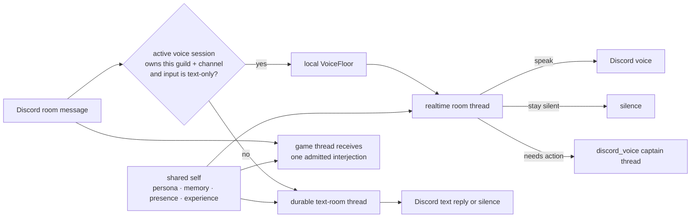

# ADR 0124: One self has many local threads

Status: accepted (James, 2026-08-18). Extends
[ADR 0024](0024-discord-dual-plane-presence.md) (two transports, one character),
[ADR 0057](0057-realtime-voice-with-captain-handoff.md) (the realtime room owns
conversation), [ADR 0118](0118-a-text-room-is-a-durable-lane.md) (text rooms
are continuing threads), and
[ADR 0098](0098-the-room-can-type-to-a-playthrough.md) (typed room input is an
experience available to another body).

## Context

Clankie is present in several places at once: Discord text rooms, a voice room,
the operator console, and a game body. Treating those as unrelated agents makes
him feel fragmented. Treating them as one global transcript is worse: unrelated
rooms leak into one another, every turn repeatedly pays for every other room,
and simultaneous conversations cannot remain simultaneous.

A text message in the attached chat of a voice channel exposed the practical
seam. Someone wrote `say something in vc clankie`. The text captain found a
tool named `say_now`, mistook that text-only progress action for speech, posted
one text message through it, and then posted its ordinary final reply. The
voice room never received the request. One Clankie appeared as two text replies
and no voice.

The system already has the missing social primitive. `VoiceFloor` continuously
decides whether a room input wakes him, continues a conversation, merely
reaches his attention, earns an unprompted offer, or is ignored. The engaged
realtime persona then authors speech or chooses silence, and reaches the
captain through `ask_clankie` when the request needs action. A second routing
model or a verbatim text-to-speech command duplicates that decision.

## Decision

**Clankie has one shared self and many local threads of attention.** Persona,
owner settings, approved memory, presence, and bounded first-person experiences
belong to the shared self. Conversation history and floor state stay local to
the room that experienced them. Threads exchange attributed experiences, not
their entire transcripts and not sentences for another body to repeat.

**The active room owns each input.** A text-only Discord message whose guild and
channel match the live voice session enters that session as an authenticated
`source: "text"` room input. It passes through the same floor as transcribed
speech. The realtime room persona may answer aloud, use `ask_clankie`, or stay
silent. The bridge does not also start a `discord_presence` captain turn for
that delivery. When no matching voice session exists, the existing durable text
lane owns it. Messages carrying images remain text-lane turns because that lane
is the one that resolves and perceives their bytes.

**Knowledge crosses as an event; authorship remains local.** The voice
conversation ring includes both speech and typed lines with their source. Text
does not enter speech-transcript subscribers: the Discord message is already
durable at its source, the opt-in development transcript remains a record of
captured speech, and the possessor already receives admitted room text directly.
Publishing it again through the speech subscriber would make the game hear one
message twice.

**The trail identifies the handoff without retaining another copy of the
words.** `discord.voice.text_input` records guild, channel, authenticated author,
delivery id, character count, and whether the line addressed him. The delivery
id then joins the floor decision, model response, captain handoff, and playback
receipts. Voice receipts remain content-free.

**Tool names state their medium.** The mid-turn text progress action is
`send_text_update`, not `say_now`. It still posts before slow work and still
does not spend the final reply; it no longer presents itself as a voice action.

## Alternatives considered

- **Give the text captain a “speak this sentence” tool** was rejected because it
  scripts the room persona and recreates the two-author defect resolved by
  [ADR 0074](0074-the-room-hears-one-voice.md).
- **Feed text to voice and still run the text captain** was rejected because two
  independent authors can answer the same delivery, disagree, or race.
- **Put every surface in one global model session** was rejected because one
  identity does not require one attention stream. It destroys room privacy,
  concurrency, and bounded context.
- **Add a coordinator that chooses text versus voice** was rejected because the
  active room and its existing floor already model ownership and volition.

## Consequences

- Typing in the active voice channel feels like talking into the same room:
  Clankie may answer aloud even though the human used text.
- Silence remains a real voice outcome. A routed message does not fall through
  to a second text answer when the room persona declines it.
- Other Discord rooms, the operator console, and the game continue concurrently
  as separate threads grounded in the same self.
- Gateway redelivery is idempotent inside a bounded window, so one Discord
  delivery cannot open two voice responses.
- Both the official bot and the personal-lab user-session body use the same
  transport-neutral room-input implementation.
