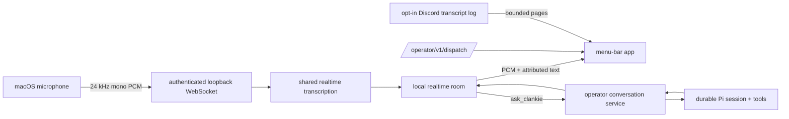

# ADR 0125: The menu bar is a private local voice room

Status: accepted (James, 2026-08-18). Extends
[ADR 0057](0057-realtime-voice-with-captain-handoff.md) (realtime voice owns
conversation), [ADR 0111](0111-a-console-process-starts-one-conversation.md)
(operator surfaces share one callable contract), and
[ADR 0124](0124-one-self-has-many-local-threads.md) (one self has local threads).

## Context

A menu-bar microphone needs to feel like opening a quiet voice chat with
Clankie, not like dictating text into the TUI. Discord already supplies the
realtime conversation, transcription, speech, and `ask_clankie` handoff needed
for that experience. Reimplementing a second local voice stack would split his
persona and tool behavior and make the TUI, relay, and app disagree about what
an operator conversation can do.

The app also needs a compact view of continuing Pi sessions and live Discord
speech. Exact Discord speech is owner-controlled retained content, while local
microphone audio does not need persistence at all.

## Decision

**The macOS menu-bar app is a private local realtime voice room.** A click on
its microphone toggles continuous voice activity detection; holding Fn opens a
momentary utterance from any app and commits it on release. Both gestures use
one authenticated loopback WebSocket. The service reuses the configured voice
provider, realtime persona, upstream transcription, and `ask_clankie` bridge
from the Discord voice composition.

**The captain boundary owns actions.** The local room speaks directly for
social conversation. Requests requiring tools use `ask_clankie`, which creates
or resumes a normal global operator conversation through the same callable
service used by the TUI and relay. A voice request that needs interactive input
continues in an authenticated operator console rather than inventing a second
approval protocol.

**Local audio is ephemeral; retained speech stays explicitly opt-in.** Raw
microphone and playback PCM remain in memory and are never written by the
service. The app reads exact Discord speech only through the captain-authenticated
transcript endpoint, which returns no content while the owner setting is off.
The endpoint uses bounded cursor pages and the existing shared transcript
store; it does not create a second log.

**Native macOS features own the surface.** `MenuBarExtra`, AVFoundation,
Keychain Services, URLSession WebSockets, and session Fn-key flags cover the
applet without a UI or networking dependency. The Fn gesture does not install
an event tap and therefore does not require Input Monitoring permission.

## Alternatives considered

- **Route microphone text into the TUI** was rejected because it loses realtime
  turn-taking, interruption, playback, and the feeling of a voice room.
- **Run Discord locally as a hidden voice channel** was rejected because a
  private local surface does not need a Discord transport, guild, or bot body.
- **Give the realtime model machine tools directly** was rejected because it
  bypasses the established authenticated captain lane and its durable Pi trail.
- **Persist local voice audio or a second transcript log** was rejected because
  the live UI needs neither and the operator conversation already retains work
  that crosses into the captain.

## Consequences

- The macOS app and future local clients can open the same voice chat through a
  base Clankie API rather than embedding Discord.
- The TUI keeps its existing operator contract and gains access to the same
  transcript page and voice WebSocket when it grows an audio surface.
- A local voice chat needs the selected voice provider credential in the
  canonical credential broker and a running Clankie service.
- The app remains a small native executable with microphone permission only.
