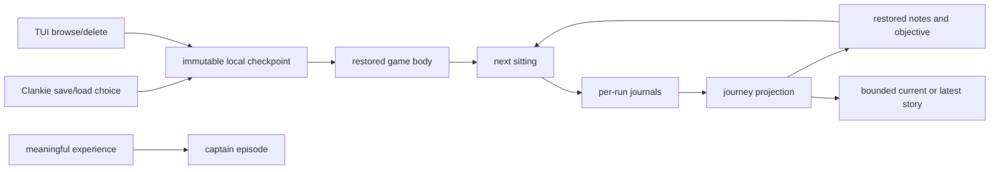

# ADR 0126: Game state, history, and memory have separate owners

Status: accepted (James, 2026-08-19). Amends
[ADR 0068](0068-a-playthrough-leaves-a-durable-trail.md) and
[ADR 0099](0099-he-can-look-at-his-own-play.md).

## Context

One Pokémon sitting already leaves three useful artifacts: the cartridge or
checkpoint that can restore the world, the append-only play journal that can
reconstruct every decision, and Clankie's bounded captain episodes. Treating
all three as interchangeable "memory" produced repetitive episode notes such
as joins, retries, and embodiment ids while still leaving a hosted-world player
without their previous objective when they returned.

Session, checkpoint, and day identifiers cannot name the adventure. Sessions
and checkpoints are replaceable instances, while a sitting can cross midnight.
The missing identity is the journey that all those instances continue.

## Decision

Every new play journal carries a stable `journeyId` in its V3 header beside the
run identity, environment, and venue.

- A local journey is keyed by environment and a stable play-profile slot. The
  current single profile is `main`; future save profiles become siblings
  without making ROM or checkpoint identity carry two meanings.
- A hosted journey is keyed by the world and the authenticated durable player
  id returned at join. The model never supplies or selects that identity.
- Run, environment-session, and checkpoint ids remain separate. They name one
  execution or saved state and never double as the journey namespace.

The existing stores keep their own authority:

- checkpoints and the hosted cartridge save restore exact game state;
- per-run journals remain the append-only evidence and history;
- a bounded story is projected across journals sharing a journey id;
- the last self-authored `notes` and `objective` seed a new mind when no exact
  checkpoint continuity is available, including every hosted-world return;
- captain episodes keep only experiences or reflections worth carrying outside
  the game, never routine game status.

Local checkpoint receipts carry their journey and environment when Clankie
mints them. This metadata makes saves browsable while checkpoint ids remain
state identities and journey ids remain adventure identities.

`pokeagent_recall` returns the live journey when one is attached and the most
recent journey otherwise. Ambient voice briefing includes the story only while
Clankie is actually playing. Historical recall stays an explicit pull.

Daily summaries are a view over domain-owned history, not another authority.
If a daily journal surface is added, it groups journey runs and selected
episodes by date and links back to them; it does not ingest raw room transcripts
or duplicate person facts.

## Alternatives considered

- **Use captain episodes for game continuity.** Rejected because their global
  128-entry ring and newest-eight prompt are intentionally small and
  autobiographical. Routine turns would evict unrelated memories.
- **Copy journals into a new memory database.** Rejected because it creates a
  second history that can drift from the append-only evidence already present.
- **Key continuity by the latest session, checkpoint, or date.** Rejected
  because each identifier serves a different lifecycle and cannot represent
  multiple sittings in one adventure.
- **Add a journey index immediately.** Deferred. Starts and explicit recall are
  low-frequency reads, so scanning the existing JSONL is the smallest complete
  design. A rebuildable index belongs here only when measured journal volume
  makes projection slow.

## Consequences

- Local and hosted play restore both the world and the reason Clankie was in it.
- A stopped adventure remains recallable without keeping a game session alive.
- Older V1/V2 journals remain valid evidence but do not claim a journey parent
  they never recorded; cross-run semantic linkage begins with V3.
- Journey projection can always be rebuilt from the journals and adds no new
  deletion, retention, or trust boundary.
