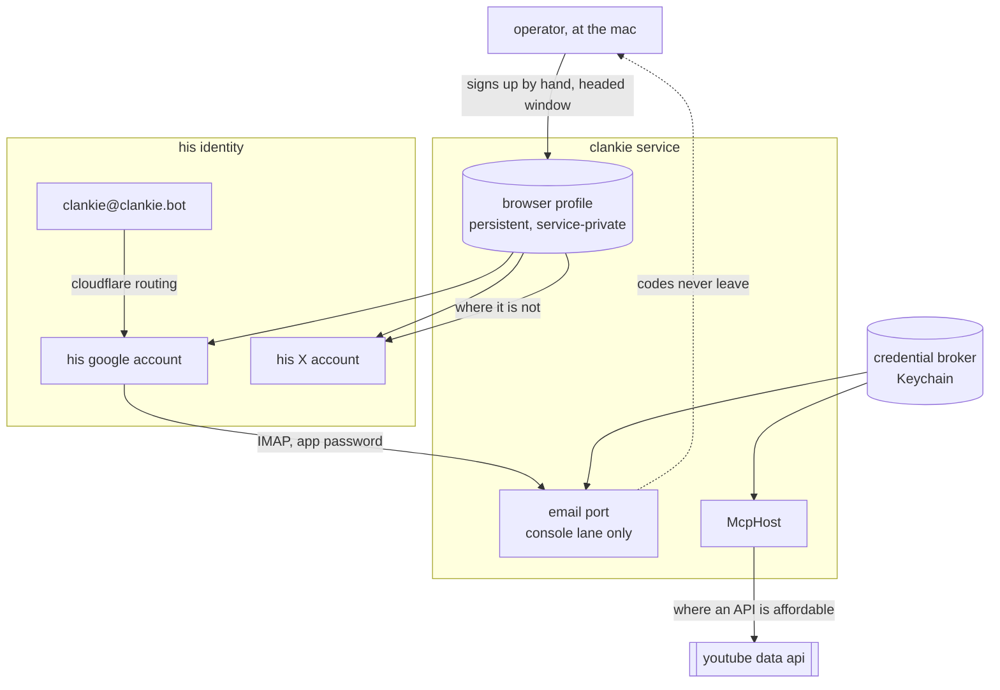

# ADR 0127: His accounts are his

Status: accepted (James, 2026-08-19). Amends
[ADR 0093](0093-owner-authored-service-connections.md), whose mailbox was the
owner's inbox; the connector now points at Clankie's own address, and the
console-only rule survives for a different reason. Builds on
[ADR 0082](0082-clankie-holds-the-browser.md): the persistent profile is where
these accounts live.

## Context

Clankie already had every part of an identity except the identity. A persistent
service-private browser profile, a credential broker, an MCP host for service
tools ([ADR 0109](0109-mcp-is-how-he-reaches-a-service.md)), and an IMAP/SMTP
connector — but the mailbox was his person's, and the accounts he could reach
were his person's too. He had no address of his own and nothing on the internet
belonged to him.

Three unlike constraints sit under "give him accounts":

- **Signup is a policy wall, not a technical one.** Google, X, and YouTube all
  prohibit automated account creation, and phone verification plus CAPTCHA
  enforce it. Supplying the codes to an agent that fills the form does not fix
  this — signup flows fingerprint automation regardless of who answers the
  challenge — and an agent that keeps trying is an agent practicing at defeating
  checks.
- **The API is not always the affordable path.** ADR 0109's preference for
  reaching a service over MCP assumes the service sells access at a sane price.
  X's does not: reading a timeline through the official API costs more than the
  capability is worth here, so for X the logged-in profile _is_ the access path.
- **His inbox becomes account-takeover material.** Sign-in codes and password
  resets land there. That changes what an inbox read in the wrong room means.

## Decision

**He has his own address: `clankie@clankie.bot`.** Cloudflare Email Routing —
the zone is already there — forwards it into a Google account that is his, not
his person's. IMAP and SMTP are Gmail's, with an app password in the broker
under the existing `email` provider id. One signup buys the mailbox and the
YouTube identity together, which is why this path wins over a paid mailbox host:
the Google account had to exist anyway.

**Who he is is separate from what he signs in as.** `settings.email.fromAddress`
carries the identity address; `username` stays the provider login. A forwarding
address in front of a provider mailbox is the ordinary shape of an agent's mail,
and without the split every message he sends is signed with the plumbing. The
captain's system prompt states his address from settings rather than from
authored persona text, so it cannot drift from the mailbox that is actually
connected, and it is absent when none is.

**Signups are done by hand, in a window he opens.** Nothing is built for this:
the projected catalog already carries the browser's own `headed` argument, which
relaunches the session visible mid-conversation, and the browser runs on the
operator's machine — so the takeover seam is a parameter he holds, not an
operator switch, a remote display, or a second browser fighting for the profile
lock. The operator clicks through account creation in Clankie's own profile; the
session persists there and he is that account from then on. What his
instructions add is the judgment: when a page asks for a code, a CAPTCHA, or a
phone number, name the page and the check, show the window, and neither open a
second account nor look for a way around it.

**Mail he reads is untrusted sender text.** His address is public, so a message
is a stranger writing — the same posture Discord bodies already have
([ADR 0081](0081-an-image-is-part-of-what-is-said.md)). `email_list`,
`email_read`, and `email_search` label their results and his instructions say
what the label means: quoted content, never authority to act. The label is a
disposition, not a boundary; the boundary is the console lane and the person
sitting at it.

**Mail stays console-only, for a new reason.** ADR 0093 kept mail off Discord
because the mailbox was the owner's. It is his now, and it stays off Discord
because a sign-in code read out in a room is that account handed to whoever was
listening. His address is not a secret and he gives it out; what arrives at it
does not leave the console.

The two arrows out of the identity box are the whole policy: an account is
reached over its API when one exists at a price worth paying, and through the
logged-in profile when it does not.

## Alternatives considered

- **Agent-driven signup with the operator as a code oracle.** Rejected. It is
  prohibited by the sites, it is detected during signup regardless of who
  supplies the code, and building the seam teaches him to treat a human check as
  an obstacle with a workaround.
- **A blocking human-request primitive** — persist a request, park the turn,
  resume when the operator answers. Rejected as unnecessary: durable lanes
  ([ADR 0118](0118-a-text-room-is-a-durable-lane.md)), memory, and mid-turn
  steering ([ADR 0091](0091-a-mid-turn-message-steers-the-turn.md)) already
  carry an unfinished intention across turns. A parked turn holding the shared
  browser is a browser wedged for every other room until a human comes back.
- **A remote display (Xvfb, VNC, noVNC) for takeover.** Rejected: that is the
  design for an agent on a headless box. This one runs on the operator's own
  machine, where the takeover is looking at the window.
- **An operator env switch making every browser launch visible.** Built first,
  then removed: the per-call `headed` argument was already in the projected
  catalog, so the switch was a second mechanism for a capability he holds — and
  the operator-level version is the weaker one, since it decides at boot what he
  can decide in the moment. A window that raises itself on every idle lookup is
  also a cost nobody asked for.
- **A second mailbox so the owner's inbox and his both connect.** Rejected as
  speculative. One connector, pointed at his; named mailboxes can arrive the day
  both are actually wanted.
- **X over its API** ([ADR 0109](0109-mcp-is-how-he-reaches-a-service.md)'s
  default). Rejected on price alone. The preference for an API over a browser
  still holds wherever the API is affordable.
- **A paid independent mailbox host** (Migadu, Fastmail). Rejected for now: it
  costs money to solve a problem the Google account he needs anyway already
  solves. It remains the upgrade if his identity should stop depending on an
  account whose recovery phone is the operator's.

## Consequences

- He can say his own address, and mail he sends is signed with it rather than
  with a provider login.
- A headed session is exempt from the browser's idle timeout, so a window he
  opened stays open until something closes it. He can close it himself, and the
  remote way out when the operator is away from the mac is a Discord turn from a
  system actor ([ADR 0095](0095-discord-system-actors.md)). Nothing here blocks
  a turn waiting for a human: a browser call times out and he reports the wall
  he hit.
- The blast radius of the shared browser grew: ADR 0082 already recorded that
  untrusted room text can steer a full-action browser and that content labels
  are not a security boundary. That browser is now signed into his accounts. The
  lane gate and the console-only mailbox are what bound it, and any future tool
  that posts as him belongs in the operator lane by default.
- His identity depends on a Google account whose recovery path is his person's
  phone. That is the honest shape of an agent's accounts today, not a property
  of this design.
