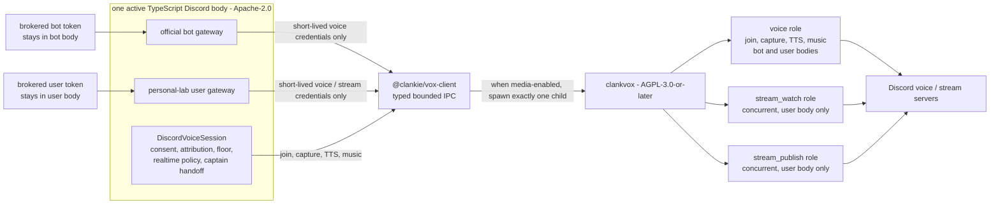

# ADR 0128: Vox is the sole Discord media owner

Status: accepted (2026-08-19). Supersedes the media-owner and staged-rollout
portions of [ADR 0045](0045-official-bot-dave-group-voice.md) and
[ADR 0100](0100-vox-is-an-owned-native-media-package.md). Their consent,
attribution, floor, allowlist, one-active-body, and AGPL process-boundary
decisions remain in force.

## Context

The bot and personal-lab user bodies shared TypeScript conversation policy but
used different media owners. Ordinary voice and music ran in Node while Vox
owned user-body screen watch and Go Live. That split duplicated transport
lifecycle, readiness, codec, DAVE, and playback truth, and made an active-body
switch change more than the Discord credential.

Vox now has a proven primary voice role as well as independent stream-watch and
stream-publish roles. `@clankie/vox-client` exposes those roles without moving
product policy or account credentials into the AGPL process.

## Decision

Each media-enabled active Discord body owns exactly one app-lifetime `clankvox`
child through the Apache-2.0 `@clankie/vox-client` process boundary. A
text-only official-bot process does not spawn Vox. Wherever Discord media is
enabled, Vox is the only Discord media owner.

The bot or user gateway performs account authentication and gateway/REST work.
The account token never crosses IPC. Only Discord-issued, short-lived
voice/stream endpoint, token, session, user, server, and channel fields cross to
the child after the body validates the target and role.

The primary `voice` role owns join/leave, per-user Opus capture, TTS playback,
and audible music in both bodies. The user body may concurrently lease
`stream_watch` and `stream_publish`. Those roles have separate transport and
DAVE state. Releasing primary voice does not destroy the child or disconnect a
watch/publish role; body shutdown closes all roles and the child once.

The TypeScript `DiscordVoiceSession` remains the policy owner. Existing rules
still apply:

- voice is off unless owner settings and guild/channel allowlists admit it;
- only consented Discord user IDs are subscribed, and gateway identity remains
  attached through transcription and receipts;
- the shared floor decides whether Clankie answers, overlaps, or permits
  barge-in; the realtime model keeps only the bounded `ask_clankie` handoff;
- raw PCM remains memory-only and content-free receipts remain the durable
  evidence surface; and
- `/discord` selects one active body, so the launcher never starts two mouths
  or two media owners.

Discord platform limits still prevent bot accounts from receiving another
member's Go Live pixels or publishing Go Live. Screen watch and publish remain
user-body roles for that reason, not because Clankie carries duplicate media
implementations.

## Readiness and live proof

Readiness is layered and role-specific:

1. `process_ready` carries the explicit IPC protocol version. The client accepts
   no command until it exactly matches `VOX_IPC_PROTOCOL_VERSION`; it still does
   not prove a Discord media connection.
2. `transport_state=ready` proves only the named role (`voice`, `stream_watch`,
   or `stream_publish`) connected.
3. Positive `dave_state=ready` proves only the named role negotiated DAVE. A
   voice join requires a protocol version greater than zero before it emits
   `joined`. Primary voice ready, connection, transport, DAVE, and transport
   error events carry the caller's `connectionId`; stream roles use independent
   generations.

TTS evidence is also layered and `playbackId`-scoped: `buffered` means PCM is
queued, `started` means the first audible TTS-containing RTP frame was
successfully transmitted, and `drained` follows `finish_tts_playback` only after
the PCM, held partial tail, and trailing output frames cross the sender.

Fresh media-enabled app evidence records `mediaOwner: vox`. The voice live proof
also requires the existing consented, attributed, floor/realtime,
spoken-response, positive DAVE, clean-leave, and reconnect ceremony. A clean leave is a
`discord.voice.left` receipt with `gatewayConfirmed: true` and `mediaOwner: vox`
after the account gateway confirms detachment. Screen watch separately requires
its role connection, decoder readiness, and a decoded still. Publish separately
requires Discord-accepted OP18 and OP22, its role transport, positive DAVE, and
Vox's first `stream_publish_media_started` H264 event from the current
connection/source generations before `discord.stream.publish_started` is
emitted.

A complete media-enabled deployment proof also demonstrates one child and no
competing media owner, then proves a clean primary-voice leave preserves any
active stream role. Deterministic checks protect those invariants, but they do
not replace the live Discord ceremonies.

## Options weighed

- **Keep Node voice and Vox streams.** Rejected because two media owners
  duplicate readiness and lifecycle truth and make bodies behave differently.
- **Spawn one Vox process per role.** Rejected because role-scoped state already
  isolates transports inside one process and extra children would compete for
  one Discord membership.
- **Move consent/floor/realtime policy into Vox.** Rejected because those are
  character and authority decisions, not deterministic media mechanics.
- **Give account tokens to Vox.** Rejected because the credential-holding body
  already owns gateway admission and can pass only ephemeral media credentials.

## Consequences

- `@discordjs/voice` and Node Opus are no longer Discord media readiness
  dependencies.
- Both bodies expose the same voice, TTS, and audible-music behavior through
  `DiscordVoiceSession` and Vox when media is enabled; text-only bot mode starts
  no native child.
- The user body adds concurrent watch/publish roles without adding another
  child, queue, or media owner.
- `apps/vox` remains AGPL-3.0-or-later; Apache product code continues to use the
  separately licensed `@clankie/vox-client` process boundary.
- Current operating detail lives in the
  [Discord media guide](../discord-media.md),
  [Vox guide](../../apps/vox/README.md), and body-specific READMEs.
