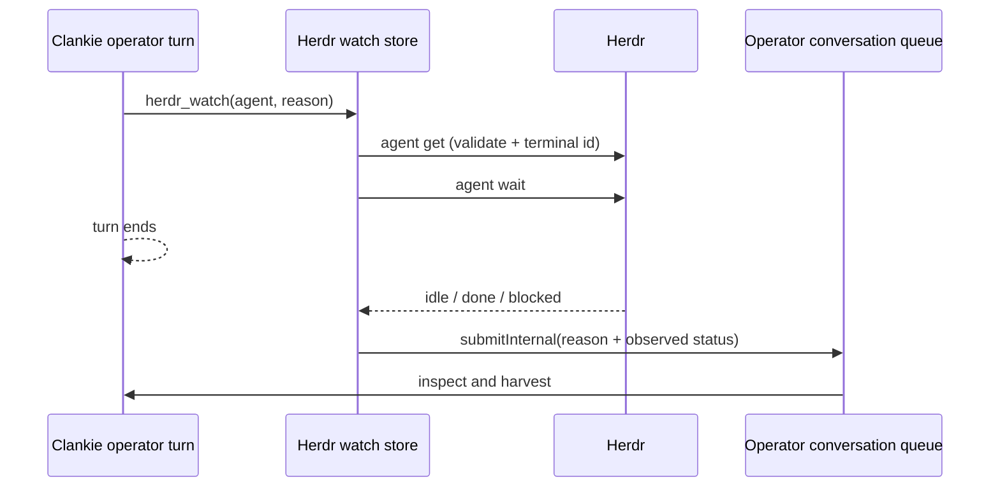

# ADR 0131: Herdr completion watches wake the operator thread

Status: accepted (James, 2026-08-26). Amends the no-bespoke-Herdr-tools
decision in [ADR 0097](0097-herdr-lead-is-the-companion-dashboard.md) for one
lifecycle bridge. Complements
[ADR 0130](0130-goals-and-self-wakes-share-the-operator-thread.md).

## Context

Clankie leads agents through the Herdr CLI, but a model turn ends after it
dispatches or agrees to harvest work. Blocking that turn with `herdr agent
wait` wastes the live model run. Polling with `schedule_wake` reacts late,
spends turns checking unchanged state, and occupies the conversation's one
clock wake.

Herdr already models the needed event: `herdr agent wait` blocks on agent
status changes and returns when an agent becomes idle, done, or blocked. The
missing piece is a bridge from that event into Clankie's existing internal
operator-turn queue.

## Decision

The operator captain exposes `herdr_watch(agent, reason)`. It validates that
the target currently has a working agent, records the pane's stable terminal
identity in `~/.clankie/captain/herdr-watches.json`, and starts one native
`herdr agent wait`. When the pane settles, the watcher submits one internal
turn to the same operator conversation with the recorded reason and observed
status.

Watches re-resolve the current pane id from the stable terminal id after a
Clankie service restart. Duplicate watches from one conversation to the same
terminal collapse to the existing watch. Closing a conversation cancels its
watches. A pane that is already settled is returned to the current turn rather
than creating a redundant wake.

The watcher notification is a cue to inspect the pane and its side effects;
agent status is not proof that the work is correct. General Herdr leadership
remains CLI-and-skill based. `schedule_wake` remains the primitive for work
that genuinely depends on wall-clock time.

## Alternatives considered

- Restore the retired Clanky supervisor and its `clanky watch` executable.
  Rejected: the current captain already owns the durable conversation queue,
  and the stale executable was a dead symlink into a removed checkout.
- Run a background shell waiter from the model. Rejected: a shell process has
  no supported way to resume the finished operator conversation and is lost
  from Clankie's lifecycle state.
- Continue scheduling timed checks. Rejected: completion is an event, not a
  time, and Herdr already emits it.

## Consequences

- Clankie reacts once when a watched pane settles without polling or holding a
  model turn open.
- Pending watches survive Clankie service restarts while the Herdr pane lives.
- The bridge intentionally handles completion only. Output milestones,
  worker sentinels, result protocols, and a general Herdr tool suite remain
  absent until they have a current use.
