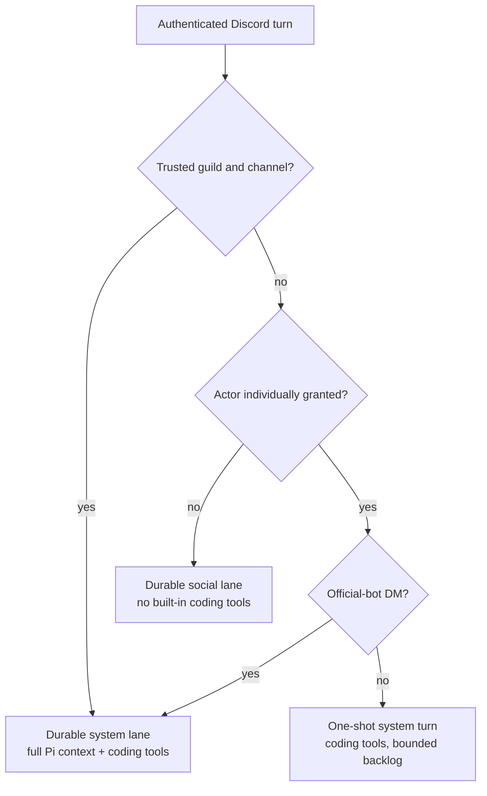

# ADR 0133: A machine grant belongs to a Discord lane

Status: accepted (James, 2026-08-26). Amends
[ADR 0086](0086-clankie-holds-a-shell.md),
[ADR 0095](0095-discord-system-actors.md),
[ADR 0105](0105-voice-is-as-capable-as-the-room-it-is-in.md), and
[ADR 0118](0118-a-text-room-is-a-durable-lane.md).

## Context

Discord already supplies authenticated actor, guild, and channel identity, and
Clankie already has deny-by-default ingress plus `systemActorUserIds`. The
missing state is the lifetime of that grant. Every individually privileged
turn is one-shot because attaching built-in tools to a shared room session
would leave them available to the next, possibly unprivileged speaker. That is
safe but means the owner cannot continue coding work with Clankie across
messages or reach Pi's normal compaction path from Discord.

Ingress is not authority. Allowing Clankie to read a server or DM does not hand
that room an unsandboxed shell, and broadening an ingress allowlist must never
broaden machine access as a side effect.

## Decision

The captain resolves one typed session plan from authenticated Discord identity
and owner-authored machine grants before it builds the prompt:

- `systemActorUserIds` grants one actor machine tools. In an official-bot DM,
  the channel is private to that actor and owns a durable system lane. In a
  guild room, or on the lab user transport where a DM may be a group DM, the
  actor receives the existing one-shot system turn.
- `systemActorGuildIds` explicitly grants every admitted human in those guilds
  machine tools. `systemActorChannelIds` optionally narrows that grant; empty
  means every otherwise-admitted channel in the named guilds. Since every
  admitted speaker has the same grant, the channel owns a durable system lane.
- Everyone else continues the durable social lane without built-in coding
  tools.

Durable social and system histories use different keys. The system key appends
`:authority:system` to the canonical room key, so a session built with tools is
never resumed as a social session or vice versa. Settings are resolved on every
turn. Removing a grant routes the next message to the social key; it does not
abort work already authorized and in flight or delete the old audit trail.

The launcher projects only settings it consumes itself into child environment.
The captain captures real process-level environment overrides before its own
startup projection, so values copied from `settings.json` do not accidentally
freeze per-turn authorization until restart.

## Consequences

- An owner can use an official-bot DM as a continuing coding-agent thread.
- A private server, or selected channels in it, can share one continuing
  coding-agent context across every member. The lane compacts through Pi like
  every other durable session.
- Revocation is a routing property instead of mutation of a live Pi session.
  An unprivileged message has no path to the old tool-bearing key.
- An individually trusted actor in a non-trusted shared room remains one-shot.
  That turn receives the bounded room backlog even when the separate social
  lane is warm.
- A guild grant is deliberately powerful: every admitted human in scope can run
  `read`, `bash`, `edit`, and `write` as the Clankie service user. The settings
  wizard calls this out and defaults every list empty.
- This is the local single-install authorization model, not multi-tenant
  isolation. A hosted GA operator grant needs a team-scoped workspace, process
  sandbox, and credentials instead of the host user's unsandboxed filesystem.

## Options weighed

- **Make every individually trusted actor durable in shared rooms.** Rejected:
  one channel would either leak tools to other speakers or split its
  conversation into per-user histories.
- **Reuse ingress guilds as machine grants.** Rejected: permission to be heard
  and permission to control the host have different blast radii.
- **Treat every DM as private.** Rejected: the lab user transport can observe
  group DMs. Only an official-bot DM supplies the required one-peer boundary.
- **Mutate one session's tool bank as speakers change.** Rejected: authorization
  would depend on timing, and revocation could race an already-bound tool list.
