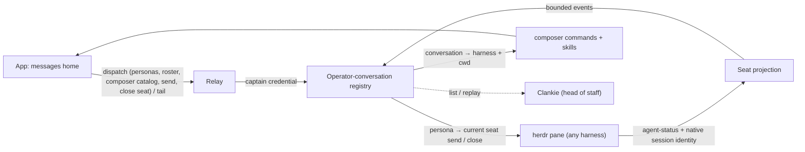

# ADR 0135: A Herdr agent has a direct conversation

Status: accepted (James, 2026-08-28). Amends the no-bespoke-Herdr-tools
decision in [ADR 0097](0097-herdr-lead-is-the-companion-dashboard.md) a second
time (the first was [ADR 0131](0131-herdr-completion-watches-wake-the-operator-thread.md)),
extending the service's herdr machinery from one lifecycle bridge to a fleet
conversation projection. [ADR 0147](0147-an-agent-persona-outlives-its-herdr-seat.md)
defines the durable persona that owns the conversation while a Herdr seat is
its current terminal address. Closes the "per-agent send has no transport" gap
recorded in the app repo's ADR 0012 (worker transcripts on the conversation
stream). [ADR 0149](0149-his-herdr-session-is-chosen-not-inherited.md) amends
the fleet-acquisition story: the led session is chosen in settings and an
unseated operator turn also carries the census; sitting in a pane remains what
makes a pane him.

## Context

The app is re-centering on messaging: Clankie pinned as the operator's head of
staff, every herdr agent a contact, threads instead of dashboards (the app
repo's ADR 0013). The interaction model is Grok Bot's — named agents you
message like coworkers — with one structural difference that is our strength:
Grok gives each bot an isolated cloud computer, while every Clankie agent
shares one machine, one filesystem, and one herdr session. The app is a window
onto a real place, not a chat skin over N sandboxes.

The service already holds the fleet's state. A seated captain turn reads a
live census (`herdr-census.ts`), distilled per-pane summaries ride the
herd-lead summaries file (`herdr-summaries.ts`), and completion watches bridge
pane settlement into the operator queue (ADR 0131). The operator-conversation
registry already carries redacted, bounded, resumable conversation streams
through the relay to devices, and the app already renders them.

What is missing is the projection between the two: the fleet is not visible as
conversations, and a device cannot send text to a pane. The app-side product
rule that forbade free-form worker steering ("a finite set of typed intents,
never free-form text-to-command") is retired by the product lead with this
decision. The auth boundary it was guarding is unchanged — a device bearer
with a `chat` grant already reaches Clankie, who holds machine tools, so
free-form text to a pane is the same power with less ceremony, not a new
power.

## Decision

Herdr agent personas are projected through the existing operator-conversation registry
and relay. No new service, route family, or credential.

### Persona and seat identity

A **persona** is the durable identity a thread hangs off. Its harness-native
occupant is replaceable. The host mints the persona id once and binds it to the
immutable Herdr subject (a managed name, or an unnamed pane's stable fallback);
the current harness session supplies a
separate occupant id. A **seat** is the current Herdr terminal address and
carries live status, cwd, and terminal routing. A dead pane renders the persona
offline; its history stays. A replacement session presenting the same subject
rebinds the persona without changing its thread.

### Contract sketch

The registry contract grows three things, all inside the existing bounded,
redacted schema discipline:

```ts
// 1. Scope: a conversation belongs to a persona. Distinct from the existing
//    "workspace" kind, which names a working directory.
OperatorConversationScope =
  | { kind: "global" }
  | { kind: "workspace"; workspaceId: string }
  | { kind: "persona"; personaId: string };    // one DM thread per agent

// 2. Roster: one bounded dispatch op for the contact list.
{ op: "roster" } → {
  seats: Array<{
    seatId: string;
    occupantId: string;
    personaId: string;
    harness: string;        // claude, codex, pi, … from herdr's agent field
    status: string;         // working | idle | done | blocked | offline
    title: string;          // pane title, bounded
    summary?: string;       // herd-lead distilled summary, when written
    next?: string;
    conversationId?: string; // the persona's thread
    workingDirectory?: string; // herdr's cwd; the district key for app ADR 0022
  }>;                        // capped like the census (48)
}

// 3. Attribution: the message event's role union gains the seat's voice.
role: "operator" | "captain" | "agent"

// 4. Closing a seat ends its pane without deleting the persona or thread.
{ op: "close_seat", seatId: string } → { seatId: string; closed: boolean }

// 5. Hiring is its symmetric twin: a tab in a working directory, a harness
//    started in it, and the seat it became. Both need the `steer` grant.
{ op: "spawn_seat", seat: { harness, title, workingDirectory } }
  → { result:
      | { outcome: "spawned"; seat: FleetSeat }
      | { outcome: "failed";
          reason: "unknown_directory" | "harness_unavailable"
                | "not_ready" | "herdr_unreachable";
          detail?: string } }

// 6. Composer discovery follows the conversation target, not app-global state.
{ op: "composer_catalog", conversationId: string }
  → { catalog: {
      commands: Array<{ name, aliases, summary, argumentHint? }>;
      skills: Array<{ name, description, source, invocation }>;
    } }
```

`spawn_seat` runs `herdr tab create --cwd` then `herdr agent start --kind`,
which returns only once herdr has detected the harness and considers it ready
for input — so a `spawned` result means the seat can actually be messaged. A
harness takes input before it has written the session file herdr reports as its
identity, so the spawn waits out that gap rather than reading identity once.
The harness is an enum, not a string, because it reaches an exec. Failure is
typed rather than thrown: a surface renders it and keeps the operator's draft,
and a start that fails closes the pane it opened so retries do not accumulate
empty tabs. The new seat is tracked the moment it exists, the way a `create`
with a persona scope tracks one, or its first reply lands in a thread nothing is
listening to.

`create` with a persona scope is idempotent per persona, like the default global
conversation. `send` to a persona conversation resolves its current seat and
pipes the text to that pane (`herdr pane send-text` + Enter) — a direct lane,
no captain model turn. A persona with no live seat rejects the send with a
typed failure; the thread stays readable.

`composer_catalog` resolves through the same address. A Clankie conversation
reports the Pi resources its captain session loads. A persona conversation
reports skills visible to the current seat's harness and working directory,
with the exact invocation token the harness accepts (`$name` for Codex,
`/name` for Claude, `/skill:name` for Pi). Codex discovery uses its native
`skills/list` app-server method, including enabled plugin skills, and fails soft
to the same filesystem roots used for other harnesses when that method is not
available. An offline persona and a channel return empty target catalogs.
Commands are restricted to operations whose effect belongs in the message
lane; terminal-only menus remain in the terminal.

### What becomes bubbles

A pty stream is not messages. The persona thread carries the _readable
projection_, built from signals the service already has:

- `activity` events from agent-status transitions — `working` is literally a
  typing indicator; `done`/`blocked`/`idle` are delivery states.
- `message` and `tool` events from the harness-native session tree. Herdr's resume
  identity selects Claude Code, Codex, and Pi sessions. Grok's exact foreground
  PID selects the matching entry in its native active-session registry, so two
  panes in the same working directory cannot cross-wire. Each active branch is
  folded in full, in order, with user text attributed to `operator`, assistant
  text attributed to `agent`, and every tool start/result joined by its native
  call id. Tool arguments and results are redacted and bounded before they enter
  the durable log; the short row stays compact while every surface can expand
  the typed `tool.detail`. Injected instructions and reasoning never enter the
  public stream. Raw PTY parsing remains outside this lane.
- Stable native entry ids checkpoint each session. A working pane's session
  tree is re-read on a short tail as well as on status changes, so each message
  and tool call reaches the thread while the agent is still working rather than
  when it settles. Re-reading is idempotent, the subject binding keeps a
  replacement session on the durable persona, and the first native import
  replaces the old one-answer seed behind a typed cursor-recovery boundary.
- A harness without a native transcript normalizer retains the bounded
  summary/final-answer projection. Adding its normalizer upgrades the same
  conversation without changing the relay or app.
- The operator's own sends publish immediately and reconcile with the same
  prompt when it appears in the native session tree.

Raw scrollback never enters the message lane. Full-screen alternate buffers and
primary-screen scrollback therefore behave the same: session history supplies
chat, while the terminal destination remains the raw-truth path over its
existing transport, one tap from the thread.

### Transparency

Persona conversations are not side channels. The captain can list and replay
them like any conversation — the lead sees everything his branches do, he is
just no longer a mandatory relay hop for steering them.



The full cross-repo picture — both repos, the trust boundary, the send and
projection loops, and the retired terminal transport:


[Editable turbopuffer tldraw source](../diagrams/seat-conversations.tldraw)

Channels and compose-to-spawn reuse the same persona, scope, roster, and direct
send machinery. A channel contains personas; only its live routing resolves
through seats.

## Alternatives considered

- **Every message routes through Clankie.** The lead as mandatory relay hop.
  Rejected: it burns a model turn per steering message, serializes the fleet
  behind one conversation, and adds nothing — his visibility is preserved by
  reading, not by forwarding.
- **A separate herdr-bridge service or new route family.** Rejected: the
  registry and relay already carry authenticated, redacted, cursor-resumable
  conversation streams end to end. A second surface is a second credential
  story — avoiding that is exactly what the app's ADR 0012 valued about this
  transport.
- **Raw pty output as the message stream.** Rejected: scrollback is not
  messages, and the app already has a real terminal for truth. The thread is
  for words; the terminal is one tap away.
- **Keep the typed-intents rule and enumerate steering verbs.** Rejected by
  the product lead: the fleet's harnesses are conversational agents; a finite
  verb set is a worse interface to them than language, and the auth boundary
  never depended on message shape.

## Consequences

- The app's per-agent send gap (its ADR 0012) closes with no new backend
  surface: configuring live captain chat configures the fleet lane.
- Any harness gets a messageable DM from the pane contract. Claude Code,
  Codex, Pi, and Grok also supply complete native message and tool history; other harnesses retain
  their safe summary projection until they gain a transcript normalizer.
- Closing an agent is a seat operation guarded by the device's `steer` grant:
  it closes the current Herdr pane and removes the live roster entry while the
  persona and durable thread remain available offline.
- ADR 0097's "no general herdr tool suite" holds for captain _tools_; the
  service's herdr machinery nonetheless grows a standing projection loop
  (roster cache, seat watchers, native transcript folding) that must fail soft the way
  the census does — a down herdr socket renders seats offline, never a failed
  conversation surface.
- Message role gains a third variant, so older app builds render seat messages
  through their existing forward-compatibility path until they update.
- The app repo's product direction retires the typed-intents sentence in the
  same change that adopts its ADR 0013.
