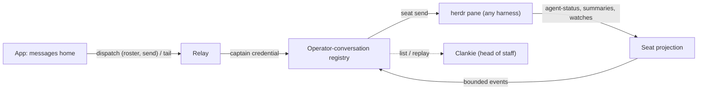
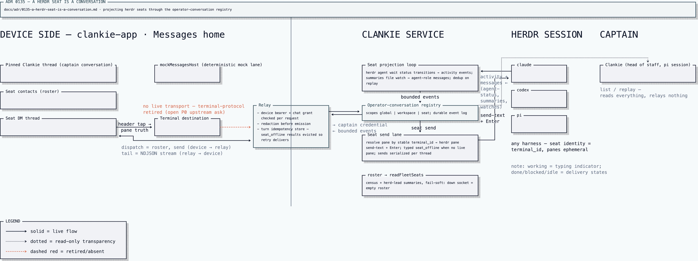

# ADR 0135: A herdr seat is a conversation

Status: accepted (James, 2026-08-28). Amends the no-bespoke-Herdr-tools
decision in [ADR 0097](0097-herdr-lead-is-the-companion-dashboard.md) a second
time (the first was [ADR 0131](0131-herdr-completion-watches-wake-the-operator-thread.md)),
extending the service's herdr machinery from one lifecycle bridge to a fleet
conversation projection. Closes the "per-agent send has no transport" gap
recorded in the app repo's ADR 0012 (worker transcripts on the conversation
stream).

## Context

The app is re-centering on messaging: Clankie pinned as the operator's head of
staff, every herdr agent a contact, threads instead of dashboards (the app
repo's ADR 0013). The interaction model is Grok Bot's — named agents you
message like coworkers — with one structural difference that is our strength:
Grok gives each bot an isolated cloud computer, while every Clankie agent
shares one machine, one filesystem, and one herdr session. The app is a window
onto a real place, not a chat skin over N sandboxes.

The service already holds the fleet's state. A seated captain turn reads a
live census (`herdr-census.ts`), distilled per-pane summaries ride the
herd-lead summaries file (`herdr-summaries.ts`), and completion watches bridge
pane settlement into the operator queue (ADR 0131). The operator-conversation
registry already carries redacted, bounded, resumable conversation streams
through the relay to devices, and the app already renders them.

What is missing is the projection between the two: the fleet is not visible as
conversations, and a device cannot send text to a pane. The app-side product
rule that forbade free-form worker steering ("a finite set of typed intents,
never free-form text-to-command") is retired by the product lead with this
decision. The auth boundary it was guarding is unchanged — a device bearer
with a `chat` grant already reaches Clankie, who holds machine tools, so
free-form text to a pane is the same power with less ceremony, not a new
power.

## Decision

Herdr seats are projected through the existing operator-conversation registry
and relay. No new service, route family, or credential.

### Seat identity

A **seat** is the durable identity a thread hangs off: herdr's stable agent
identity (the named agent where one exists, the stable terminal identity
otherwise — the same identity ADR 0131's watches already record and
re-resolve). Pane ids are ephemeral; a seat's pane sessions come and go inside
one thread the way a contact gets a new phone. A dead pane renders the seat
offline; history stays; a respawned pane resumes the same thread.

### Contract sketch

The registry contract grows three things, all inside the existing bounded,
redacted schema discipline:

```ts
// 1. Scope: a conversation can belong to a seat. Distinct from the existing
//    "workspace" kind, which names a working directory.
OperatorConversationScope =
  | { kind: "global" }
  | { kind: "workspace"; workspaceId: string }
  | { kind: "seat"; seatId: string };          // one DM thread per seat

// 2. Roster: one bounded dispatch op for the contact list.
{ op: "roster" } → {
  seats: Array<{
    seatId: string;
    harness: string;        // claude, codex, pi, … from herdr's agent field
    status: string;         // working | idle | done | blocked | offline
    title: string;          // pane title, bounded
    summary?: string;       // herd-lead distilled summary, when written
    next?: string;
    conversationId?: string; // present once the seat thread exists
  }>;                        // capped like the census (48)
}

// 3. Attribution: the message event's role union gains the seat's voice.
role: "operator" | "captain" | "agent"
```

`create` with a seat scope is idempotent per seat, like the default global
conversation. `send` to a seat conversation pipes the text to the seat's
current pane (`herdr pane send-text` + Enter) under the service's own herdr
seat — a direct lane, no captain model turn. A seat with no live pane rejects
the send with a typed failure; the thread stays readable.

### What becomes bubbles

A pty stream is not messages. The seat thread carries the _readable
projection_, built from signals the service already has:

- `activity` events from agent-status transitions — `working` is literally a
  typing indicator; `done`/`blocked`/`idle` are delivery states.
- `message` events (role `agent`) from distilled output: the herd-lead
  summaries where written, harness-native turn boundaries where a lane learns
  to read them. Producer owns redaction and bounding, as everywhere else.
- A seed at track time: a seat already settled when its projection starts
  contributes its current distilled answer, so a freshly opened thread begins
  with what the agent last said rather than empty. The registry dedups an
  identical re-projection, which makes re-tracking after a restart safe.
- The operator's own sends.

Raw scrollback never enters the message lane. The terminal destination remains
the raw-truth path over its existing transport, one tap from the thread.

### Transparency

Seat conversations are not side channels. The captain can list and replay
them like any conversation — the lead sees everything his branches do, he is
just no longer a mandatory relay hop for steering them.



The full cross-repo picture — both repos, the trust boundary, the send and
projection loops, and the retired terminal transport:



[Editable turbopuffer tldraw source](../diagrams/seat-conversations.tldraw)

### Phases

DMs first: roster, seat threads, direct send, status/summary projection.
Channels (a herdr workspace or tab as a group thread of its panes) and
compose-to-spawn (new message → spawn a pane in a chosen harness) follow once
the DM projection has proven the event shapes; both reuse the same scope and
roster machinery.

## Alternatives considered

- **Every message routes through Clankie.** The lead as mandatory relay hop.
  Rejected: it burns a model turn per steering message, serializes the fleet
  behind one conversation, and adds nothing — his visibility is preserved by
  reading, not by forwarding.
- **A separate herdr-bridge service or new route family.** Rejected: the
  registry and relay already carry authenticated, redacted, cursor-resumable
  conversation streams end to end. A second surface is a second credential
  story — avoiding that is exactly what the app's ADR 0012 valued about this
  transport.
- **Raw pty output as the message stream.** Rejected: scrollback is not
  messages, and the app already has a real terminal for truth. The thread is
  for words; the terminal is one tap away.
- **Keep the typed-intents rule and enumerate steering verbs.** Rejected by
  the product lead: the fleet's harnesses are conversational agents; a finite
  verb set is a worse interface to them than language, and the auth boundary
  never depended on message shape.

## Consequences

- The app's per-agent send gap (its ADR 0012) closes with no new backend
  surface: configuring live captain chat configures the fleet lane.
- Any harness gets a DM for free — the pane pty is the universal contract;
  harness differences are contact-card metadata.
- ADR 0097's "no general herdr tool suite" holds for captain _tools_; the
  service's herdr machinery nonetheless grows a standing projection loop
  (roster cache, seat watchers, summary tailing) that must fail soft the way
  the census does — a down herdr socket renders seats offline, never a failed
  conversation surface.
- Message role gains a third variant, so older app builds render seat messages
  through their existing forward-compatibility path until they update.
- The app repo's product direction retires the typed-intents sentence in the
  same change that adopts its ADR 0013.
