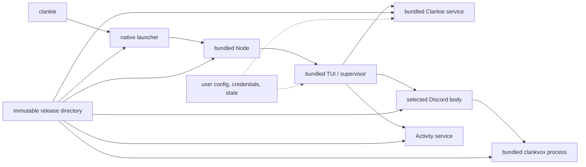

# ADR 0136: A release is one command and one runtime

Status: accepted (James, 2026-08-29).

## Context

The source launcher assumes its root is a pnpm workspace and starts each
service through `pnpm --filter`. That is useful for development but makes a
checkout, Node, pnpm, Rust, and CMake part of the end-user installation. It also
makes the launcher's location an accidental source of runtime paths.

Clankie remains a multiprocess system. The service, active Discord body,
Activity, and native Vox media boundary have different ownership and licensing
responsibilities; merging them into one executable would erase those useful
boundaries merely to produce one command.

## Decision

The first downloadable target is a self-contained macOS Apple silicon release
directory installed behind one native `clankie` executable. It preserves the
repository-relative application layout, replaces workspace service commands
with bundled JavaScript entrypoints when they exist, and includes one pinned
Node runtime plus `clankvox`.

The launcher resolves the release root from its own real path and exports that
path for deferred restarts. Supervised processes run from the release root;
the operator conversation keeps the directory where `clankie` was invoked.
Mutable state lives outside the release under the normal XDG and Clankie user
homes.

The artifact contains a generated CycloneDX SBOM, a generated dependency
license report, and the corresponding license texts. The installer verifies a
separately published SHA-256 checksum and switches an immutable versioned
installation through symlinks.

## Alternatives considered

- **Require a source checkout and pnpm.** Rejected because it is the current
  development workflow, not a binary installation.
- **Compile the whole TypeScript graph into one executable.** Rejected because
  it couples the release to a packager-specific Node compatibility surface and
  does not remove Clankie's necessary process boundaries.
- **Ship system Node plus compiled JavaScript.** Rejected because host Node
  versions would become part of the support matrix and could drift from the
  runtime used to validate a release.
- **Ship a `.pkg` first.** Rejected because the versioned directory plus one
  symlink is sufficient for the command-line installation. A notarized package
  is warranted when browser-driven distribution exists.

## Consequences

- Users need macOS 14 or newer on Apple silicon, but do not need the source
  tree, Node, pnpm, Rust, or CMake.
- Source checkouts keep their existing pnpm development path.
- Release builds depend on the pinned Node distribution and must update that
  pin deliberately.
- The archive is larger than a JavaScript-only package but has one tested
  runtime and a reversible version switch.
- Developer ID signing, notarization, Intel macOS, Linux, and package-manager
  formulas are separate targets added when those distribution channels exist.
