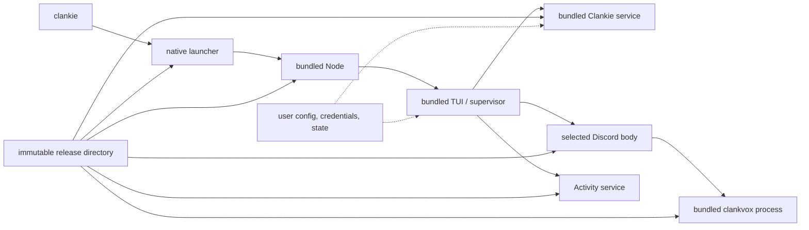

# ADR 0136: A release is one command and one runtime

Status: accepted (James, 2026-08-29). Which skills and herdr plugin files the
archive copies is amended by
[ADR 0142](0142-the-install-tells-him-the-truth.md).

## Context

The source launcher assumes its root is a pnpm workspace and starts each
service through `pnpm --filter`. That is useful for development but makes a
checkout, Node, pnpm, Rust, and CMake part of the end-user installation. It also
makes the launcher's location an accidental source of runtime paths.

Clankie remains a multiprocess system. The service, active Discord body,
Activity, and native Vox media boundary have different ownership and licensing
responsibilities; merging them into one executable would erase those useful
boundaries merely to produce one command.

## Decision

The first downloadable target is a self-contained macOS Apple silicon release
directory installed behind one native `clankie` executable. It preserves the
repository-relative application layout, replaces workspace service commands
with bundled JavaScript entrypoints when they exist, and includes one pinned
Node runtime plus `clankvox`.

```mermaid
flowchart LR
  Operator["clankie"] --> Launcher["native launcher"]
  Launcher --> Node["bundled Node"]
  Node --> TUI["bundled TUI / supervisor"]
  TUI --> Service["bundled Clankie service"]
  TUI --> Discord["selected Discord body"]
  TUI --> Activity["Activity service"]
  Discord --> Vox["bundled clankvox process"]
  Release["immutable release directory"] --> Launcher
  Release --> Node
  Release --> Service
  Release --> Discord
  Release --> Activity
  Release --> Vox
  State["user config, credentials, state"] -.-> TUI
  State -.-> Service
```

The launcher resolves the release root from its own real path and exports that
path for deferred restarts. Supervised processes run from the release root;
the operator conversation keeps the directory where `clankie` was invoked.
Mutable state lives outside the release under the normal XDG and Clankie user
homes.

The artifact contains a generated CycloneDX SBOM, a generated dependency
license report, and the corresponding license texts. The installer verifies a
separately published SHA-256 checksum and switches an immutable versioned
installation through symlinks.

## Alternatives considered

- **Require a source checkout and pnpm.** Rejected because it is the current
  development workflow, not a binary installation.
- **Compile the whole TypeScript graph into one executable.** Rejected because
  it couples the release to a packager-specific Node compatibility surface and
  does not remove Clankie's necessary process boundaries.
- **Ship system Node plus compiled JavaScript.** Rejected because host Node
  versions would become part of the support matrix and could drift from the
  runtime used to validate a release.
- **Ship a `.pkg` first.** Rejected because the versioned directory plus one
  symlink is sufficient for the command-line installation. A notarized package
  is warranted when browser-driven distribution exists.

## Consequences

- Users need macOS 14 or newer on Apple silicon, but do not need the source
  tree, Node, pnpm, Rust, or CMake.
- Source checkouts keep their existing pnpm development path.
- Release builds depend on the pinned Node distribution and must update that
  pin deliberately.
- The archive is larger than a JavaScript-only package but has one tested
  runtime and a reversible version switch.
- Developer ID signing, notarization, Intel macOS, Linux, and package-manager
  formulas are separate targets added when those distribution channels exist.

## Release safety amendment (2026-10-05)

[VUH-1706](https://linear.app/vuhlp/issue/VUH-1706) adds a separate fleet-load
gate to release and manual runs. Pushes and pull requests retain their cheap
checks. Its CPU and transport budgets exercise actual native bridges and fleet
proof, including incident revisions; they are not model evaluations.

[VUH-1707](https://linear.app/vuhlp/issue/VUH-1707) distinguishes successful
service cutover from healthy steady operation. A new self-hosted Git runtime
acquires an owned deploy hold before its listener admits another deployment,
then observes CPU and health latency over a durable five-minute canary. A
pass releases that hold under the registry lock and advances the healthy
checkpoint. Failure retains the current pin and hold, names the previous healthy
commit and claims one runtime-health alert. CPU regressions do not automatically
roll back; the owner decides recovery. A restart requires a fresh full window.

The detached helper remains dependency-free and records pending observation
after liveness succeeds. Runtime targets without the coordinator are refused
before installation or shutdown. Existing rollback on failed initial service
liveness remains separate; confirmed pre-canary rollback cleans up only its own
temporary hold. Settings use the operator API, launcher CLI and TUI, and apply
to the next observation. The process-only metadata schema exposes cumulative
CPU and a boot identity without conversation content or credentials.

Health probes use fresh native HTTP connections, including connection setup
and the complete bounded response. The installed Node client's idle fetch pool
could delay dispatch by roughly 500 ms while the handler remained below 1 ms;
the [passive investigation](../testing/2026-10-05-health-latency/README.md)
records that measurement fault. The 250 ms budget remains unchanged, and no
global dispatcher or background wakeup is added.

## CPU is report-only (2026-10-06)

The 10% absolute CPU budget failed every canary on the owner's machine from
`72c1571a` to `c72c3d02` (13–21% mean, health p95 under 30 ms), so seven CPU-only
holds accumulated and each deploy overrode them. An absolute figure describes one
machine's fleet and workload, not the runtime. The canary now holds only when the
new service is not healthy: missing, stale or wrong-identity health, a sampling
gap, or health p95 over budget. CPU is still sampled and recorded; status reports
it beside the previous runtime's recorded mean on the same machine, their ratio,
and the advisory `cpuPercent`, which stays in the policy schema so existing policy
files and older runtimes still parse. No pre-cutover baseline sampler or CPU alert
was added. Legacy CPU-only holds are released explicitly by the owner.

## Retry transient canary unavailability (VUH-1845, 2026-10-08)

The first unavailable health sample previously failed the canary immediately;
an otherwise healthy update failed after nine seconds with zero samples. Keep
the existing three-interval sampling-gap budget, but retry unavailable checks
within it and the full observation window. Recovery clears the temporary error;
only verified samples count toward the canary. Sustained unavailability retains
the underlying check name and transport error code in the existing error field,
without response bodies or a metadata schema change. CPU remains advisory.

A failed canary never clears itself merely because the runtime later looks
healthy. An explicit audited hold release removes its hold; an owner update
override authorizes one update and leaves the old hold recorded. See the
[launcher procedure](../cli.md) for both commands. Neither changes the
historical failed result or rolls back the runtime.

## Superseded canary holds and finished operations (VUH-1863, 2026-10-08)

An override admitted the replacement but left the older canary hold blocking
subsequent updates after the replacement passed. Retain exact override snapshots
inside the accepted operation before helper scheduling. A full passing canary
releases matching canary holds from that snapshot or its recorded runtime
predecessors, under the hold registry lock with exact ownership checks. Unrelated,
changed-owner and unreadable holds stay blocking; failed observations remain
historically failed. Repeat cleanup during passed-canary recovery, including
records whose own hold was already released.

Status derives `pending` from nonterminal operations rather than lock presence.
Reads stay read-only; admission retires terminal locks. A refused update names
its blocking lifecycle or maintenance reason, including when holds were overridden.

## Source update repair (VUH-1737, 2026-10-06)

The source updater previously resolved bare `main` from the owner's checkout.
Operation `70adecaa-cd71-4dc1-bfb9-a31bbbdc5cee` selected local `e1f45750`
over a newer live pin, then reported healthy. Named branch updates now fetch
that branch from origin before accepting its exact SHA; failed fetches cannot
fall back to a local or cached branch. Explicit SHA/tag targets remain available
with older/diverged warnings. Each accepted operation retains its authenticated
operator or host-admitted conversation; CLI seat/session claims remain attribution.

Cutover supervises only code dependent on the pin. The external activity tunnel
stays with its existing owner instead of failing cleanup or acquiring authority
to kill an unowned process. Result readers tolerate unknown optional evidence;
malformed known records report reconciliation as JSON without retiring locks.
Tests use actual Git remotes, HTTP CLI calls and isolated native supervisor
processes. Integration into the live pin belongs to the fleet integrator.

## Release installs update to official releases (2026-10-06)

A source checkout updates to `origin/main`; the owner develops there. A release
install had no update path: `clankie update` and `update_runtime` were
unavailable, and rerunning the installer only switched `current` without stopping,
restarting or verifying anything. Users, and Clankie on their machines, now update
to the latest official release through the same command and journal. The service
resolves the release tag and its commit through the GitHub API, then a helper
bundled in the running release (`apps/tui/bin/release-update-helper.js`) downloads
and verifies the archive as `install.sh` does, requires its manifest to name the
accepted version and commit, and unpacks it into `releases/<version>`. It stops
services through the old release's launcher, switches `current` atomically and
starts them through the new release's launcher, which must report the new
revision; otherwise `current` switches back and the old release restarts. The
old release stays in place throughout, so the helper runs from it without a copy.
Status, the health canary, the restart guard and self-healing reconciliation are
shared with checkouts. A release that predates this helper cannot update itself;
its owner runs the installer once.
