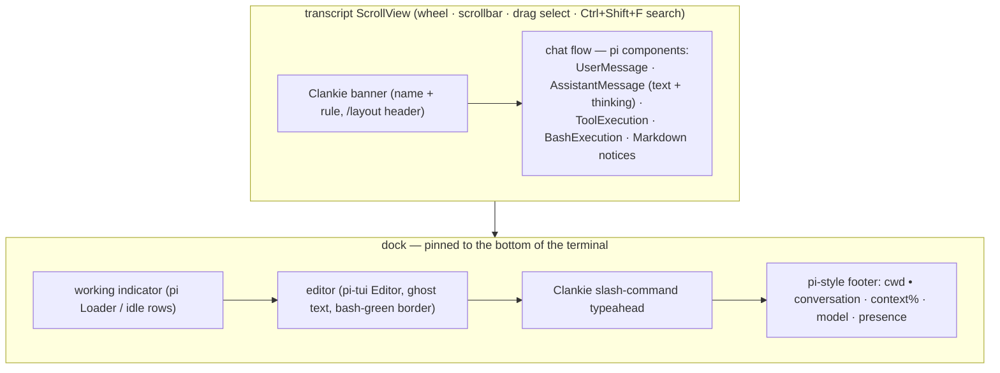

# 0137. The face wears pi's chat surface

Accepted 2026-08-29.

## Context

The operator console's face was a ported v1 design: a fullscreen band layout
(banner, fixed-height transcript viewport, status bar, typeahead, editor) with
its own markdown blocks, its own scrollbar, and a hand-rolled SGR mouse stack
for drag selection, click-to-collapse, and clipboard copy. The captain already
runs on pi, and pi ships its entire interactive chat surface as importable
components — user message boxes, assistant markdown with thinking blocks,
bordered tool executions, bash blocks, a working indicator, a footer — kept
current with every pi upgrade the repo already takes.

Maintaining a parallel chat renderer meant every transcript improvement
(streaming polish, tool-output previews, markdown fidelity) had to be rebuilt
by hand, while the parts of the console that are genuinely Clankie's — the
banner, the slash-command typeahead, the `Ctrl+/` workbench, the guided setup
modals — carried the cost of the custom layout's mouse and band math.

## Decision

The chat surface is pi's, verbatim, in pi's fullscreen mode: a `TuiAltScreen`
whose transcript lives in a `ScrollView` above a dock pinned to the bottom of
the terminal, rendering conversation content with pi's own components against
pi's dark theme (`initTheme("dark")`):

Mouse behavior is pi's alt-screen layer: the wheel and scrollbar scroll the
transcript, dragging selects text (copied via the clipboard), double-click
selects a word, `Ctrl+Shift+F` searches the transcript, and OSC 8 links open
in the browser. On top of that, a plain left click on a tool or bash block
toggles that block between preview and full output — a terminal-level input
observer hit-tests the click against the transcript, since the alt screen
consumes mouse sequences before shell input listeners run. `Ctrl+O` still
toggles every block at once, matching pi. On exit the transcript is written to
the primary screen so the conversation stays in scrollback, pi's fullscreen
exit default.

The conversation renderer maps operator conversation events onto typed
insertions (user box, assistant markdown, reasoning, tool begin/complete)
instead of markdown strings, so tool calls get pi's bordered execution blocks
with live loaders.

Clankie's chrome stays Clankie's — the banner (name and rule only — the model
and workspace moved to the footer), the slash-command typeahead panel, the
`Ctrl+/` command workbench, the guided-flow modals, and the inline `!` shell
escape (rendered through pi's bash block, streaming as it runs) — but wears
pi dark's palette: teal accent `#8abeb7`, muted grays, `#cc6666` errors,
`#b5bd68` success, and pi's heading gold `#f0c674` where pi's harsh literal
warning yellow would be too loud. The input top/bottom and status placement
layout settings are retired; `/layout` keeps only the header toggle.

## Consequences

- The chat UI tracks pi: transcript rendering improvements arrive by bumping
  the pinned pi version, not by porting them.
- ~2k lines of custom face machinery (viewport, blocks, mouse, layout math)
  are gone; scrolling, selection, search, and copying are pi-tui's alt-screen
  implementation, and the face owns only chrome, routing, and click hit-tests.
- The editor is always docked at the bottom of the terminal; the transcript
  has no native terminal scrollback (the ScrollView holds the history, and
  exit dumps it to the primary screen). `Home`/`End` scroll the transcript,
  as in pi fullscreen, so editor line jumps are `Ctrl+A`/`Ctrl+E`.
- Clankie chrome colors are pinned copies of pi dark's values; a pi dark
  palette change requires re-syncing `clankie-face-theme.ts` by hand.
