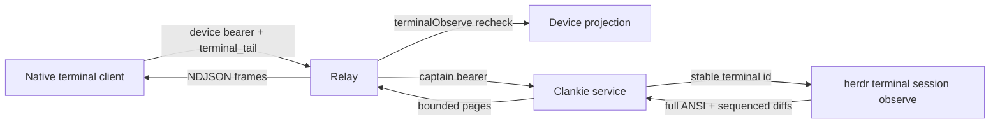

# ADR 0138: Terminal truth rides the operator relay

Status: accepted (James, 2026-08-29). Extends the seat identity and terminal
deep-link decision in [ADR 0135](0135-a-herdr-seat-is-a-conversation.md).

## Context

Seat conversations expose readable agent messages, not terminal truth. The app
keeps its native terminal renderer and links each seat thread to the seat's
stable terminal identity, but the pi rewrite retires the old
`terminal-protocol` package and its separate gateway. The renderer therefore
has no live backend wire.

The replacement has four constraints:

- bytes go directly to the native terminal client and never enter React state;
- a pane move or respawn keeps the stable Herdr terminal identity while pane ids
  remain ephemeral;
- every public frame and retained queue is bounded and sequence gaps reset to a
  fresh full redraw;
- a missing binary, down socket, dead terminal, or malformed local frame is a
  typed unavailable/reset result, never a failed conversation surface.

Herdr already owns the hard part. In Herdr 0.8.0 at `d1a30cdadd5f`,
`herdr terminal session observe <target> --cols N --rows N` connects to the
normal Herdr client socket in read-only terminal mode. It resolves pane, agent,
or stable terminal targets, renders hidden panes, and emits NDJSON with an
initial full ANSI redraw followed by monotonic base64 diffs. Its frame fields
are sequence, width, height, full/diff, and bytes. `herdr pane read` instead
formats rendered text snapshots; it cannot preserve VT state or provide a live
byte stream. The observer bytes are Herdr-generated render output rather than
raw PTY ingress; separate terminal control messages such as clipboard writes do
not enter this stream.

The relay already supplies the other hard part: current device-session bearer
validation before a stream, between polls, and immediately before emission.
Paired devices already carry a distinct `terminalObserve` grant. The
`terminalControl` grant remains ungrantable.

## Decision

Terminal observation extends the existing callable operator service envelope
with a bounded `terminal_catalog` operation and a `terminal_tail` operation.
The catalog preserves Herdr's workspace, tab, and pane coordinates beside each
stable terminal id. Tail bytes use the dedicated relay streaming path
`POST /operator/v1/terminal-tail`.

The callable envelope already owns the captain-authenticated service hop,
strict result validation, redaction, and relay dispatch used by every operator
surface. Reusing it adds no authority and keeps one upstream failure boundary.
Terminal frames remain a distinct result on a distinct public streaming route;
they never become conversation events or enter conversation retention. A
sibling envelope would duplicate the same dispatcher and credential story
without separating a trust domain.

The request names:

- the stable Herdr terminal id;
- a native surface client id;
- the requested columns and rows;
- an optional `{ streamId, sequence }` cursor;
- a bounded page limit.

The service starts one Herdr observer per native surface. This gives every
renderer its own initial full redraw and its own dimensions without sharing a
mutable VT baseline. The service validates Herdr's NDJSON, requires contiguous
sequence numbers and a full first frame, retains at most 256 frames and 16 MiB
of base64 data, and expires an idle observer after 30 seconds. Falling behind
retention returns `sequence_expired`; losing the observer returns `stream_lost`.
Both tell the native client to reconnect without a cursor and receive a fresh
full redraw.

The relay emits strict NDJSON items:

- `frame` carries one bounded base64 ANSI frame and its stream id;
- `reset` ends a stream whose cursor cannot be resumed;
- `unavailable` ends a stream whose terminal or Herdr observer is unavailable;
- `auth_failure` ends a stream whose live device authority disappears.

The relay requires `terminalObserve`, not `chat`, and rechecks the current
device projection between service polls and immediately before emitting a
page. The relay's captain bearer is the only credential sent upstream; the
device bearer never leaves the relay.

Terminal input is a later decision. It uses Herdr's separate terminal control
session, requires a renewable host-owned grant, and must decide how
`terminalControl` becomes grantable without adding a visible authority mode.
Observation neither accepts input nor implies control authority.

## Alternatives considered

- **Poll `herdr pane read`.** Rejected: text snapshots discard VT bytes,
  alternate-screen state, cursor behavior, and incremental ordering.
- **Expose Herdr's client socket through the relay.** Rejected: it couples the
  app to Herdr's private binary protocol and bypasses the service's bounded
  schema and fail-soft boundary.
- **Restore `terminal-protocol`.** Rejected: its replay, lease, discovery, and
  runner abstractions duplicate Herdr's live terminal session contract. Only
  the bounded public projection the product consumes returns.
- **Share one observer across devices.** Deferred: clients can request different
  geometry and need an independent full/diff baseline. A shared snapshot cache
  is justified only if the bounded 64-surface ceiling becomes measurable.
- **Add input with observation.** Rejected for this phase: read authority is
  already modeled by `terminalObserve`; write authority is deliberately not.

## Consequences

- A seat thread's terminal link attaches to pane truth by stable terminal id.
- The terminal browser mirrors Herdr's workspace → tab → pane organization
  without deriving mutable hierarchy from stable terminal ids or display labels.
- The native app can write decoded bytes directly into SwiftTerm or another
  native renderer without routing them through React state.
- Reconnect is deterministic: resume a live observer by cursor or reset to a
  new full redraw.
- Herdr failure is contained to the terminal destination; messages and roster
  remain available.
- One service process owns at most 64 active native observer sessions. If real
  use reaches that ceiling, observer sharing or admission by device replaces
  the current per-surface model.
