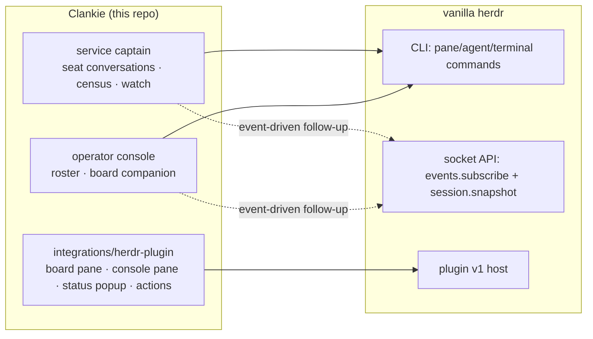

# 0139. Clankie rides vanilla herdr

Accepted 2026-08-29. The runtime ownership and fork-retirement decision is
superseded by [ADR 0157](0157-herdr-is-an-owned-runtime.md). The upstream
CLI/socket boundary and optional plugin remain applicable to external mode.

## Context

Clankie leads his fleet through a private herdr fork
(`Volpestyle/clankie-herdr`) carrying a 13-patch stack. An audit of every
herdr call in this repo, clankie-app, and the `herdr-lead` board found that
the fork's Clankie-specific API surface has gone unused: the byte-attach API
(patch/30), output-changed attach streaming (patch/82), agent-session report
fields (patch/80), and the bundled `clankie-herdr` installer binary
(patch/84) have zero consumers. Everything Clankie does today — `pane list`,
`pane send-text`/`send-keys`/`close`/`report-agent`, `agent list`/`wait`/
`get`, `terminal session observe` for seat screens — is pure upstream CLI.

What remains fork-only is a performance quartet (patches 40–70: API
request-read stalls, the multi-client retained-render fast path, API service
between render targets, and a pane-read damage guard) that protects the
Herdr GUI while Clankie's observers and pollers hammer the same server.

Meanwhile upstream shipped two things that change the calculus: a socket API
with long-lived `events.subscribe` streams (`pane.agent_status_changed`,
`pane.created/updated/closed/exited`, workspace/tab/worktree events, filtered
per pane and status) plus a `session.snapshot` bootstrap (`herdr api
snapshot`), and a plugin v1 system (manifest-declared actions, event hooks,
panes, link handlers, with the full CLI as the plugin API).

## Decision

Clankie targets stock upstream herdr. The fork is a temporary performance
overlay with a scheduled death, not part of Clankie's design.

- **Commands stay CLI.** Sends, reads, waits, observation, and reports keep
  using the upstream CLI exactly as today.
- **Fleet awareness goes event-driven** (follow-up work): the roster and
  census move from polling `pane list`/`agent list` to one long-lived
  `events.subscribe` stream bootstrapped by `herdr api snapshot`, with
  today's polling kept as the fallback when the socket or protocol version
  is unavailable. This removes the API pressure that motivated half the
  perf quartet.
- **The plugin carries only what a plugin can uniquely declare**
  (`integrations/herdr-plugin`): the herdr-lead board and the operator
  console as first-class plugin panes, a transient status popup, and
  keybindable actions. No fork patches, no private protocol. Plugin event
  hooks stay empty in v1 — the service's own subscription is the efficient
  event path; manifest hooks spawn a process per event.
- **Fork retirement sequence**: (1) drop the unused integration patches
  (30/82/80/84) at the next quiet point in the fork's patch-stack lane;
  (2) trial the `upstream-baseline` build with the full fleet and live seat
  observation; (3) if the GUI stays smooth, drop the perf quartet and the
  remaining small fixes, delete the fork, and install official releases.
  Upstream PRs for the perf fixes were considered and declined — not worth
  the maintenance relationship for patches we intend to stop needing.

## Consequences

- Clankie is guaranteed to work against any current official herdr release;
  the fork can lag or die without breaking him.
- Until the quartet retires, vanilla costs are known and bounded: ~100ms
  latency per CLI call, possible GUI render contention while a seat is
  observed, and an occasional pane-read render glitch — all judged in the
  vanilla trial rather than assumed.
- A raw-socket subscription client introduces a version-skew surface; the
  polling fallback keeps a protocol mismatch degraded, not broken.
- The plugin requires `clankie` and `herdr-lead` on `PATH` and activates on
  the next herdr server start after `herdr plugin link`.
